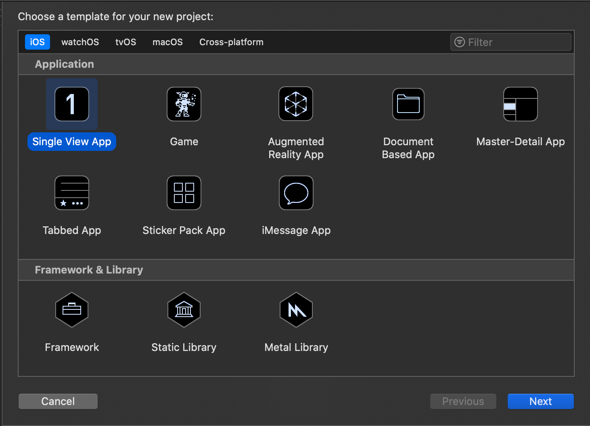
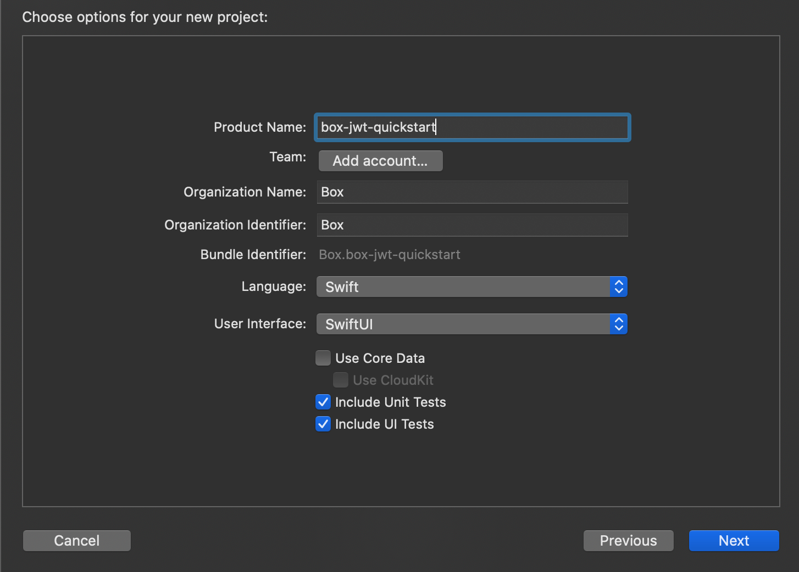

# Create an iOS App

Before installing the Box iOS SDK you'll need to have an iOS application
available to add the dependencies into. We'll create a new blank application
now.

## Setup an iOS App

Xcode will be the tool that we use to create and edit our iOS application
during this quick-start guide. If you don't have Xcode, download it now from the
[Apple developer site](https://developer.apple.com/xcode/).

If this is the first application you're creating in Xcode or you already have
application development experience in it, we'll start our integration of the
Box iOS SDK with a new blank application.

1. Start Xcode
2. From the top menu, select **File** -> **New** -> **Project...**
3. Select the option for **Single View App**
    <ImageFrame center>
      
    </ImageFrame>
4. Enter your application configuration information, including the `Product Name`, `Organization Identifier`, and `Organization Name`.
    <ImageFrame center>
      
    </ImageFrame>
5. Select a local storage location for the application and click **Create**

</Choice>

## Summary

* You created a new blank iOS application in Xcode

<Next>I created a blank iOS application</Next>