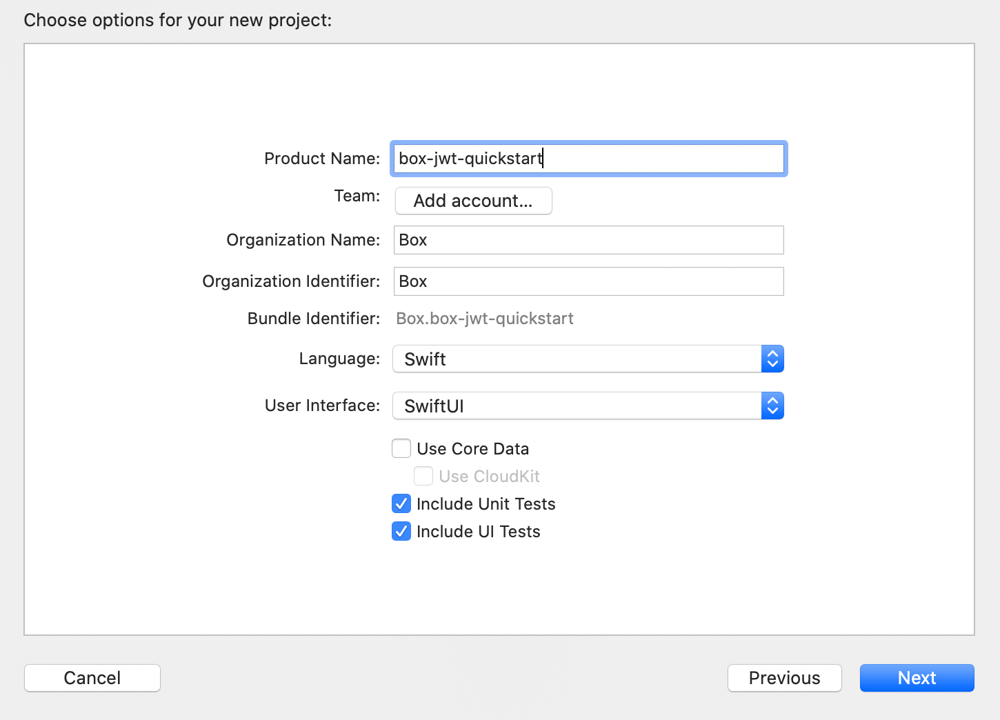

# Create an iOS App

Before installing the Box iOS SDK you'll need to have an iOS application
available to add the dependencies into. We'll create a new blank application
now.

## Setup an iOS App

<Grid columns='2'>
  <Choose option='ios.app_setup' value='new' color='blue'>
    # Create a new iOS application

    If this is the first application you're creating in Xcode or you
    wish to use a new blank application for testing the SDK, this method
    will guide you through creating a new blank iOS application.
  </Choose>

  <Choose option='ios.app_setup' value='existing' color='none'>
    # Use an existing iOS application

    If you have some iOS development experience and already have a blank
    iOS application created.
  </Choose>
</Grid>

<Choice option='ios.app_setup' value='new' color='blue'>
  # Create a new iOS application

  1. Load Xcode
  2. From the top menu, select `File` -> `New` -> `Project...`
  3. Select the option for **Single View App**
    <ImageFrame border center>
      
    </ImageFrame>
  4. Enter your application configuration information, including the **Product
     Name**, **Organization Identifier**, and **Organization Name**
     <ImageFrame border center>
       
     </ImageFrame>
  5. Select a local storage location for the application and click **Create**
</Choice>

<Choice option='ios.app_setup' value='existing' color='none'>
  # Use an existing iOS application

  If you have an existing blank application, skip to the next step.
</Choice>

## Summary

* You created and configured a new iOS application in Xcode, or
* You used an existing iOS application

<Observe option='ios.app_setup' value='new,existing'>
  <Next>
    I have an iOS application
  </Next>
</Observe>