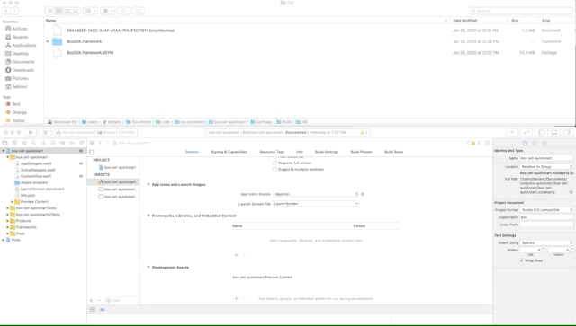
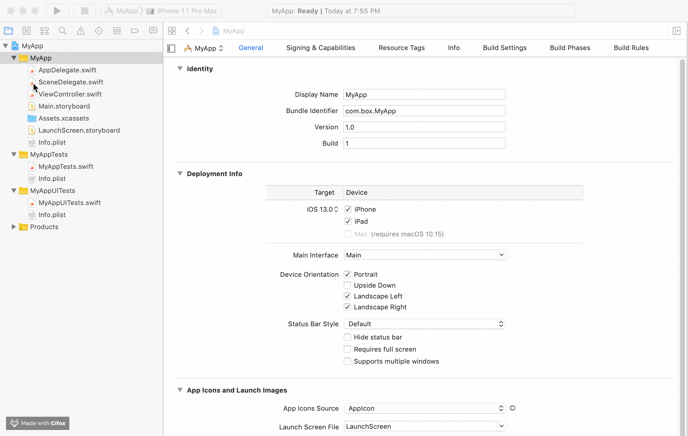

# Install the iOS SDK

With an iOS application in place, you will need to import the required **Box
iOS SDK** dependencies into your project using one of the available package
manager options.

## Select a package manager to use

<Grid columns='3'>
  <Choose option='ios.pm_type' value='carthage' color='blue'>
    # Carthage

    Carthage is a decentralized dependency manager for Swift
    and Objective-C Cocoa projects. It is open-source and built
    with Swift.
  </Choose>

  <Choose option='ios.pm_type' value='cocoapods' color='none'>
    # CocoaPods

    CocoaPods is a centralized dependency manager for Swift and
    Objective-C Cocoa projects. It is open-source and was built
    with Ruby.
  </Choose>

  <Choose option='ios.pm_type' value='swift' color='blue'>
    # Swift Package Manager

    The Swift Package Manager is a tool for managing the distribution
    of source code, making it easy to share your code and reuse
    others’ code.
  </Choose>
</Grid>

<Choice option='ios.pm_type' value='carthage' color='blue'>
  # Install the iOS SDK using Carthage

  1. From a terminal window, install Carthage: `brew install carthage`. Visit the [Carthage documentation][carthage-docs] for other installation methods.
  2. At the root of your iOS application folder, where the `{APPNAME}.xcodeproj` is located, create a new file named `Cartfile`, without an extension.
  3. Open the `Cartfile` and add the **Box iOS SDK** dependency with `git "https://github.com/box/box-ios-sdk.git" ~> 3.0`, then save and close the file.
  4. From the terminal, in the folder where the `Cartfile` is present, update all dependencies: `carthage update --platform iOS`. A `Cartfile.resolved` file and a `Carthage` directory will be created in the directory.
  5. Within a Finder or File Explorer window load the **Carthage** -> **Build** -> **iOS** directory. This should have a framework file named `BoxSDK.framework`. Keep this window open as we'll use it to add the framework to our project in the next step.
  6. In your Xcode project, click on the name of your application at the top of the project navigator on the left. In the content that displays, click on the name of your project under the **TARGETS** option. Scroll down to **Frameworks, Libraries, and Embedded Content**.
  7. Drag `BoxSDK.framework` from our Finder window over to the frameworks section.

  <ImageFrame center>
    
  </ImageFrame>

</Choice>

<Choice option='ios.pm_type' value='cocoapods' color='blue'>
  # Install the iOS SDK using CocoaPods

  1. From a terminal window, install CocoaPods: `sudo gem install cocoapods`.
  2. At the root of your iOS application folder, where the `APPNAME.xcodeproj` is located, run `pod init` to create a new `Podfile` with smart defaults.
  3. Load `Podfile`, add the **Box iOS SDK** dependency under `# Pods for {APPNAME}` with `pod 'BoxSDK', '~> 3.0'`, then save and close.
  4. From the terminal, in the folder where the `Podfile` is present, download all dependencies: `pod install`.
  5. Open `.xcworkspace` in Xcode: `open {APPNAME}.xcworkspace` and build the project.
</Choice>

<Choice option='ios.pm_type' value='swift' color='blue'>
  # Install the iOS SDK using the Swift Package Manager

  1. In your Xcode project, click on the name of your application at the top of the project navigator on the left. In the content that displays, click on the name of your project under the **PROJECT** option.
  2. Click on **Swift Packages** and click on the `+` to add a package.
  3. Enter the following repository URL `https://github.com/box/box-ios-sdk.git` and click next.
  4. Leave the default settings and click next to finish importing.

  <ImageFrame center>
    
  </ImageFrame>

</Choice>

## Summary

* You either selected to install the iOS dependencies using Carthage
    * You installed Carthage
    * You create a `Cartfile` with the Box iOS SDK dependency
    * You installed the iOS SDK dependencies
    * You manually imported the built dependencies into the Xcode project framework list.
* Or selected to use **CocoaPods** and
    * You installed CocoaPods
    * You created a new `Podfile` with the Box iOS SDK dependency
    * You installed the iOS SDK dependencies
    * You built the project in Xcode
* Or selected to use the **Swift Package Manager** and
    * You imported the iOS SDK `.git` repository into the Swift packages

<Observe option='ios.pm_type' value='carthage,cocoapods,swift'>
  <Next>I've installed the Box iOS SDK dependencies</Next>
</Observe>

[carthage-docs]: https://github.com/Carthage/Carthage#installing-carthage