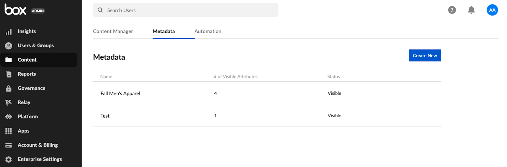
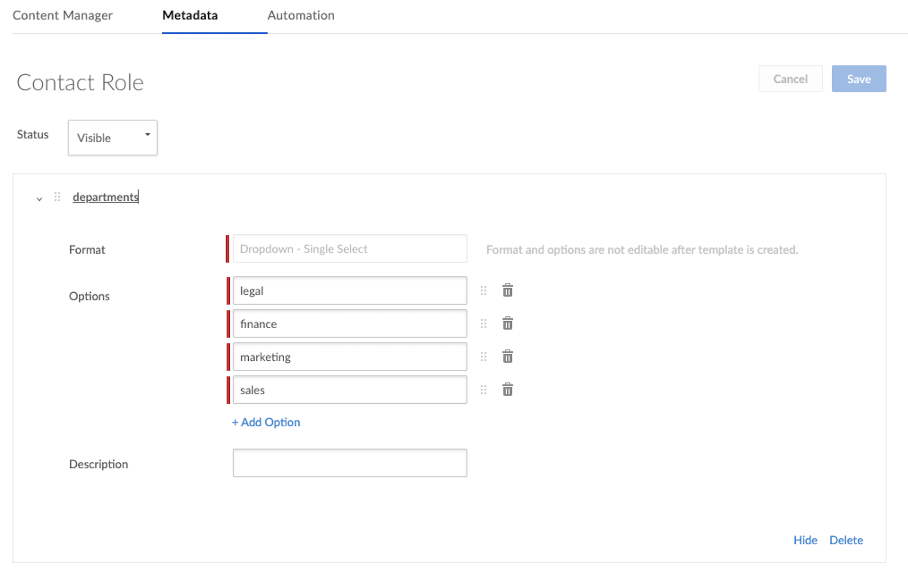
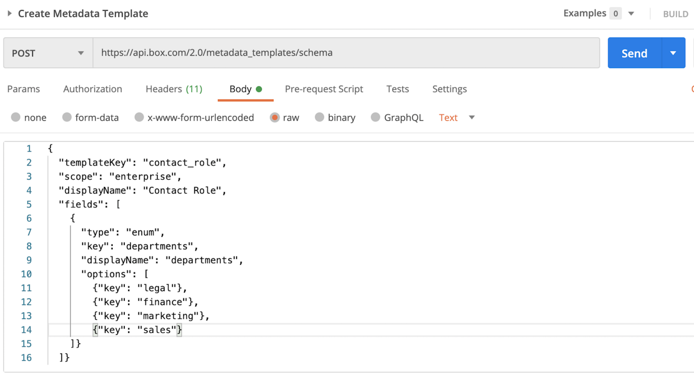

# Create a Metadata Template

There are two ways to create a new metadata template: via the Admin Console or
via the API using an Admin access token. 

## Admin Console

To create a template via the Admin Console, navigate to: 

**Admin Console** > **Content** Tab > **Metadata** > **Create New**

<ImageFrame center>
    
</ImageFrame>

<Message warning>
  The metadata feature is reserved for Business Plus accounts and above. To
  upgrade your account, please contact your Box account team. 
</Message>

Once you select **Create New**, you are brought to a form used to create a new
template, which is shown below. Select a Dropdown-Single Select format. 

<Message warning>
Selecting a Dropdown-Multi Select format will change the structure of you query
later on in this quick-start and is highly discouraged if you plan to search
more than a few thousand items.
</Message>

<ImageFrame center>
    
</ImageFrame>

## API

Creating a metadata template via the API requires an [Access Token][at]
associated with a Box Admin or Co-Admin with permission to 
**create and edit metadata templates for your company**. If you are not sure
who your token is associated with, make a quick API call to the 
[get current user endpoint][current-user]. The easiest way to obtain a token
meeting these requirements, is to log in as an Admin or Co-Admin, pull up the
application in the [Developer Console][dc], and click 
**Generate Developer Token** under the **Configuration** tab. 
[Developer tokens][dt] are always be associated with the user logged into the
Developer Console when the button is clicked.

Using [Postman][postman] and the [Box Postman Collection][post-collab], below is
an example of what an API call looks like to create the same metadata template
created above using the Admin Console. 

<ImageFrame center>
    
</ImageFrame>

<Message tip>
If you would like to use a different template format than a Dropdown-Single
Select, you will need to consult our reference documentation, as the API call
above differ from the example above.
</Message>

The response to this API call provides crucial information needed in the next
step. If you created your template via the UI, we will show how to obtain this
same information.

<Next>I created my metadata template</Next>

[at]: g://authentication/access-tokens/
[current-user]: e://get-users-me/
[dc]: https://account.box.com/developers/console
[dt]: g://authentication/access-tokens/developer-tokens/
[postman]: https://postman.com/
[post-collab]: g://tooling/postman/
