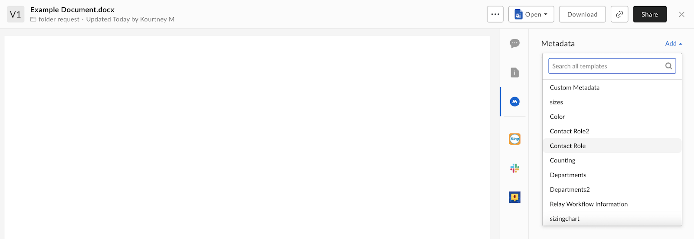
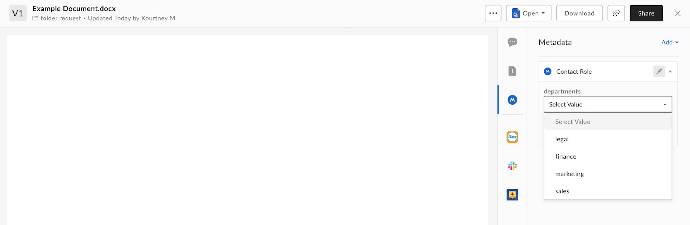

# Add Metadata Template to a File

In order to get at least one result when we search using metadata in step 4,
we need to ensure the metadata template is applied to at least one file. Again,
there are two ways to do this: via the UI or via the AP. 

## UI 

To apply metadata to a file using the UI, navigate to a file and open the
preview. Use the **Metadata** tab and click **Add**. Find the metadata template
created in step 1 and select a value. Ensure you click **Save**. 

<ImageFrame center>
    
    
</ImageFrame>

## API 

To add a metadata template to a file you will need to use the 
[create metadata instance on a file endpoint][add-metadata]. 

NEED DETAILS HERE

<Next>I applied my template to at least one file</Next>

[add-metadata]: e://post-files-id-metadata-id-id/