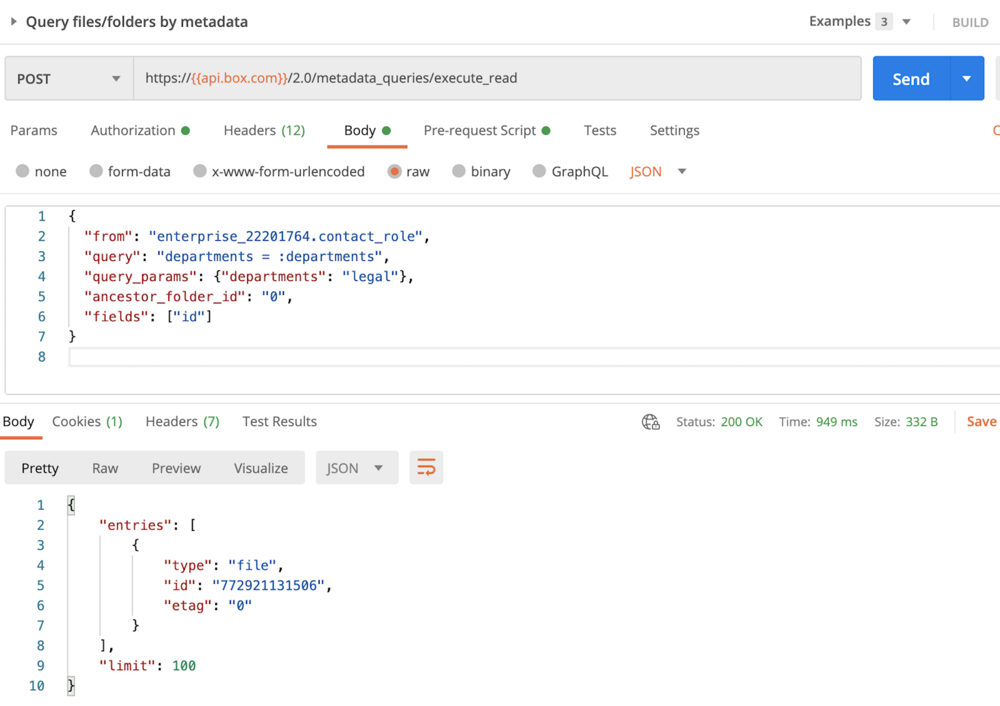

# Use the Metadata Query API

Finally, you need to build a [metadata search API call][mq] using some of the
information provided in the response of step 3. Here is an example of what the
body of the API call looks like:

```json
{
   "from": "enterprise_22201764.contact_role",
   "query": "departments = :departments",
   "query_params": {"departments": "legal"},
   "ancestor_folder_id": "0",
   "fields":["id"]
}
```

This API call will return any file ID that meets the following criteria: 

- Has the Contact Role template applied
- Has value of department is legal
- Is located anywhere under the root folder, since "0" is the
  `ancestor_folder_id`

As you can see below, this results in a successful call showing information
about the file we added the template to in step 2.

<ImageFrame center>
    
</ImageFrame>

<Next>I found my file(s) using a search query</Next>

[mq]: e://post-metadata-queries-execute-read/