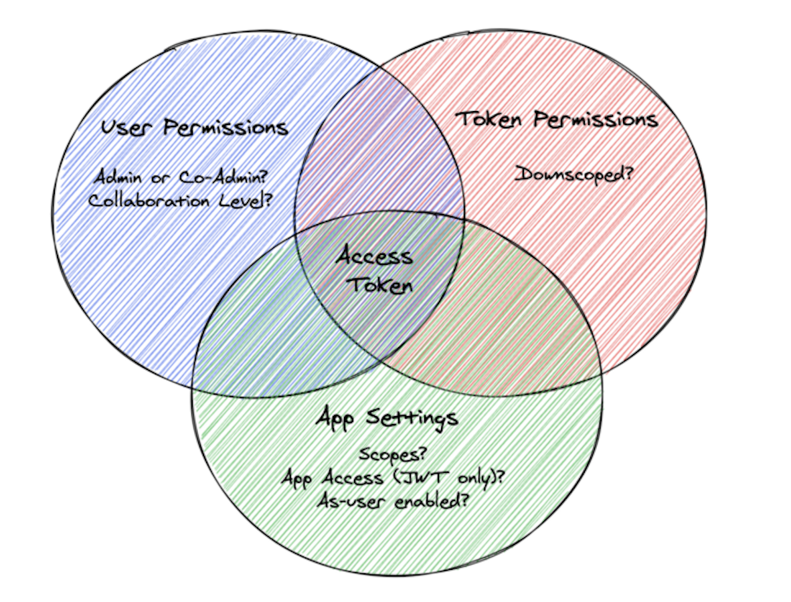
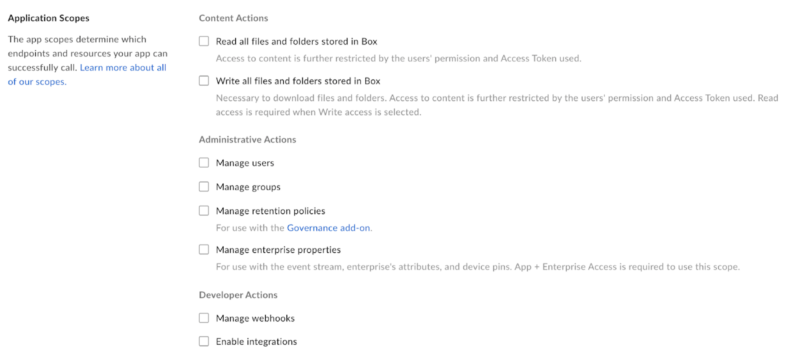
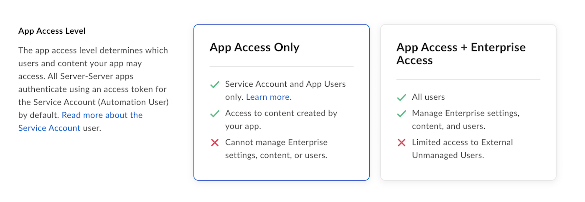
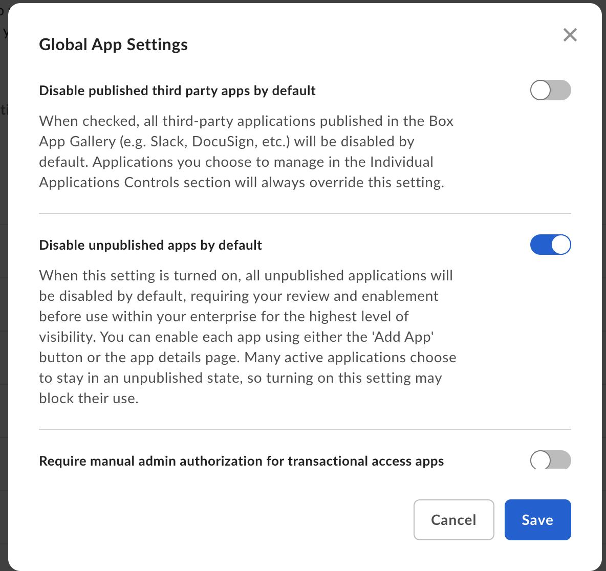
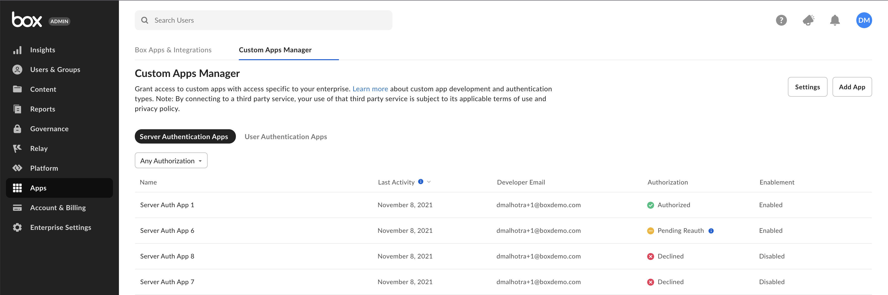

# Security

Whether your are a developer getting started with the Box API or a Box Admin
tasked with [authorizing][auth] applications, it is critical you understand the
security mechanisms in place to protect content stored in Box.

The Box API follows the same security principals and restrictions as the Box web
app. This means that you will not be able to bypass content [permissions][perm],
the [waterfall folder structure][waterfall], or Admin-only requirements by
leveraging the Box API.

## Access Tokens

At the core of every Box API call is an [Access Token][at]. Because a username
and password cannot be used, the Box servers need a way of validating user
identity. The full capability of an Access Token encompasses user permissions,
token permissions, and application settings.

<ImageFrame center shadow border>

</ImageFrame>

Access Tokens represent the authenticated user and determine what content a
user can successfully call. Similar to using the Box Web App, you will only be
able to successfully interact with content the user, associated with the Access
Token, either owns or is a collaborator on. This can be further restricted by
[downscoping][downscope] a token.

[Access Tokens][at] are only valid for 60 minutes, but can be [revoked][revoked]
earlier if needed. Once an Access Token expires, when using an OAuth 2.0
application, a [Refresh Token][rt] can be [exchanged][exchange] for another
Access Token. Refresh tokens are valid for 60 days or one use. Alternatively,
when using a server authentication application, the
[request Access Token endpoint][gettoken] must be called for a new Access Token.
For security reasons we do not allow long-lived access tokens.

<Message type='tip'>
  Unsure why you are receiving a 404 error? A great place to start is checking
  to see what user is associated with your Access Token by using the get
  current user endpoint.
</Message>

## Scopes

<ImageFrame center shadow border>

</ImageFrame>

[Scopes][scopes] are configured in the [Developer Console][dc] upon application
creation. They determine which of the 150+ endpoints Access Tokens of an
application can successfully call.

Because scopes work in conjunction with user permissions, granting the write
scope does not automatically provide a user with API access to all content in a
Box enterprise. Instead, it means that the authenticated user can receive
successful API responses when making write calls to content they have access to.

For example, take an application with only the manage users and manage groups
scopes enabled. If an Access Token of this application tried to make an API call
to get information about a folder, even if the associated user owned it, it
would receive a 403 error. This is because the read scope is required to
preform this action. Access Tokens of this application could only receive
successful responses on API calls related to users and groups.

## Restricted endpoints

There are some API endpoints that only Admins or Co-Admins, granted the
appropriate [permissions][coadminperm], can successfully use. As a general rule
of thumb, if only an Admin or Co-Admin can perform an action via the Box Admin
Console, an Access Token associated with one of these users is required to
complete an API call for the same action. This is called out in our API
[reference][reference] documentation for a given endpoint if it is required.

Some Admin-restricted endpoints include:

- Creating, deleting, or getting information about [users][users]
- Creating, deleting, or modifying [groups][groups]
- Viewing user or enterprise [events][events]

Other endpoints can only be used by an Admin user's Access Token if the
enterprise has purchased add-on products such as Box Governance or Box Shield.
Some of these endpoints include:

- Interacting with [security classifications][sc]
- Interacting with [legal hold policies][lh] and [assignments][lha]
- Interacting with [retention policies][retention] and [assignments][rassign]

## Application Access

<ImageFrame center shadow border>

</ImageFrame>

Application access is only configured in the [Developer Console][dc] for
applications leveraging Server Authentication with [JWT)][jwt] or
[Client Credentials Grant][ccg]. This setting determines the
[types of users][usertypes] that can be used with the application. The two
options are **app access only** or **app + enterprise access**.

Upon [authorizing][auth] one of these applications in the Box Admin Console, a
[Service Account][serviceaccount] (`AutomationUser_xxxx_@boxdevedition.com`)
representing the application is automatically generated. This account is an
Admin-like user that can only be accessed via the API and can then be used to
create user’s of the application called [App Users][appusers]. If an application
only needs to interact with the Service Account and App Users,
**app only access** must be selected. If an application needs to interact with
[managed users][mu] and their existing Box content, app + enterprise access must
be selected.

As an example, take a JWT application that has the read/write scopes,
app only access, and is properly [authorized][auth] in the Admin console. If a
managed user obtains an Access Token and makes an API call to a folder they own,
that call would receive a 400 error with the message “Cannot obtain token based
on the enterprise configuration for your app”. Even though the user has access
to the content, the correct scopes are enabled and the app is authorized,
the selected application access only allows the application to interact with the
Service Account and App Users.

## Enterprise settings and authorization

There are a few enterprise settings to be aware of when it comes to the Box API.

<ImageFrame center shadow border>

</ImageFrame>

Custom applications fall into two categories: published and unpublished.
Published applications are found in the [Box Integrations][appcenter]. Box
Admins decide whether published and unpublished application are enabled by
default and therefore can be used without approval. The status of these settings
determines what actions are necessary to successfully [authorize][auth] an
application for use.

<ImageFrame center shadow border>

</ImageFrame>

Regardless of the settings above, in order for an application leveraging
[JWT][jwt] or [Client Credentials Grant][ccg] to be used by an enterprise, an
Admin must explicitly [authorize][auth] it via the Box Admin console. The
authorization is a snapshot in time.  This means that if a developer revisits
the Developer Console and changes the configuration, the Admin must re-authorize
the application in order for generated Access Tokens to reflect the changes.

If the setting **Disable unpublished apps by default** is turned on, an Admin
must also explicitly [enable][auth] any application leveraging
[OAuth 2.0][oauth] as the authentication method.

Additionally, if this setting is turned on, Server Authenticated apps will also
require enablement.

<!-- i18n-enable localize-links -->
[perm]: https://support.box.com/hc/en-us/articles/360044196413-Understanding-Collaborator-Permission-Levels
[waterfall]: https://support.box.com/hc/en-us/articles/360043697254-Understanding-Folder-Permissions
<!-- i18n-disable localize-links -->
[downscope]: g://authentication/tokens/downscope
[at]: g://authentication/tokens
[revoked]: e://post-oauth2-revoke
[rt]: g://authentication/tokens/refresh
[gettoken]: e://post-oauth2-token
[exchange]: e://post-oauth2-token--refresh
<!-- i18n-enable localize-links -->
[coadminperm]: https://support.box.com/hc/en-us/articles/360044194393-Granting-And-Modifying-Co-Admin-Permissions
[reference]: page://reference
[dc]: https://app.box.com/developers/console
<!-- i18n-disable localize-links -->
[scopes]: g://api-calls/permissions-and-errors/scopes
[users]: e://resources/user
[groups]: e://resources/group
[events]: e://resources/event
[sc]: e://resources/classification
[lh]: e://resources/legal-hold-policy
[lha]: e://resources/legal-hold-policy-assignment
[retention]: e://resources/retention-policies
[rassign]: e://resources/retention-policy-assignment
[jwt]: g://authentication/jwt
[usertypes]: page://platform/user-types
[serviceaccount]: page://platform/user-types/#service-account
[appusers]: page://platform/user-types/#app-user
[mu]: page://platform/user-types/#managed-users
[auth]: g://authorization/custom-app-approval
[oauth]: g://authentication/oauth2
[jwt]: g://authentication/jwt
[ccg]: g://authentication/client-credentials
<!-- i18n-enable localize-links -->
[appcenter]: https://app.box.com/services
<!-- i18n-disable localize-links -->
[auth]: g://authorization