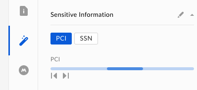

# Skills Cards Metadata 

Once a processing service has determined the metadata for the file, your
application can write that data back to the file stored on Box as metadata. 

This process involves the following steps.

1. Prepare the Skill Cards metadata
2. Write the metadata to the file

## Prepare Skill Cards metadata

The Skills metadata uses a globally available metadata template called
`boxSkillsCards`. This template follows a specific format for the JSON
structure that will be stored on the associated files.

Box currently supports 4 kinds of cards.

<!-- markdownlint-disable line-length -->

|                                         |                                                                                                                                 |                                        |
|-----------------------------------------|---------------------------------------------------------------------------------------------------------------------------------|----------------------------------------|
| [Keyword](r://keyword-skill-card)       | Displays a list of keywords next to the file.                                                                                   |     |
| [Timeline](r://timeline-skill-card)     | Displays a set of text/images, and when clicked shows when those images appear in a timeline.                                   |    |
| [Transcript](r://transcript-skill-card) | Displays a transcript with the corresponding timestamps.                                                                        |  |
| [Status](r://status-skill-card)         | Displays a status to the user, which can be used to inform the user of the status of the Skill while it is processing the file. |                                        |

<!-- markdownlint-enable line-length -->

## Write metadata cards to file

To write one or more cards to a file, you can use the [`POST
/files/:id/metadata/global/boxSkillsCards`](e://post_files_id_metadata_global_boxSkillsCards)
API and pass along a list of Box Skill `cards`.

<!-- markdownlint-enable line-length -->

<Tabs>
  <Tab title='cURL'> 

```curl
curl -X POST https://api.box.com/2.0/files/12345/metadata/global/boxSkillsCards \
     -H 'Authorization: Bearer <ACCESS_TOKEN>'
     -H 'Content-Type: application/json'
     -d '{
       "cards": [{
         "type": "skill_card",
         "skill_card_type": "keyword",
         "skill_card_title": {
           "code": "license-plates",
           "message": "Licence Plates"
         },
         "skill": {
           "type": "service"
           "id": "license-plates-service"
         },
         "invocation": {
           "type": "skill_invocation"
           "id": "license-plates-service-123"
         },
         "entries": {
           { "text": "DD-26-YT" },
           { "text": "DN86 BOX" }
         }
       }],
     }'
```

  </Tab>
  <Tab title='Node'>

```js
const metadata = { 
  cards: [{
    "type": "skill_card",
    "skill_card_type": "keyword",
    "skill_card_title": {
      "code": "license-plates",
      "message": "Licence Plates"
    },
    "skill": {
      "type": "service"
      "id": "license-plates-service"
    },
    "invocation": {
      "type": "skill_invocation"
      "id": "license-plates-service-123"
    },
    "entries": {
      { "text": "DD-26-YT" },
      { "text": "DN86 BOX" }
    }
  }] 
}

client.files.addMetadata('12345', 'global', 'boxSkillsCards', metadata)
  .then(metadata => { 
    // ...
  })
```

  </Tab>
  <Tab title='Python'>

```py
metadata = { 
  cards: [{
    "type": "skill_card",
    "skill_card_type": "keyword",
    "skill_card_title": {
      "code": "license-plates",
      "message": "Licence Plates"
    },
    "skill": {
      "type": "service"
      "id": "license-plates-service"
    },
    "invocation": {
      "type": "skill_invocation"
      "id": "license-plates-service-123"
    },
    "entries": {
      { "text": "DD-26-YT" },
      { "text": "DN86 BOX" }
    }
  }] 
}

client.file(file_id='12345').metadata(scope='global', template='boxSkillsCards').create(metadata)
```

  </Tab>
  <Tab title='Java'>

```java
BoxFile file = new BoxFile(api, "12345");
Metadata metadata = new Metadata()
file.createMetadata("global", "boxSkillsCards", metadata);
```

  </Tab>
  <Tab title='.NET'>

```cs
var metadataValues = new Dictionary<string, object>()
{ 
  cards: [{
    "type": "skill_card",
    "skill_card_type": "keyword",
    "skill_card_title": {
      "code": "license-plates",
      "message": "Licence Plates"
    },
    "skill": {
      "type": "service"
      "id": "license-plates-service"
    },
    "invocation": {
      "type": "skill_invocation"
      "id": "license-plates-service-123"
    },
    "entries": {
      { "text": "DD-26-YT" },
      { "text": "DN86 BOX" }
    }
  }] 
};
Dictionary<string, object> metadata = await client.MetadataManager
    .CreateFileMetadataAsync(fileId: "12345", metadataValues, "global", "boxSkillsCards");
```

  </Tab>
</Tabs>

<!-- markdownlint-enable line-length -->

<Message warning>
  If Box Skill cards have already been applied to this file, this API call will
  return an error with a HTTP status code of `409`.
</Message>

## Update metadata card on file

If Box Skill cards have already been applied to to a file then it can be updated
using the [`PUT
/files/:id/metadata/global/boxSkillsCards`][update_skills]  
API. This API accepts a number of operations (`op`) to perform, and each
operation can be used to replace a card at a position (`path`).

<!-- markdownlint-disable line-length -->

<Tabs>
  <Tab title='cURL'> 

```curl
curl -X PUT https://api.box.com/2.0/files/12345/metadata/global/boxSkillsCards \
     -H 'Authorization: Bearer <ACCESS_TOKEN>'
     -H 'Content-Type: application/json-patch+json'
     -d '[
       "op": "replace",
       "path": "/cards/0",
       "value": {
         "type": "skill_card",
         "skill_card_type": "keyword",
         "skill_card_title": {
           "code": "license-plates",
           "message": "Licence Plates"
         },
         "skill": {
           "type": "service"
           "id": "license-plates-service"
         },
         "invocation": {
           "type": "skill_invocation"
           "id": "license-plates-service-123"
         },
         "entries": {
           { "text": "DD-26-YT" },
           { "text": "DN86 BOX" }
         }
       }
     ]'
```

  </Tab>
  <Tab title='Node'>

```js
const updates = [
  { 
    'op': 'replace', 
    'path': '/cards/0',
    'value': {
      "type": "skill_card",
      "skill_card_type": "keyword",
      "skill_card_title": {
        "code": "license-plates",
        "message": "Licence Plates"
      },
      "skill": {
        "type": "service"
        "id": "license-plates-service"
      },
      "invocation": {
        "type": "skill_invocation"
        "id": "license-plates-service-123"
      },
      "entries": {
        { "text": "DD-26-YT" },
        { "text": "DN86 BOX" }
      }
    }
  }
]

client.files.updateMetadata('12345', 'global', 'boxSkillsCards', updates)
  .then(metadata => { 
    // ...
  })
```

  </Tab>
  <Tab title='Python'>

```py
file_metadata = client.file(file_id='12345').metadata(scope='global', template='boxSkillsCards')

card = {
  "type": "skill_card",
  "skill_card_type": "keyword",
  "skill_card_title": {
    "code": "license-plates",
    "message": "Licence Plates"
  },
  "skill": {
    "type": "service"
    "id": "license-plates-service"
  },
  "invocation": {
    "type": "skill_invocation"
    "id": "license-plates-service-123"
  },
  "entries": {
    { "text": "DD-26-YT" },
    { "text": "DN86 BOX" }
  }
}


updates = file_metadata.start_update()
updates.replace('/cards/0', card)
file_metadata.update(updates)
```

  </Tab>
  <Tab title='Java'>

```java
BoxFile file = new BoxFile(api, "12345");
Metadata metadata = new Metadata()
file.updateMetadata("global", "boxSkillsCards", metadata);
```

  </Tab>
  <Tab title='.NET'>

```cs
var card = new Dictionary<string, object>()
{
  "type": "skill_card",
  "skill_card_type": "keyword",
  "skill_card_title": {
    "code": "license-plates",
    "message": "Licence Plates"
  },
  "skill": {
    "type": "service"
    "id": "license-plates-service"
  },
  "invocation": {
    "type": "skill_invocation"
    "id": "license-plates-service-123"
  },
  "entries": {
    { "text": "DD-26-YT" },
    { "text": "DN86 BOX" }
  }
};
var updates = new List<BoxMetadataUpdate>()
{
    new BoxMetadataUpdate()
    {
        Op = MetadataUpdateOp.replace,
        Path = "/cards/0",
        Value = card
    }
};
Dictionary<string, object> updatedMetadata = await client.MetadataManager
    .UpdateFileMetadataAsync("12345", updates, "global", "boxSkillsCards");
```

  </Tab>
</Tabs>

<!-- markdownlint-enable line-length -->

[update_skills]: e://put_files_id_metadata_global_boxSkillsCards