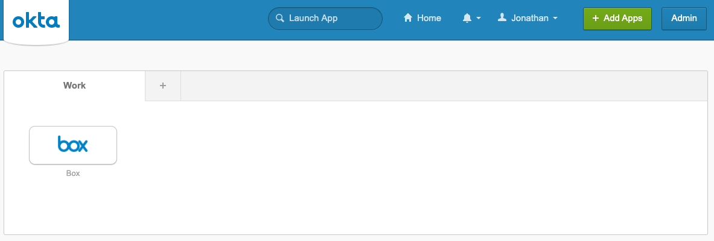
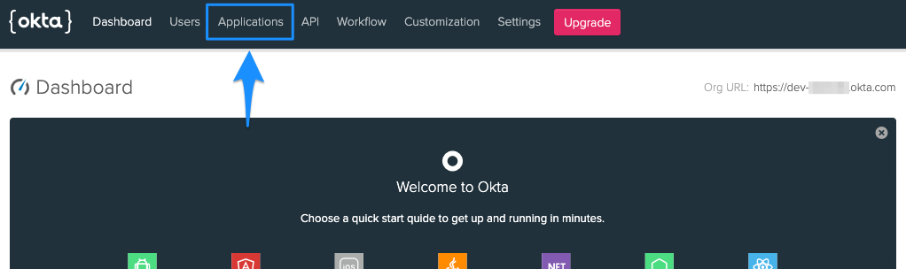
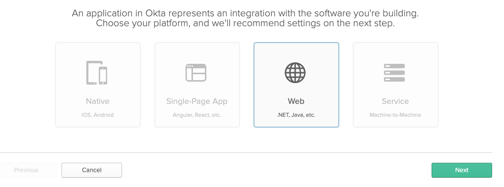
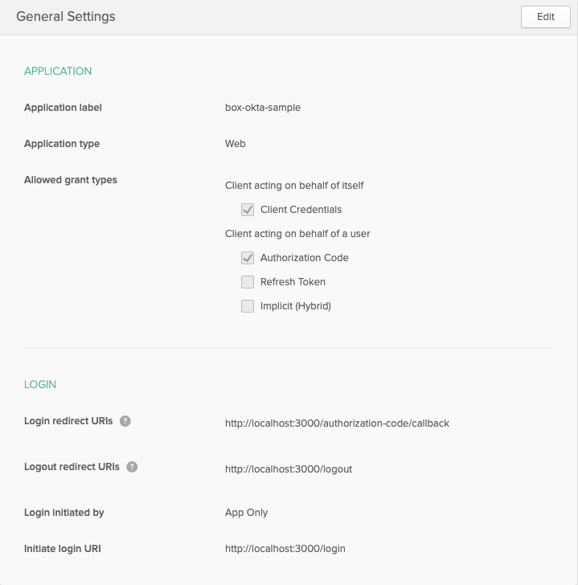
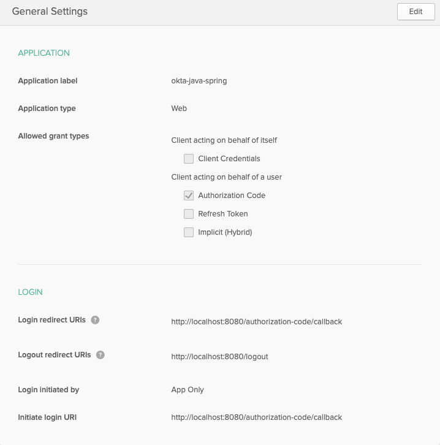
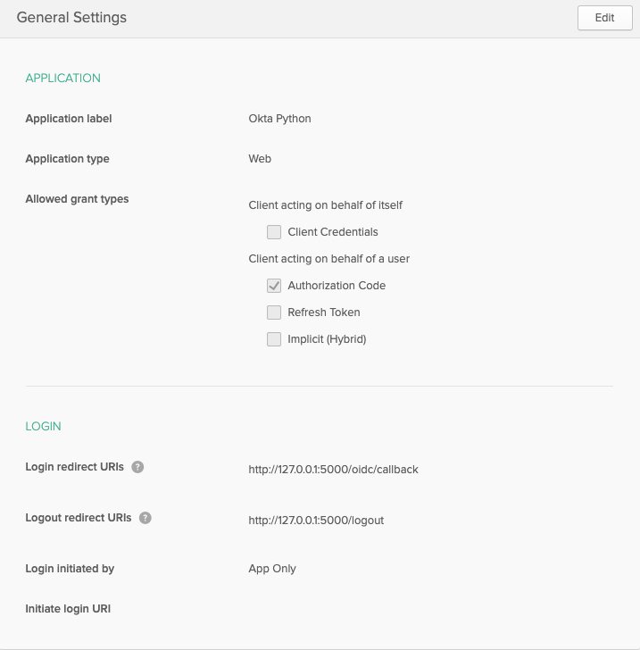
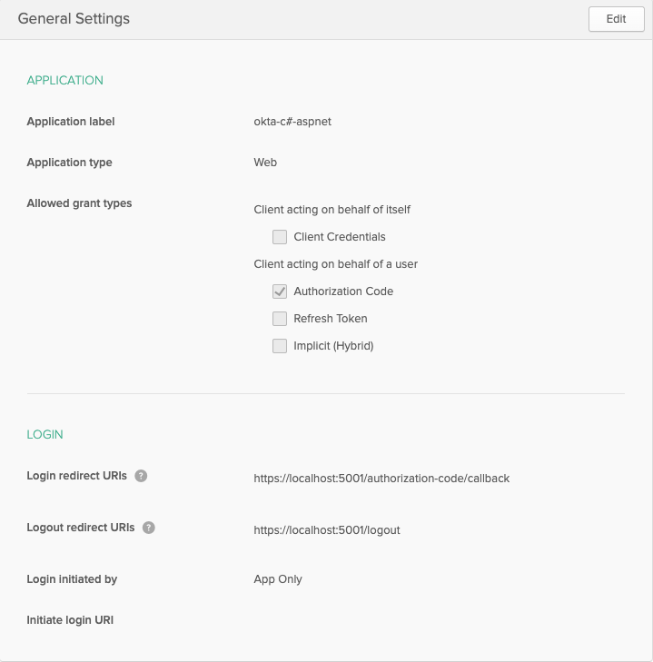
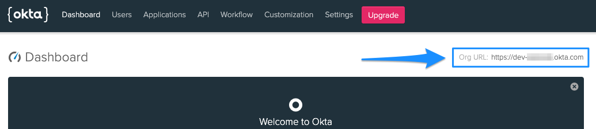

# Configure Okta

Our next step in the Okta / Box integration is to create and configure the Okta
application and users, then extract a few pieces of information that we will
need to connect to Okta in our application.

<ImageFrame noborder center shadow>
  
</ImageFrame>

For this tutorial we will be starting with a blank Okta application and user
dashboard to avoid any negative effects on existing installations that may be
in place, and to ensure that we have admin rights to the instance.

## Create an Okta Application

Starting from the [Okta developer site][okta-dev], sign up for a new developer
account, or log in under your personal account if you already have one.

If you're logging in with an existing account, you should see the Okta
dashboard. Click on the **Admin** button at the top right.

<ImageFrame noborder center shadow>
  
</ImageFrame>

If you've created a new developer account rather than logging into an existing
account, you will have already be redirected to the admin dashboard.

You should now see the admin panel. Click on the **Applications** option at the
top.

<ImageFrame noborder center shadow>
  
</ImageFrame>

On the application page, click the **Add Application** button. Select **Web**
as the application type and click the **Next** button.

<ImageFrame noborder center shadow>
  
</ImageFrame>

Okta employs both [OAuth 2][oauth2] and [OpenID Connect][openid-connect] (OIDC)
for application authorization and user authentication, respectively. The OpenID
Connect integration allows us to use baked in OIDC connectors within a number
of popular language frameworks to simplify application and user management by
handling the callback routes and providing methods for logging in,
logging out, and protecting routes into your application.

To simplify this first integration, we're going to use the default callback
routes and settings for the language and framework OIDC connector. Depending on
your preferred integration type, the configuration settings will slightly
change.

Fill out the application details with the following configuration settings:

<Choice option='programming.platform' value='node' color='none'>

* Name: Any
* Base URIs: `http://localhost:3000/`
* Login redirect URIs: `http://localhost:3000/authorization-code/callback`
* Logout redirect URIs: `http://localhost:3000/logout`
* Grant type allowed: Only **Authorization Code** selected

<ImageFrame noborder center shadow>
  
</ImageFrame>

</Choice>
<Choice option='programming.platform' value='java' color='none'>

* Name: Any
* Base URIs: `http://localhost:8080/`
* Login redirect URIs: `http://localhost:8080/authorization-code/callback`
* Logout redirect URIs: `http://localhost:8080/logout`
* Grant type allowed: Only **Authorization Code** selected

<ImageFrame noborder center shadow>
  
</ImageFrame>

</Choice>
<Choice option='programming.platform' value='python' color='none'>

* Name: Any
* Base URIs: `http://127.0.0.1:5000/`
* Login redirect URIs: `http://127.0.0.1:5000/oidc/callback`
* Logout redirect URIs: `http://127.0.0.1:5000/logout`
* Grant type allowed: Only **Authorization Code** selected

<ImageFrame noborder center shadow>
  
</ImageFrame>

</Choice>
<Choice option='programming.platform' value='cs' color='none'>

* Name: Any
* Base URIs: `https://localhost:5001/`
* Login redirect URIs: `https://localhost:5001/authorization-code/callback`
* Logout redirect URIs: `https://localhost:5001/logout`
* Grant type allowed: Only **Authorization Code** selected

<ImageFrame noborder center shadow>
  
</ImageFrame>
</Choice>

<Choice option='programming.platform' unset color='none'>
  <Message danger>
    # Incomplete previous step
    Please select a preferred language / framework in step 1 to get started.
  </Message>
</Choice>

Click the **Done** button to create the application and be dropped on to the
general settings of the application.

## Copy Application Credentials

Using the configuration files set up in the last step, we next have to add in
the Okta application org and app details within the files.

Most Okta application information can be found on the general settings page,
with the exception of the `Org URL` that is used in the configuration URIs to
reference back to your Okta organization. To obtain the `Org URL`, go to the
dashboard of your Okta admin console. The `Org URL` will be in the top right
corner of the screen.

Depending on the language and framework previously chosen, we'll set up the
appropriate configuration files.

<ImageFrame noborder center shadow>
  
</ImageFrame>

<Choice option='programming.platform' value='node' color='none'>
* Open `config.json` within the local application directory in your preferred editor.
* Update the following line items with the appropriate Okta configuration info:
    * `oktaClientId`: Obtained from the **Client Credentials** section of the application general settings.
    * `oktaClientSecret`: Obtained from the **Client Credentials** section of the application general settings.
    * `oktaOrgUrl`: Obtained from the top right of the main admin dashboard page.
* Save the file.

Your `config.json` file should look similar to the following.

```js
const oktaClientId = exports.oktaClientId = '0oa48567frkg5KW4x6';
const oktaClientSecret = exports.oktaClientSecret = 'cugDJy2ERfIQHDXv-j2134DfTTes-Sa3';
const oktaOrgUrl = exports.oktaOrgUrl = 'YOURDOMAIN.okta.com';
const oktaBaseUrl = exports.oktaBaseUrl = 'http://localhost:3000';
const oktaRedirect = exports.oktaRedirect = '/authorization-code/callback';
```

</Choice>
<Choice option='programming.platform' value='java' color='none'>
* Open the `/src/main/resources/application.properties` file and update the following lines:
    * `okta.oauth2.issuer`: Your Org URL, obtained from the top right of the main admin dashboard page, followed by `/oauth2/default`. For example, if your Org URL was `https://dev-123456.okta.com`, the issuer string should be `https://dev-123456.okta.com/oauth2/default`.
    * `okta.oauth2.clientId`: Obtained from the **Client Credentials** section of the application general settings.
    * `okta.oauth2.clientSecret`: Obtained from the **Client Credentials** section of the application general settings.
* Save the file

Your `/src/main/resources/application.properties` file should look similar to
the following.

```java
okta.oauth2.redirect-uri=/authorization-code/callback
okta.oauth2.issuer=https://YOURDOMAIN.okta.com/oauth2/default
okta.oauth2.clientId=0oa48567frkg5KW4x6
okta.oauth2.clientSecret=cugDJy2ERfIQHDXv-j2134DfTTes-Sa3
security.oauth2.sso.loginPath=/authorization-code/callback
```

</Choice>
<Choice option='programming.platform' value='python' color='none'>
In addition to the standard configuration information for the org and app, the
Python / Flask integration requires an additional auth token.

To create an auth token:

* Go to the **API** -> **Token** section of the Okta admin dashboard.
* Click the **Create Token** button.
* Enter a name for the token and click **Create**.
* Copy the token that is generated.

Next, update the local application configuration file.

* Open `config.py` within the local application directory in your preferred editor.
* Update the following line items with the appropriate Okta configuration info:
    * `okta_client_secret`: Obtained from the **Client Credentials** section of the application general settings.
    * `okta_org_url`: Obtained from the top right of the main admin dashboard page.
    * `okta_auth_token`: The token created above.
* Save the file.

Your `config.py` file should look similar to the following.

```python
okta_client_id = '0oa48567frkg5KW4x6'
okta_client_secret = 'cugDJy2ERfIQHDXv-j2134DfTTes-Sa3'
okta_org_url = 'http://YOURDOMAIN.okta.com'
okta_auth_token = '01KkTQTRfs1yKLr4Ojy26iqoIjK_4fHyq132Dr5T'
okta_callback_route = '/oidc/callback'
```

Lastly, update the Flask configuration file

* Open `client_secrets.json` within the local application directory in your preferred editor.
* Update the following line items with the appropriate Okta configuration info:
    * `client_id`: Obtained from the **Client Credentials** section of the application general settings.
    * `client_secret`: Obtained from the **Client Credentials** section of the application general settings.
    * `auth_uri`: Your Org URL, obtained from the top right of the main admin dashboard page, followed by `/oauth2/default/v1/authorize`. For example, if your Org URL was `https://dev-123456.okta.com`, the issuer string should be `https://dev-123456.okta.com/oauth2/default/v1/authorize`.
    * `token_uri`: Your Org URL, obtained from the top right of the main admin dashboard page, followed by `/oauth2/default/v1/token`. For example, if your Org URL was `https://dev-123456.okta.com`, the issuer string should be `https://dev-123456.okta.com/oauth2/default/v1/token`.
    * `issuer`: Your Org URL, obtained from the top right of the main admin dashboard page, followed by `/oauth2/default`. For example, if your Org URL was `https://dev-123456.okta.com`, the issuer string should be `https://dev-123456.okta.com/oauth2/default`.
    * `userinfo_uri`: Your Org URL, obtained from the top right of the main admin dashboard page, followed by `/oauth2/default/userinfo`. For example, if your Org URL was `https://dev-123456.okta.com`, the issuer string should be `https://dev-123456.okta.com/oauth2/default/userinfo`.
* Save the file.

Your `client_secrets.json` file should look similar to the following.

```json
{
  "web": {
    "client_id": "0oa48567frkg5KW4x6",
    "client_secret": "cugDJy2ERfIQHDXv-j2134DfTTes-Sa3",
    "auth_uri": "https://YOURDOMAIN.okta.com/oauth2/default/v1/authorize",
    "token_uri": "https://YOURDOMAIN.okta.com/oauth2/default/v1/token",
    "issuer": "https://YOURDOMAIN.okta.com/oauth2/default",
    "userinfo_uri": "https://YOURDOMAIN.okta.com/oauth2/default/userinfo",
    "redirect_uris": [
      "http://127.0.0.1:5000/oidc/callback"
    ]
  }
}
```

</Choice>

<Choice option='programming.platform' value='cs' color='none'>
* Open `Startup.cs` within the local application directory in your preferred editor.
* Update the following line items within the `ConfigureServices` method with the appropriate Okta configuration info:
    * `OktaDomain`: Obtained from the top right of the main admin dashboard page.
    * `ClientId`: Obtained from the **Client Credentials** section of the application general settings.
    * `ClientSecret`: Obtained from the **Client Credentials** section of the application general settings.
* Save the file.

Your `ConfigureServices` method should look similar to the following.

```csharp
services.AddControllersWithViews();
services.AddAuthentication(options =>
{
    options.DefaultAuthenticateScheme = CookieAuthenticationDefaults.AuthenticationScheme;
    options.DefaultSignInScheme = CookieAuthenticationDefaults.AuthenticationScheme;
    options.DefaultChallengeScheme = OktaDefaults.MvcAuthenticationScheme;
})
.AddCookie()
.AddOktaMvc(new OktaMvcOptions
{
    OktaDomain = "https://YOURDOMAIN.okta.com",
    ClientId = "0oa48567frkg5KW4x6",
    ClientSecret = "cugDJy2ERfIQHDXv-j2134DfTTes-Sa3"
});
```

</Choice>

<Choice option='programming.platform' unset color='none'>
  <Message danger>
    # Incomplete previous step
    Please select a preferred language / framework in step 1 to get started.
  </Message>
</Choice>

## Create a User

Our last step in the Okta setup is to create a test user that we will use to
log in to the application.

1. Go to the **Users** section of the Okta admin dashboard.
2. Click on the **Add Person** button.
3. Enter all appropriate user info. Under password, select **Set by admin** and input a password for the user. Also deselect the **User must change password on first login** option. You will use the username and password to log in. These settings will only be used for testing purposes and are not best practices for user creation and security.
4. Click the **Save** button to create the user.

## Summary

* You created an Okta application.
* You updated the Okta configuration information in the local application.
* You created a test Okta user.

<Observe option='programming.platform' value='node,java,python'>
  <Next>I've created my Okta app and set up user / local configuration</Next>
</Observe>

[okta-dev]: https://developer.okta.com/
[oauth2]: https://oauth.net/2/
[openid-connect]: https://openid.net/