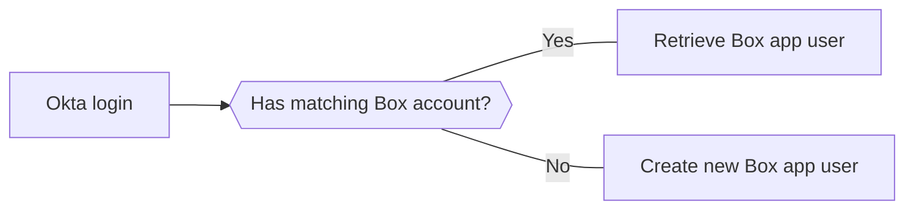

# Find or create Box app users

At this point we have application code that will handle traffic from users
visiting, forward them to Okta to login, provide Okta user information, before
finally handing off to a yet to be created handler for Box.



This section will cover the final Box components: 

* Validating if an Okta user has an associated Box app user account.
* Creating a new app user for the associated Okta record if they don't.
* Fetching tokens for the Box user to make user-specific API calls.

## Create New App Users

Before validating users we need a method for creating an associated Box user
account if one doesn't already exist for the Okta user.

<Choice option='programming.platform' value='node' color='none'>

In your local application directory, load the `server.js` file created in
step 1.

Add the following `box` object into the file and save. 

```js
  const box = (() => {
    const configJSON = JSON.parse(fs.readFileSync(path.resolve(__dirname, './config.json')));
    const sdk = boxSDK.getPreconfiguredInstance(configJSON);
    const client = sdk.getAppAuthClient('enterprise');

    let oktaRecord = {};
    let userId = '';
    let userClient;

    function validateUser(userInfo, res) {
      // TODO: VALIDATE USER
    }

    function createUser(res) {
      // TODO: CREATE USER
    }

    return {
      validateUser,
      createUser
    };
  })();
```

This object defines a number of items:

* Configuration: A new instance of the Box Node SDK is instantiated and made
 available to the object functions, along with a number of variables.
* `validateUser` function: Will house the code to validate whether a Box user
 exists for an associated Okta user.
* `createUser` function: Creates a new Box user bound to the associated Okta
 user ID.

With that structure defined, replace the `// TODO: CREATE USER` section with
the following code.

```js
  const spaceAmount = 1073741824;   // ~ 1gb

  client.enterprise.addAppUser(
    this.oktaRecord.name, 
    {
      space_amount: spaceAmount,
      external_app_user_id: this.oktaRecord.sub
    }
  ).then(appUser => {
    res.send(`New user created: ${appUser.name}`);
  });
```

This code will create a new Box app user and will set the
`external_app_user_id` parameter of the user object to the unique Okta user ID,
which will define the binding between the two user records.

</Choice>
<Choice option='programming.platform' value='java' color='none'>

In your local application directory, load the
`/src/main/java/com/box/sample/Application.java` file created in step 1, or
similar directory if an alternate application name was used.

Within the `public class Application` definition, add the following methods:

```java
  static String validateUser(OidcUser user) throws IOException {
    // TODO: VALIDATE USER
  }

  static String createUser(OidcUser user) {
    // TODO: CREATE USER
  }
```

These methods will handle the Box user validation and creation. Breaking them
down: 

* `validateUser`: Will house the code to validate whether a Box user
 exists for an associated Okta user.
* `createUser`: Creates a new Box user bound to the associated Okta
 user ID.

With those methods defined, replace `# TODO: CREATE USER` with the following
code:

```java
  String oktaName = (String) user.getAttributes().get("name");
  Object oktaSub = user.getAttributes().get("sub");

  CreateUserParams params = new CreateUserParams();
  params.setExternalAppUserId((String) oktaSub);
  BoxUser.Info createdUserInfo = BoxUser.createAppUser(api, oktaName, params);

  return "New User Created: " + createdUserInfo.getName();
```

This code will create a new Box app user and will set the
`external_app_user_id` parameter of the user object to the unique Okta user ID,
which will define the binding between the two user records.

</Choice>
<Choice option='programming.platform' value='python' color='none'>

In your local application directory, load the `server.py` file created in step
1.

Add the following `Box` class object to the existing code, below the route
definitions.

```python
  # Box user class
  class Box(object):
    def __init__(self):
      # Instantiate Box Client instance
      auth = JWTAuth.from_settings_file('../config.json')
      self.box_client = Client(auth)

    # Validate if Box user exists
    def validateUser(self, g):
      # TODO: VALIDATE USER

    # Create new Box user
    def createUser(self, ouser):
     # TODO: CREATE USER
```

This class defines:

* `init`: When initialized, a new instance of the Box Python SDK is
 instantiated and made available to the object methods.
* `validateUser` method: Accepting a user object as input, this will house the
 code to validate whether a Box user exists for an associated Okta user.
* `createUser` method: Accepting a user object as input, this creates a new Box
 user bound to the associated Okta user ID.

With that class defined, replace the `# TODO: CREATE USER` section with
the following code.

```python
  user_name = f'{ouser.profile.firstName} {ouser.profile.lastName}'
  uid = ouser.id
  space = 1073741824

  user = self.box_client.create_user(user_name, None, space_amount=space, external_app_user_id=uid)
  return f'New user created: {user_name}'
```

This code will create a new Box app user and will set the
`external_app_user_id` parameter of the user object to the unique Okta user ID,
which will define the binding between the two user records.

</Choice>
<Choice option='programming.platform' value='cs' color='none'>
Within the `Controllers` > `AccountController.cs` file, inside the associated
`AccountController` class, add the following method.

<!-- markdownlint-disable line-length -->
```dotnet
static async Task validateUser(string name, string sub)
{
  // Configure Box SDK instance
  var reader = new StreamReader("config.json");
  var json = reader.ReadToEnd();
  var config = BoxConfig.CreateFromJsonString(json);
  var sdk = new BoxJWTAuth(config);
  var token = sdk.AdminToken();
  BoxClient client = sdk.AdminClient(token);

  // Search for matching Box app user for Okta ID
  BoxCollection<BoxUser> users = await client.UsersManager.GetEnterpriseUsersAsync(externalAppUserId:sub);
  System.Diagnostics.Debug.WriteLine(users.TotalCount);

  if (users.TotalCount > 0)
  {
     // TODO: VALIDATE USER
  }
  else
  {
    // TODO: CREATE USER
  }
}
```
<!-- markdownlint-enable line-length -->

Within the code block a new Box .NET SDK client is created using the
`config.json` file downloaded in step 2. In the case of this code sample, that
`config.json` file is stored at the root of the local application directory.

That client is then used to search all users in the Box enterprise, passing in
the Okta `sub` unique ID as the `externalAppUserId` search parameter. The
number of users returned is then checked to see if a valid user was found.

With that structure defined, replace the // TODO: CREATE USER section with the
following code.

```dotnet
var userRequest = new BoxUserRequest()
{
  Name = name,
  ExternalAppUserId = sub,
  IsPlatformAccessOnly = true
};
var user = await client.UsersManager.CreateEnterpriseUserAsync(userRequest);
System.Diagnostics.Debug.WriteLine("New user created: " + user.Name);
```

This code will create a new Box app user and will set the
`external_app_user_id` parameter of the user object to the unique Okta user ID,
which will define the binding between the two user records.

A diagnostic message is then written back stating that the new user was created.

</Choice>
<Choice option='programming.platform' unset color='none'>
  <Message danger>
    # Incomplete previous step
    Please select a preferred language / framework in step 1 to get started.
  </Message>
</Choice>

## Validate Okta Users

With the create user functionality defined, let's turn our attention to
defining the code for validating whether an Okta user record has an associated
Box user record by searching all Box enterprise users for the associated
`external_app_user_id`.

<Choice option='programming.platform' value='node' color='none'>

Replace the `// TODO: VALIDATE USER` comment with the following:

```js
  this.oktaRecord = userInfo

  client.enterprise.getUsers({ "external_app_user_id": this.oktaRecord.sub })
  .then((result) => {
    if (result.total_count > 0) {
      // TODO: MAKE AUTHENTICATED USER CALL
    } else {
      // User not found - create user
      this.createUser();
    }
  });
```

Using the Box Node SDK, we call `enterprise.getUsers` to search all enterprise
users, and pass in the unique Okta user ID as the `external_app_user_id` value
to search specifically for that user.

If found (number of records is greater than 0) we can make an
authenticated call to the Box APIs using that user record, which will be
defined in the next section. 

If not found, we call the `createUser` function we defined in the last section
to create a new Box user with that `external_app_user_id` association.

</Choice>
<Choice option='programming.platform' value='java' color='none'>

Replace the `// TODO: VALIDATE USER` comment with the following:

```java
  // Set up Box enterprise client
  Reader reader = new FileReader("config.json");
  BoxConfig config = BoxConfig.readFrom(reader);
  api = BoxDeveloperEditionAPIConnection.getAppEnterpriseConnection(config);

  // Get Okta user sub for unique ID attachment to Box user
  Object oktaSub = user.getAttributes().get("sub");

  // Check enterprise users for matching external_app_user_id against Okta sub
  URL url = new URL("https://api.box.com/2.0/users?external_app_user_id=" + oktaSub);
  BoxAPIRequest request = new BoxAPIRequest(api, url, "GET");
  BoxJSONResponse jsonResponse = (BoxJSONResponse) request.send();
  JsonObject jsonObj = jsonResponse.getJsonObject();
  JsonValue totalCount = jsonObj.get("total_count");

  // Set return string
  String outputString = "";

  if (totalCount.asInt() > 0) {
    // TODO: MAKE AUTHENTICATED USER CALL
  } else {
    outputString = createUser(user);
  }

  return outputString;
```

Using the Box Java SDK generic request method, we make a call directly to the
`https://api.box.com/2.0/users` endpoint to search enterprise users, passing in
the unique Okta user ID as the `external_app_user_id` value to search
specifically for that user.

If found (number of records is greater than 0) we can make an
authenticated call to the Box APIs using that user record, which will be
defined in the next section. 

If not found, we call the `createUser` function we defined in the last section
to create a new Box user with that `external_app_user_id` association.

</Choice>
<Choice option='programming.platform' value='python' color='none'>

Replace the `# TODO: VALIDATE USER` comment with the following:

```python
  # Fetch Okta user ID
  uid = g.user.id

  # Validate is user exists
  url = f'https://api.box.com/2.0/users?external_app_user_id={uid}'
  response = self.box_client.make_request('GET', url)
  user_info = response.json()

  # If user not found, create user, otherwise fetch user token
  if (user_info['total_count'] == 0):
    self.createUser(g.user)
  else:
    # TODO: MAKE AUTHENTICATED USER CALL
```

Using the Box Python SDK generic request method, we make a call directly to the
`https://api.box.com/2.0/users` endpoint to search enterprise users, passing in
the unique Okta user ID as the `external_app_user_id` value to search
specifically for that user.

If found (number of records is greater than 0) we can make an
authenticated call to the Box APIs using that user record, which will be
defined in the next section. 

If not found, we call the `createUser` function we defined in the last section
to create a new Box user with that `external_app_user_id` association.

</Choice>
<Choice option='programming.platform' value='cs' color='none'>

Replace the `// TODO: VALIDATE USER` comment with the following:

```dotnet
  var userId = users.Entries[0].Id;
  var userToken = sdk.UserToken(userId);
  BoxClient userClient = sdk.UserClient(userToken, userId);

  // TODO: MAKE AUTHENTICATED USER CALL
```

If a valid user is found, the Box ID is extracted and used to generate a Box
SDK client that is scoped specifically for that user, rather than the
application.

</Choice>
<Choice option='programming.platform' unset color='none'>
  <Message danger>
    # Incomplete previous step
    Please select a preferred language / framework in step 1 to get started.
  </Message>
</Choice>

## Make Authenticated Box User Calls

Once an associated Box user is found for the Okta user we're going to generate
an access token specifically
[scoped for that user](g://authentication/jwt/user-access-tokens/) to make Box
API calls, then make a call to get the current user to ensure that everything
is working and that we have a valid user access token.

<Choice option='programming.platform' value='node' color='none'>

Replace `// TODO: MAKE AUTHENTICATED USER CALL` from the previous section with
the following:

```js
  this.userId = result.entries[0].id;
  this.userClient = sdk.getAppAuthClient('user', this.userId);

  this.userClient.users.get(this.userClient.CURRENT_USER_ID)
  .then(currentUser => {
    res.send(`Hello ${currentUser.name}`);
  });
```

With a user found we capture the Box user ID, then generate a user client
object scoped for that user. We finish by making a call to fetch the current
user with the user client object, which should return the user profile
information for the Okta associated Box app user.

</Choice>
<Choice option='programming.platform' value='java' color='none'>
<!-- markdownlint-disable line-length -->

Replace `// TODO: MAKE AUTHENTICATED USER CALL` from the previous section with
the following:

```java
  // User found, authenticate as user
  // Fetch user ID
  JsonArray entries = (JsonArray) jsonObj.get("entries");
  JsonObject userRecord = (JsonObject) entries.get(0);
  JsonValue userId = userRecord.get("id");

  // Get user scoped access token and fetch current user with it
  BoxDeveloperEditionAPIConnection userApi = BoxDeveloperEditionAPIConnection.getAppUserConnection(userId.asString(), config);
  BoxUser currentUser = BoxUser.getCurrentUser(userApi);
  BoxUser.Info currentUserInfo = currentUser.getInfo();

  outputString = "Hello " + currentUserInfo.getName();
```

With a user found we capture the Box user ID, then generate a user client
object scoped for that user. We finish by making a call to fetch the current
user with the user client object, which should return the user profile
information for the Okta associated Box app user.

<!-- markdownlint-enable line-length -->
</Choice>
<Choice option='programming.platform' value='python' color='none'>

Replace `# TODO: MAKE AUTHENTICATED USER CALL` from the previous section with
the following:

```python
  # Create user client based on discovered user
  user = user_info['entries'][0]
  user_to_impersonate = self.box_client.user(user_id=user['id'])
  user_client = self.box_client.as_user(user_to_impersonate)

  # Get current user
  current_user = user_client.user().get()
  return f'Hello {current_user.name}'
```

With a user found we capture the Box user ID, then generate a user client
object scoped for that user. We finish by making a call to fetch the current
user with the user client object, which should return the user profile
information for the Okta associated Box app user.

</Choice>
<Choice option='programming.platform' value='cs' color='none'>
Replace `// TODO: MAKE AUTHENTICATED USER CALL` from the previous section with
the following:

<!-- markdownlint-disable line-length -->
```dotnet
  BoxUser currentUser = await userClient.UsersManager.GetCurrentUserInformationAsync();
  System.Diagnostics.Debug.WriteLine("Current user name: " + currentUser.Name);
```

  Using that user scoped client, the current user record is then extracted from
  Box, and a diagnostic message is written back stating the current user name.
</Choice>

<Choice option='programming.platform' unset color='none'>
  <Message danger>
    # Incomplete previous step
    Please select a preferred language / framework in step 1 to get started.
  </Message>
</Choice>

## Summary

* You've validated whether an Okta user exists as a Box user.
* You've creating a new app user if they don't exist.
* You're making a Box API call for an existing Box user.

<Observe option='box.app_type' value='use_own,create_new_'>
  <Next>I have set up Box user validation and creation</Next>
</Observe>