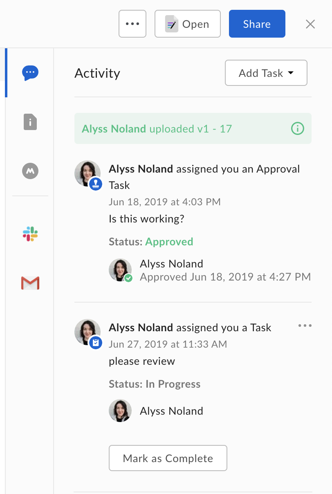

# Tasks

Users can create tasks on files and assign them to collaborators on Box. Tasks
can be used by developers to create file-centric workflows. Learn more about
tasks from [Adding Comments and Tasks][community] on our Support site.

<ImageFrame border>
  
</ImageFrame>

<Message>
    Box currently supports two types of tasks: approval and general. All tasks
    can be assigned to more than one person and every task has a completion
    rule that either requires all assignees to complete it or any single
    assignee.

    A *general* task starts out in an incomplete state and can be marked
    incomplete or completed. Once a general task is marked completed, no
    further changes can be made to the task's state.

    An *approval* task starts out in an incomplete state and can be marked as
    incomplete, approved, or rejected.
</Message>

[community]: https://community.box.com/t5/Sharing-Content-with-Box/Adding-Comments-and-Tasks/ta-p/19815
