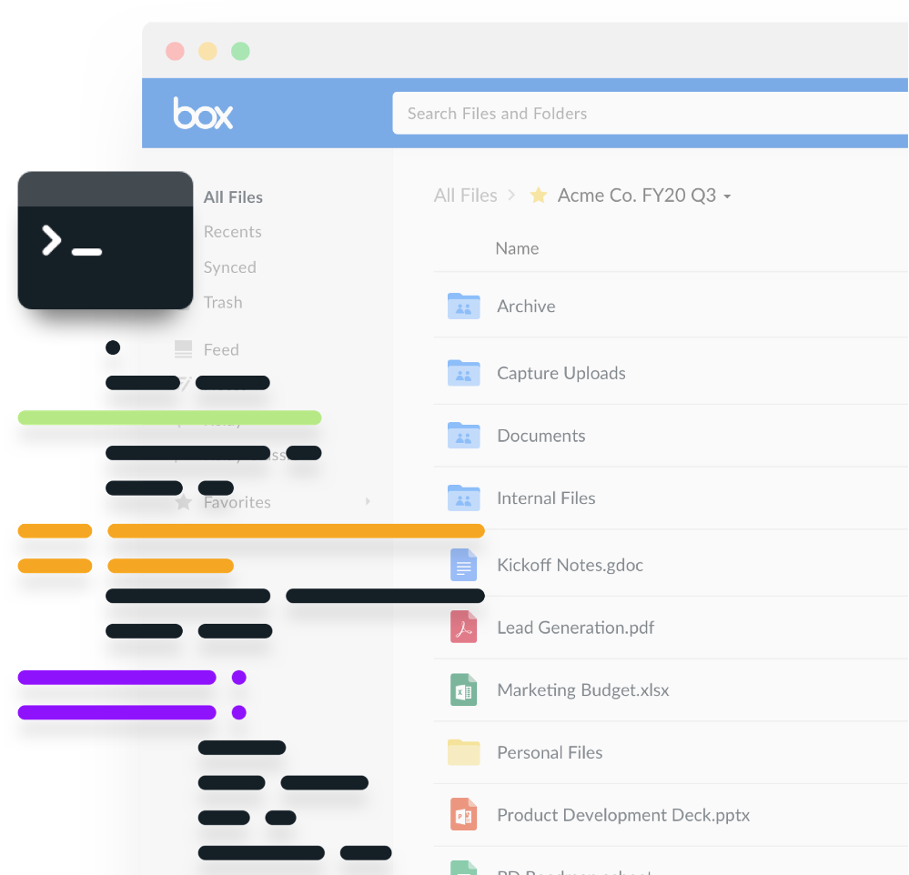

# Learn to use the Box CLI

<!--alex ignore executed-->

The Box CLI is a user-friendly command line tool which allows both technical and
non-technical users to leverage the Box API to perform routine or bulk actions.
There is no need to write any code, as these actions are executed through a set
of [commands][commands].

<ImageFrame center>
  
</ImageFrame>

## Overview

This guide will take you through the following steps.

1. [Create, configure, and authorize][one] a Box application
2. [Install and configure][two] the CLI
3. [Run commands][three] with the CLI
4. Use [options and bulk commands][four]
5. [Next steps][five]

<Next>
  I am ready to get started
</Next>

[commands]: https://github.com/box/boxcli#command-topics
[one]: g://tooling/cli/quick-start/create-jwt-app/
[two]: g://tooling/cli/quick-start/install-and-configure/
[three]: g://tooling/cli/quick-start/build-commands-help/
[four]: g://tooling/cli/quick-start/options-and-bulk-commands/
[five]: g://tooling/cli/quick-start/next-steps/
