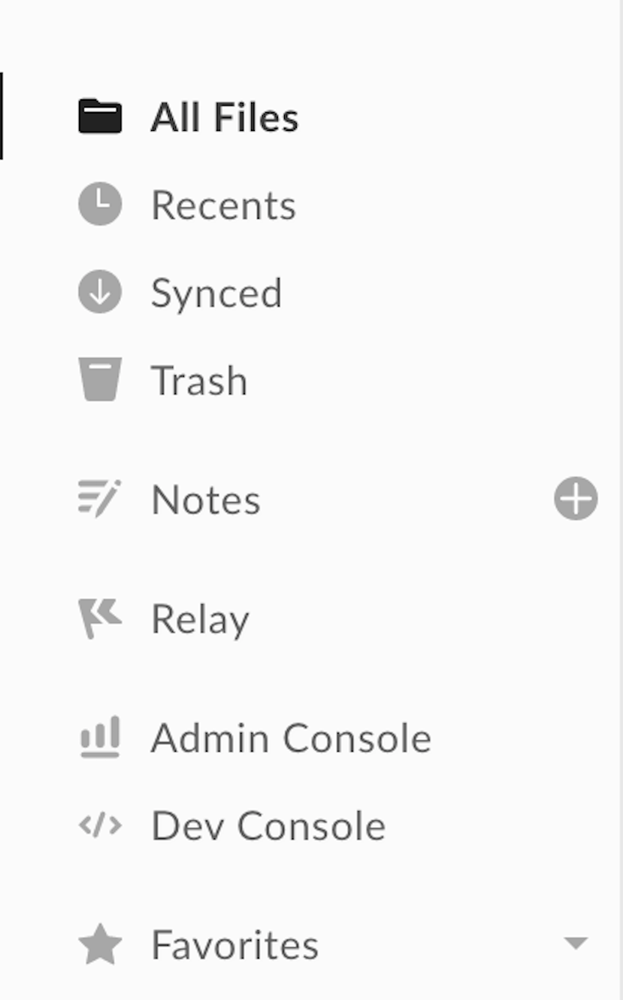

# Create a JWT application

The first step to using the CLI is creating an application in the
[Developer Console][dc], which the CLI can use behind the scenes to make API 
calls. If you would like to associate your CLI with an existing JWT application
you can skip this step. 

<Message warning>
  Server Authentication (with JWT) is the only authentication method currently
  supported by the Box CLI and requires Admin authorization before use. 
</Message>

## Setup a new application

1. Open the Developer Console. If this is your first time using the Box API and
   this option is not already available via the left-hand navigation panel on
   your All Files page, you can add it to your account by clicking [here][dc].
   <ImageFrame center>
   
   </ImageFrame>

2. Click **Create New App** > **Custom App** > **Server Authentication
   (with JWT)** > **Create App**

This will bring you to the application’s configuration page where you need to
choose its access and permissions. Again, keep in mind that because of the
application’s authentication type, it will require Admin approval. 

## Summary

* You created a new JWT application to associate with the CLI

<Next>I created a new JWT application</Next>

[dc]: https://app.box.com/developers/console