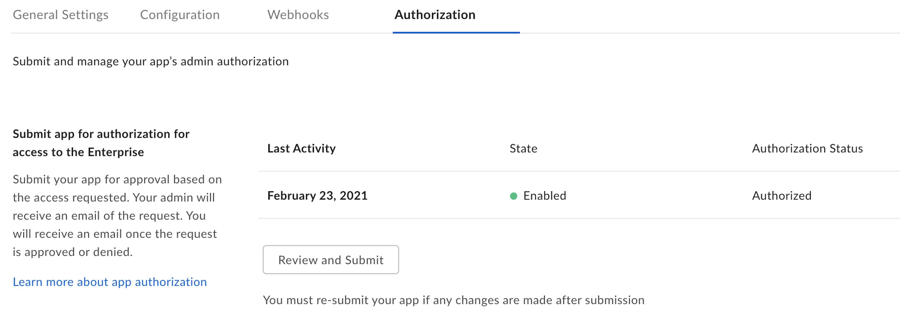

# Create, Configure and Authorize a Box Application

The first step to using the CLI is creating a Box application in the
[Developer Console][dc], which the CLI can use behind the scenes to make API
calls. If you would like to associate your CLI with an existing JWT application
you can skip this step. However, you will want to ensure that, at a minimum, the
following scopes are set in the **Configuration** tab of your application:

- Read all files and folders stored in Box
- Write all files and folders stored in Box

## Setup a JWT application

1. From the left-hand navigation panel on your All Files page, open the
   [Developer Console][dc]. If this is your first time using the Box
   API and this option is not already available, you can add it to your account
   by clicking [here][dc].

2. Click **Create New App** > **Custom App** > **Server Authentication
   (with JWT)** > name the application > **Create App**

<Message warning>
  Server Authentication (with JWT) is the only authentication method currently
  supported by the Box CLI and always requires Admin authorization before use. 
</Message>

## Configure the application

This will bring you to the application’s configuration page where you need to
choose its access and permissions. Again, keep in mind that because of the
application’s authentication type, it will require Admin approval.

At a minimum, you will need the following [scopes][scopes]:

- Read all files and folders stored in Box
- Write all files and folders stored in Box

You can choose either App Access Only or App + Enterprise Access as the
[application access][aa].

<Message warning>
  If at any time you make configuration changes to this application, you will
  need to clear the token cache in the CLI to reflect these changes. Failing to
  do so may result in unexpected errors, such as a 403. 
</Message>

## Authorize the application

All applications leveraging Server Authentication must be authorized in the
Admin Console before making successful API calls. This is because all JWT
applications have a [Service Account][sa], which, based on the applications
[scopes][scopes], may be able to perform Admin actions.

Steps for developers and Admins can be found in our [authorization guide][ag].

If you would like more information on how scopes, application access, tokens,
and permissions work together, please see our article on understanding
[Box's security mechanisms][blogpost].

<Message warning>
   If configuration changes are made to this application, it will need to be 
   reauthorized in order for the changes to take effect.
</Message>

You will know when an application is ready for use by visiting its Authorization
tab in the [Developer Console][dc]. The state and status must be enabled and
authorized.

<ImageFrame center>
    
</ImageFrame>

## Download Required Data

The CLI needs a configuration file stored locally in order to make API calls.

To download the configuration file, visit the **Configuration** tab in the 
[Developer Console][dc]. Click **Generate a Public/Private Keypair**, which will
send you through 2FA verification before automatically downloading the
configuration file for your application. For more information see
our [guide][keypair]. 

<Message warning>
   For security reasons 2FA must be enabled on your Box account to successfully
   generate a public/private keypair.
</Message>

Locate the downloaded file on your machine which has a default name in the
format: `EnterpriseID_publicKeyID_config.json`. You may leave this name or
choose to rename it. This guide assumes the file is renamed to `config.json`. 

<Message warning>
   It is critical you place the file in a location where it will not be
   inadvertently deleted or moved. If this occurs you will need to repeat the
   step 2 to reconfigure the CLI. 
</Message>

## Summary

- You created a new or have an existing JWT application to associate with the
  CLI, which is authorized.
- You downloaded your application's configuration file and moved it to a safe
  location on your machine.

<Next>My app is authorized and I downloaded my configuration file</Next>

[dc]: https://account.box.com/developers/console
[keypair]: g://applications/custom-apps/jwt-setup/#public-and-private-key-pair
[sa]: g://authentication/user-types/service-account/
[scopes]: g://api-calls/permissions-and-errors/scopes/
[ag]: g://applications/custom-apps/app-approval/
[blogpost]: https://medium.com/box-developer-blog/box-api-understanding-security-9fcad7b1d72e
[scopes]: g://api-calls/permissions-and-errors/scopes/
[aa]: g://applications/custom-apps/jwt-setup/#application-access
