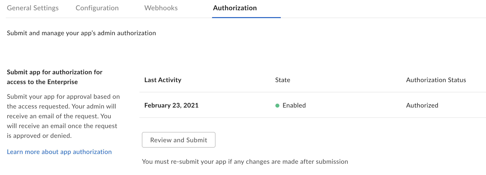

# App authorization

All applications leveraging Server Authentication must be authorized in the
Admin Console before making successful API calls. This is because all JWT
applications have a [Service Account][sa], which, based on the applications
[scopes][scopes], may be able to perform Admin actions.

Steps for developers and Admins can be found in our [authorization guide][ag].

You will know when an application is ready for use by visiting its Authorization
tab in the [Developer Console][dc]. The state and status must be enabled and
authorized. 

<ImageFrame center>
    
</ImageFrame>

<Next>My app is authorized</Next>

[sa]: g://authentication/user-types/service-account/
[scopes]: g://api-calls/permissions-and-errors/scopes/
[ag]: g://applications/custom-apps/app-approval/
[dc]: https://app.box.com/developers/console