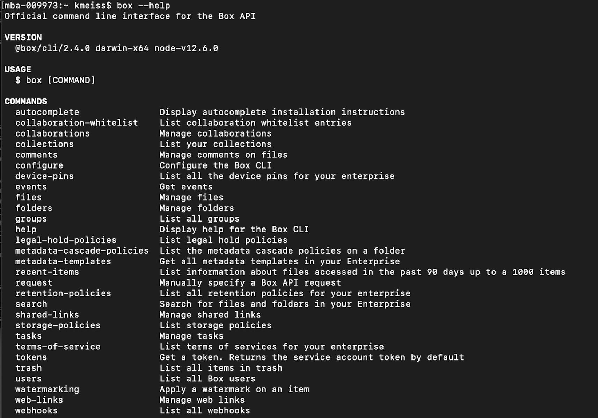

# Building Commands and Help Feature

A full list of CLI commands can be found in the [GitHub repository][github].

If you do not see a command for an endpoint you need, you can build a 
[custom request][custom].

<Message type=tip>
   Use in conjunction with reference documentation to see information the 
   help command won't provide. This includes restrictions, token permission
   requirements, fields, etc. 
</Message> 

## Creating a folder with help

Every command will always begin with `box`. Add `--help` to any command for help
building it. For example, executing `box --help` will bring you to a list of all
possible object commands.

<ImageFrame center>
  
</ImageFrame>

<!--alex ignore execute-->
Then, for example, use the folder object and execute the command
`box folders --help`. This provides a list of all eligible actions for this
object.

<ImageFrame center>
  
</ImageFrame>

Discover the required arguments for creating a folder with 
`box folders:create --help`

<ImageFrame center>
  
</ImageFrame>

<!--alex ignore execute-->
Execute `box folders:create 0 "My CLI Folder” ` and note the folder ID in the
response. 

<Message type=tip>
   The root level, All Files page, is always represented by folder ID 0.
</Message> 

Log into your Box account. Can you see this folder? Why not? 

<!--alex ignore execute-->
Now execute the command: `box folders:collaborations:add folder_id_created_above --role=editor --user-id=YOUR_USER_ID` 

Return to your All Files page. You should now be able to see this folder. 

## Summary

* You used the help feature to create a folder
* You added a collaboration to the folder and viewed it in Box

<Next>I made my first folder</Next>

[github]: https://github.com/box/boxcli#command-topics-1
[custom]: https://github.com/box/boxcli/blob/master/docs/request.md