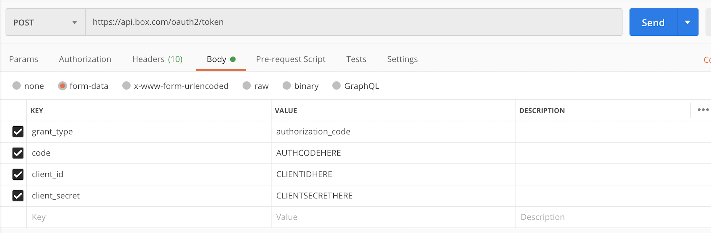

# Retrieve an Access Token

Every API call requires an **Access Token** to identify the authenticated user.
For security reasons, Access Tokens expire after 1 hour. 

## OAuth 2.0 

If your application leverages [OAuth 2.0][oauth] for authentication, you can use
the steps below to obtain an Access Token using [Postman][postman]. 

<ImageFrame border center shadow>
  
</ImageFrame>

- The `grant_type` will always be `authorization_code`.
- The `client_id` and `client_secret` values can be obtained from the
  **Configuration** tab for your application in the [Developer Console][dc].

To obtain the value for `code`, build and visit your
[authorization URL][authurl] in your browser. Complete the OAuth 2.0 flow and,
upon redirecting to your configured redirect URL, the authorization code will be
at the end of the URL. As a reminder, this authorization code is only valid for
30 seconds, so you must add this into Postman and click **Send** before it
expires.

<ImageFrame border center shadow>
  
</ImageFrame>

[oauth]: g://authentication/oauth2
[dc]: https://app.box.com/developers/console
[authurl]: g://authentication/oauth2/without-sdk
[postman]: g://tooling/postman/install