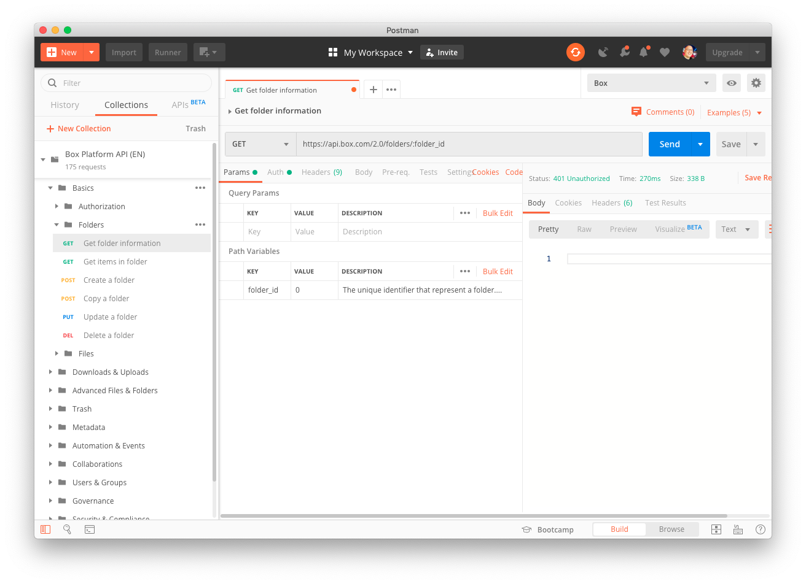

# Install Postman

To use the **Box Postman Collection** you will need to have the
[Postman][postman] app installed on your device.
Postman is available for Windows, Mac, and Linux environments.

<Trigger option='postman.downloaded' value='win32,win64,osx,linux64'>
  [Download the appropriate version for your operating system][downloads]
</Trigger>

Next, install Postman on your machine and (optionally)
[register for a Postman account and log in][register].

<ImageFrame border center>
  
</ImageFrame>

## Summary

* You installed Postman
* You created a Postman account (optional)
* You logged into the Postman application with your Postman account

<Observe option='postman.downloaded' value='win32,win64,osx,linux64'>
  <Next>
    I have installed Postman
  </Next>
</Observe>

[register]: https://identity.getpostman.com/signup
[postman]: https://getpostman.com
[downloads]: https://www.postman.com/downloads/
