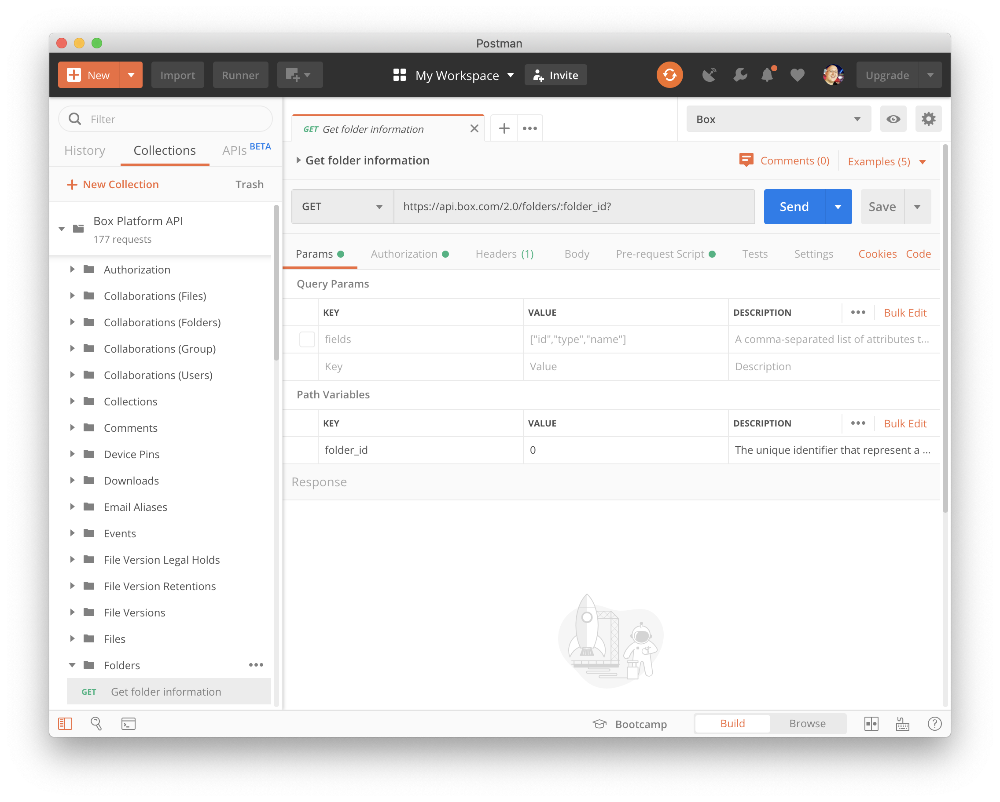

<!-- alex disable postman-postwoman -->

# Install Postman

The first step will be to install the [Postman][postman] app on your device.
Postman is available for Windows, Mac, and Linux environments.

<Grid columns='4'>
  <Download>
     Windows (x32)

    <Trigger event='download'>
      [Download](https://dl.pstmn.io/download/latest/win32) 
    </Trigger>
  </Download>

  <Download>
     Windows (x64)

    <Trigger event='download'>
      [Download](https://dl.pstmn.io/download/latest/win64) 
    </Trigger>
  </Download>

  <Download>
     MacOS

    <Trigger event='download'>
      [Download](https://dl.pstmn.io/download/latest/macos) 
    </Trigger>
  </Download>

  <Download>
     Linux (x64)

    <Trigger event='download'>
      [Download](https://dl.pstmn.io/download/latest/linux64) 
    </Trigger>
  </Download>
</Grid>

Next, install the Postman app on your machine and (optionally)
[register for a Postman account and log in][register].

<ImageFrame border center>
  
</ImageFrame>

At the end of this step you should have:

* Installed the Postman app
* Created a Postman account (optional) 
* Logged into the Postman app with your Postman account

<Observe event='download'>
  <Next>
    I have installed Postman
  </Next>
</Observe>

[register]: https://identity.getpostman.com/signup
[postman]: https://getpostman.com
