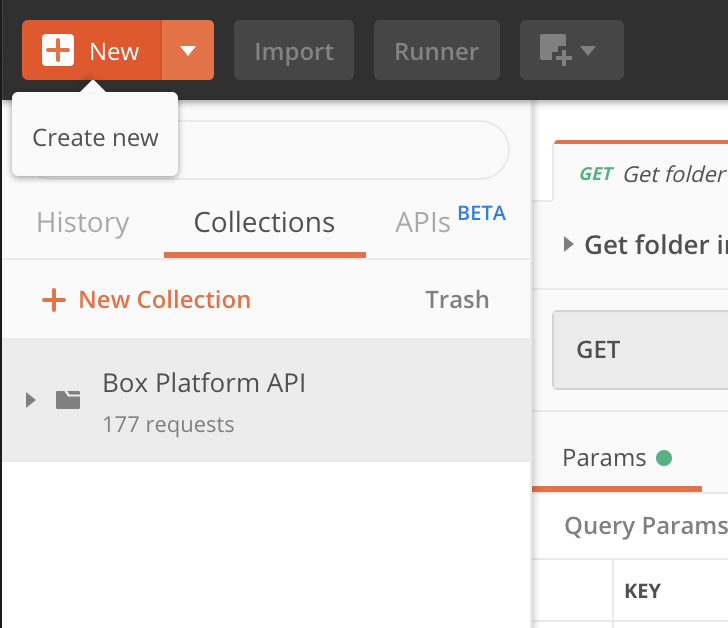

# Fork a collection

<LoggedIn id='postman_credentials'>
  Now that you are logged in we can fork the **Box Postman Collection** into the
  **Postman App** that we installed previously. When we fork the Postman
  Collection we will also automatically load your API credentials as a Postman
  environment.

  ## Forking a collection and environment

  By clicking the button below you will fork the **Box Postman
  Collection** into your Postman application. In the same click it will also
  load your **Access Token**, **Refresh Token**, **Client ID** and **Client
  Secret** into a Postman environment.

  <Trigger option='postman_collection_downloaded' value='true'>
    <Postman env='postman_credentials' />
  </Trigger>

  We recommend to fork the Box Postman Collection - you will be asked if you 
  want to update the collection any time Box makes changes to it. You can also
  copy the collection, but you might miss important updates.
</LoggedIn>

<Choice option='postman_collection_downloaded' value='true' color='none'>

## Exploring the collection

When you clicked the button above it would have asked you to fork the
collection into the Postman application. Once imported, the collection should
appear within the app in the left-hand sidebar. 

<ImageFrame border center shadow width='600'>
  
</ImageFrame>

You can click on the collection to open it up and explore our over 170 API
endpoints.

## Summary

* You forked the Postman collection into Postman
* You additionally loaded your Box Postman environment into Postman

</Choice>

<Choice option='postman.app_type' unset color='none'>
  <LoggedIn reverse>
    <Message danger>
      # Incomplete previous step

      Complete the previous steps to select and log in to a **Box App**.
    </Message>
  </LoggedIn>
</Choice>

<Choice option='postman.app_type' value='create_new,use_existing' color='none'>
  <LoggedIn id='postman_credentials' reverse>
    <Message danger>
      # Incomplete previous step

      Complete the previous steps to select and log in to a **Box App**.
    </Message>
  </LoggedIn>
</Choice>

<Observe option='postman_collection_downloaded' value='true'>
  <Next>I have forked the collection</Next>
</Observe>