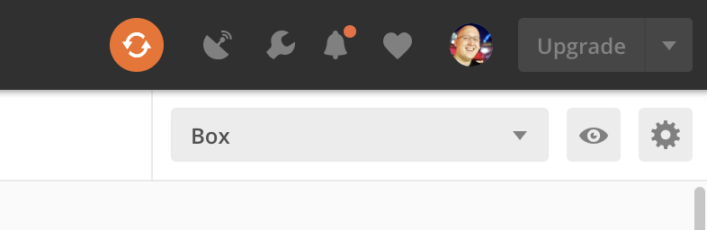
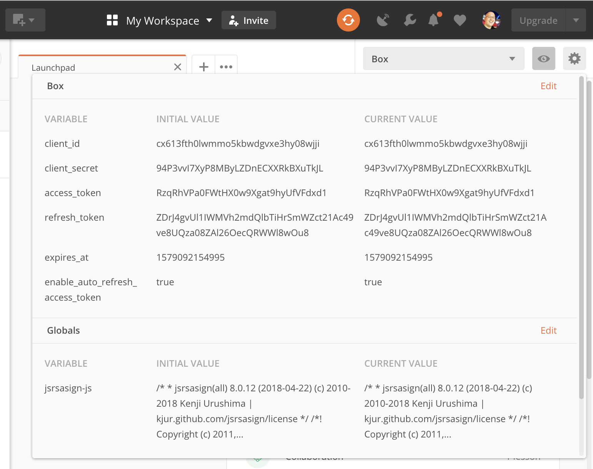
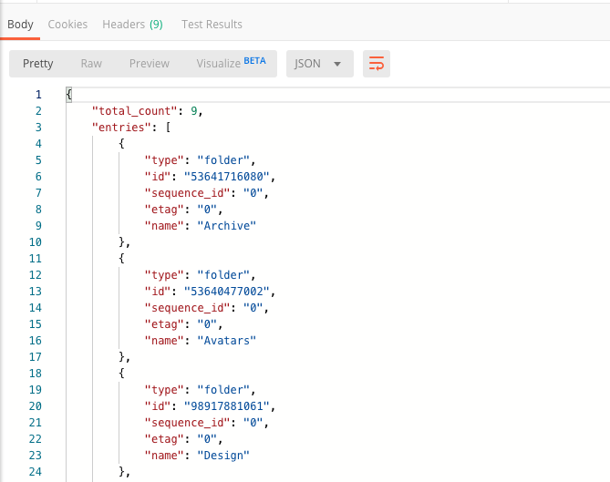

# Make an API call

With the **Box Postman Collection** forked into the **Postman App** it is now
possible to make API calls to the **Box API** on behalf of the user you logged
in as.

## First: Reset browser storage

Now that you've imported the Box API credentials into Postman you should take a
moment to remove these credentials from your browser's storage.

<ResetButton id='postman,credentials,observable_events'>
  Clear credentials
</ResetButton>

<Message warning>
  Removing your API credentials from the browser storage ensures that no other
  script can read your **Client ID**, **Client Secret**, **Access Token** or
  **Refresh Token**.
</Message>

## Select an environment

Before an API call can be made it is important to select the right **Postman
environment** to use when making API calls.

When you imported the **Box Postman collection** it automatically imported a
`Box` Postman environment for you to use. The collection will automatically
recognize and use the variables in this environment for making API calls.

To select the Box Postman environment, select **Box** from the dropdown in the
top-right of Postman.

<ImageFrame border center shadow>
  
</ImageFrame>

You can inspect the environment by clicking the **eye** icon to the right of the
dropdown.

<ImageFrame border center shadow>
  
</ImageFrame>

## Make an API request

To make an API request, select a **Request** from the Box Postman Collection. In
this example, we will use the **List items in folder** API which can be found
in the **Folders** folder.

<ImageFrame border center shadow>
  
</ImageFrame>

By default the `folder_id` for this API endpoint is set to `0` which represents
every user's root folder. You can leave this value as is or set it to the folder
ID of a folder you want to inspect.

Next, click the **Send** button in the top right to make the API request.

<ImageFrame border center shadow>
  
</ImageFrame>

The API call should return quickly and show you a list of items
in your folder in the response **Body** tab in the bottom half of the screen.

<ImageFrame border center shadow>
  
</ImageFrame>

<Message warning>
  # Authentication error

  At this point Postman might return an error instead of a list. Often,
  this means your **Access Token** has expired. Check our guide on [refreshing
  an access token in Postman](g://tooling/postman/refresh) for more details.
</Message>

## Summary

* You selected the Postman environment to use for making API calls to Box
* You made your first API call to Box, requesting the folder items for your user's root folder.

<Next>I made an API call</Next>
