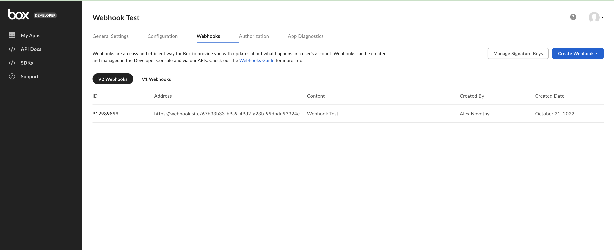

# Webhooks

Webhooks let you monitor events in your Box account and receive real-time notifications via HTTP POST requests to a URL you specify. This enables you to automate workflows based on actions like file uploads, downloads, or deletions.

For example, you might want to remove a shared link after a file is downloaded. By setting up a webhook on the file to listen for the `FILE.DOWNLOADED` event, your application can trigger a script to delete the shared link when the event occurs.

<ImageFrame center shadow border>
  
</ImageFrame>

## Webhook Versions

Box offers two versions of webhooks: V1 and V2. While both allow you to receive event notifications, V2 provides enhanced features and is recommended for most use cases.

<Message type='notice'>
  For improved security, more event triggers, and automatic retries, we recommend using V2 webhooks.
</Message>

### Comparison of V1 and V2 Webhooks

| Feature                         | V1                                              | V2                                                                 |
|---------------------------------|--------------------------------------------------|---------------------------------------------------------------------|
| Creation Method                 | Developer Console                               | Developer Console or API                                           |
| Target Scope                    | Root level only                                 | Specific files or folders (not root)                               |
| Event Triggers                  | 14 events                                       | Over 30 events                                                     |
| Payload Content                 | Selected callback parameters                    | Full object details with additional context                        |
| Retry Mechanism                 | None                                            | Retries up to 10 times on delivery failure                         |
| Payload Verification            | Not supported                                   | Supported via HMAC signatures                                      |
| Notification URL Protocol       | HTTP or HTTPS                                   | HTTPS only                                                         |
| Scalability and Reliability     | Limited                                         | High scalability and reliability                                   |

## Creating V2 Webhooks

You can create V2 webhooks either through the Developer Console or via the API.

### Using the Developer Console

1. Navigate to your application in the [Developer Console](https://app.box.com/developers/console).
2. Select the **Webhooks** tab.
3. Click **Create Webhook**.
4. Choose **V2** from the version dropdown.
5. Fill in the required details:
   - **Target Type**: `file` or `folder`
   - **Target ID**: ID of the file or folder
   - **Triggers**: Events to listen for (e.g., `FILE.UPLOADED`)
   - **Notification URL**: HTTPS endpoint to receive notifications
6. Click **Create Webhook** to save.

### Using the API

Ensure your application has the `Manage Webhooks` scope enabled.

Here's an example using `curl`:

```bash
curl -X POST https://api.box.com/2.0/webhooks \
  -H "Authorization: Bearer YOUR_ACCESS_TOKEN" \
  -H "Content-Type: application/json" \
  -d '{
    "target": {
      "id": "123456789",
      "type": "file"
    },
    "address": "https://yourdomain.com/webhook",
    "triggers": ["FILE.UPLOADED"]
  }'
```

## Testing Webhooks

Before deploying, it's crucial to test your webhook integrations. Here are some tools you can use:

| Tool      | URL                                             | Description                                                  |
|-----------|--------------------------------------------------|--------------------------------------------------------------|
| Beeceptor | [https://beeceptor.com](https://beeceptor.com)  | Create custom endpoints and inspect incoming webhook calls.  |
| Pipedream | [https://pipedream.com/requestbin](https://pipedream.com/requestbin) | Capture, log, and debug webhook payloads with ease.          |
