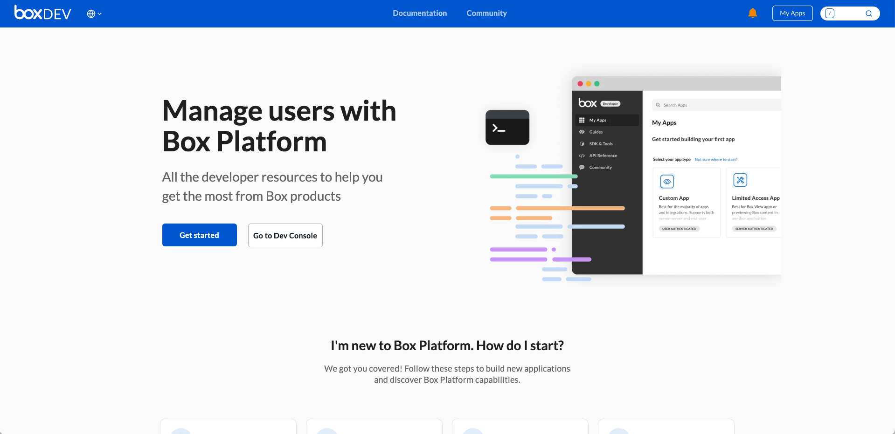
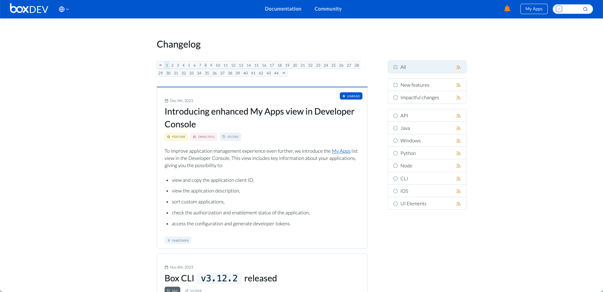
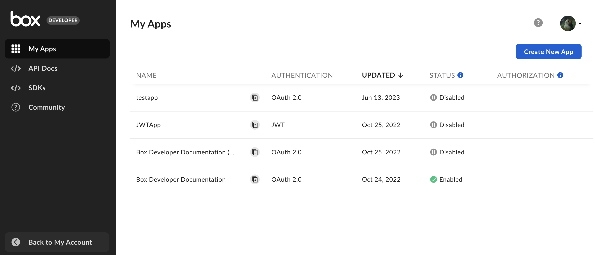
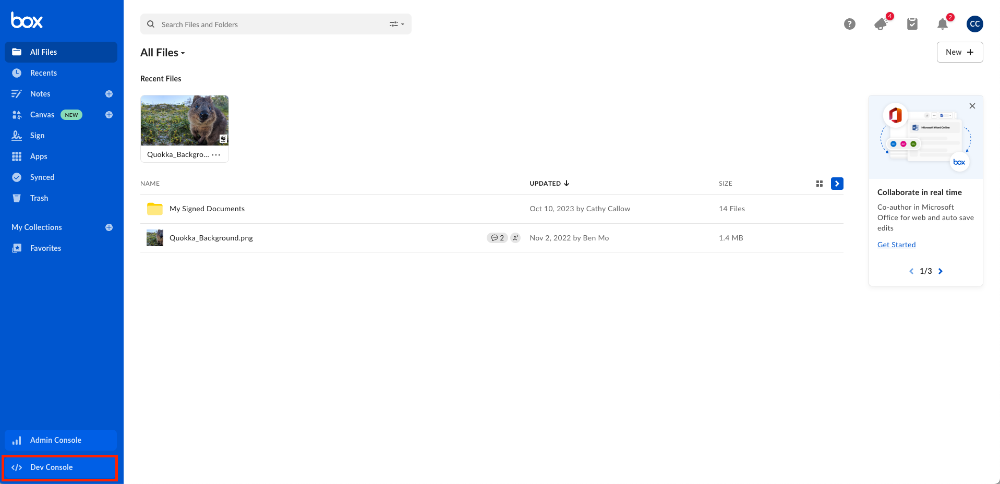
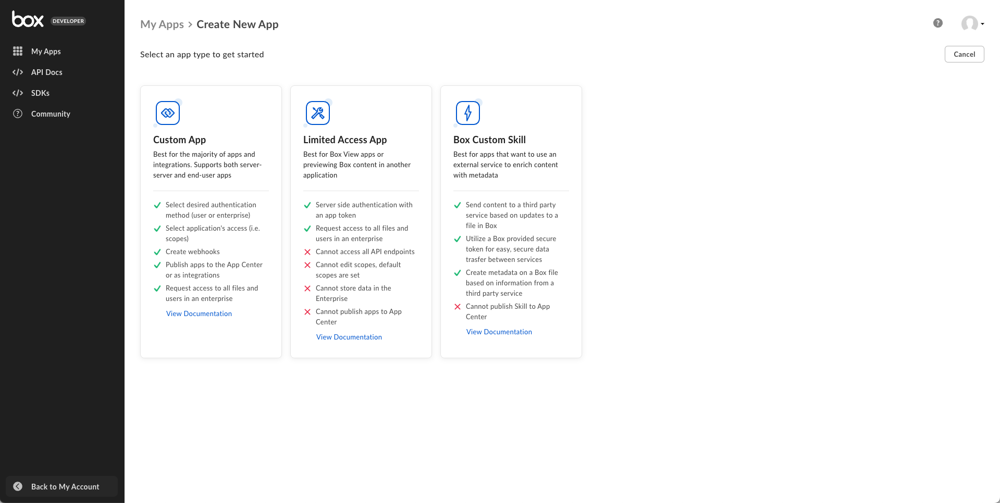
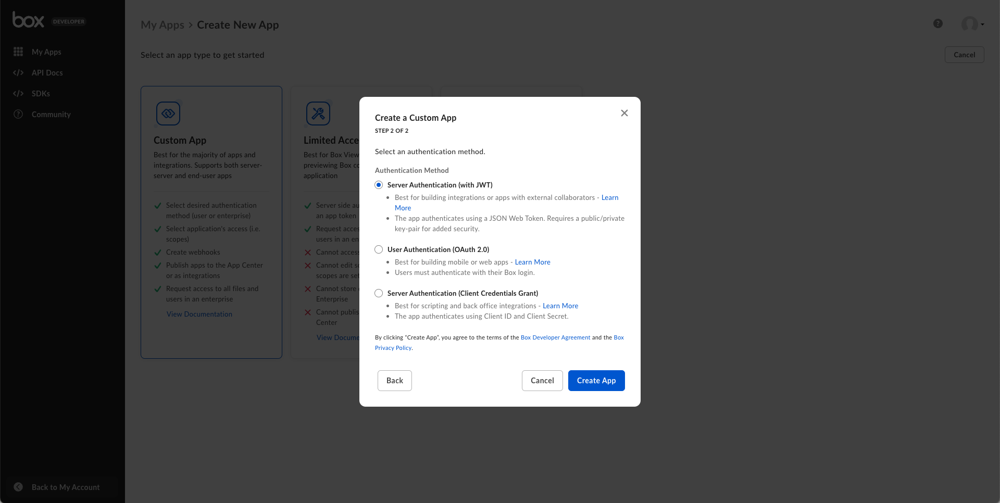

# Box Platform 101

<!-- INSERT VIDEO HERE LATER -->

## What is Box

[Box][box] is a cloud-based content management and file sharing platform that
enables individuals and businesses to store, access, and collaborate on
content from anywhere. Known for its focus on security and user-friendly
interface, Box is widely used for managing digital assets and fostering
collaboration within organizations.
Box [integrates with various productivity tools][integrations], enhancing team
efficiency and data accessibility.

## What is Box Platform

[Box Platform][platform] is a set of tools and APIs offered by Box. It
allows developers to integrate and customize the capabilities of the Box cloud
content management system into their own applications and services. 
With Box Platform, businesses and developers can build secure and scalable
content-centric applications. Leverage features like file storage,
sharing, and collaboration while maintaining control over data and access.
You can create tailored solutions that enhance productivity and streamline
content management workflows.

## How do I make applications

In order to use the [Box API][api], you first have to
[create an application][app] in Box. This application serves as the gateway for
any API call made to the platform. 
Create your app in the Developer Console while using the resources available on
the Box developer site. Let's take a closer look at what those two websites are.

### Box developer site

The Box developer site is the website you're browsing right now. It is a
comprehensive resource for developers building solutions on top of Box, and
should be used alongside the developer console to create applications and make
API calls. You can browse the [guides][guides], full OpenAPI specs, quick
starts, [sample code][samples], all within its pages. Check the
[getting started][getting-started] page to learn about sections of our
documentation.

<ImageFrame center>

</ImageFrame>

The site is frequently updated, and the latest updates are posted
to the [changelog][change].

<ImageFrame center>

</ImageFrame>

### Box Developer Console

The [Box Developer Console][dc] is an interactive interface that provides
developers with tools and resources for managing their applications integrated
with Box. Using the console, you can create, configure, and monitor apps,
gaining insights and control over how these apps interact with the Box
platform.

<ImageFrame center>

</ImageFrame>

After you create your first application in the console, a **Dev Console**
button appears in the main Box web app. Use this button to access the console in the future.

<ImageFrame center>

</ImageFrame>

## Box Platform Concepts

Here are some terms and concepts you'll need to be familiar with before we
go into more depth on specific topics.

### User Types

There are several [user types][ut] to keep in mind when developing on Box
Platform. These include users with admin privileges (such as [Admin or Co-Admin
users][admin]) and those without admin privileges ([Managed][managed] or
[External Users][ext]).
Additionally, there are platform-only users, which are categorized as 
[Service Accounts][SA] and [App Users][appuser]. Each user type has specific
roles and access levels within the Box environment. It impacts how they
interact with applications and content. At the core, if a user can access a
piece of content from the main Box web app, they should be able to access it
using the API.

### Application Type

There are three main types of applications that can be created in the developer
console: 
- custom app, 
- limited access app, 
- custom skills. 

You can also create third party and web app integrations.

<ImageFrame center>

</ImageFrame>

### Authentication Method

There are five different authentication methods you can use to gain an 
[access token][at], depending on the application type you selected. An
access token is the key to get through the gateway that is your application
to successfully make an API call to Box.

<ImageFrame center>

</ImageFrame>

<Next>
  Next step
</Next>

[admin]: page://platform/user-types/#admin-or-co-admin-user
[managed]: page://platform/user-types/#managed-users
[ext]: page://platform/user-types/#external-users
[SA]: page://platform/user-types/#service-account
[appuser]: page://platform/user-types/#app-user
[integrations]: https://www.box.com/integrations
[app]:g://getting-started/first-application
[box]: https://www.box.com
[platform]: https://www.box.com/platform
[apptypes]: g://applications/app-types/select
[authmethods]: g://authentication/select
[api]: https://developer.box.com/reference/
[change]: page://changelog
[dc]: https://app.box.com/developers/console
[at]: g://authentication/tokens
[guides]: https://developer.box.com/guides/
[samples]: https://developer.box.com/sample-code/
[getting-started]: g://getting-started
<!-- i18n-enable localize-links -->
[ut]: https://support.box.com/hc/en-us/articles/4636533822483-Box-User-Types
<!-- i18n-disable localize-links -->
