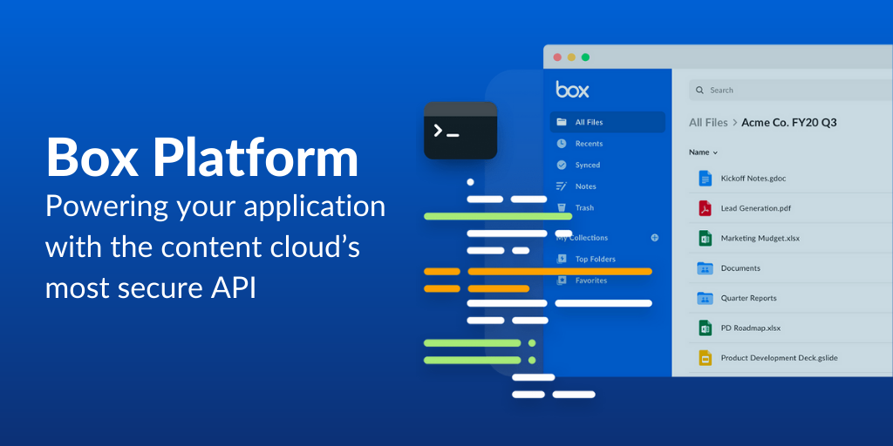

# Learn Box Platform

If you are new to Box, **start here**!
In the following pages, you'll learn how all the Box Platform
concepts and components work together to help you create an application quickly.

<!-- To kick off your learning journey, checkout this video for an overview
on everything Box Platform. -->

<ImageFrame center>

</ImageFrame>

<!-- REPLACE ABOVE IMAGE WITH VIDEO -->

## Learn Sections

These pages go into more depth on each topic. Checkout each one and become
a Box Platform expert.

- [Box Platform 101][platform101]
- [Use Cases][usecases]
- [User Types][usertypes]
- [Application Types][apptypes]
- [Authentication Methods][authtypes]
- [Support][support]
- [Tools][tools]

<Next>
  Get Started
</Next>

[platform101]: page://platform/box-platform-101
[usecases]: page://platform/use-cases
[usertypes]: page://platform/user-types
[apptypes]: page://platform/application-types
[authtypes]: page://platform/authentication-methods
[support]: page://platform/support
[tools]: page://platform/tools