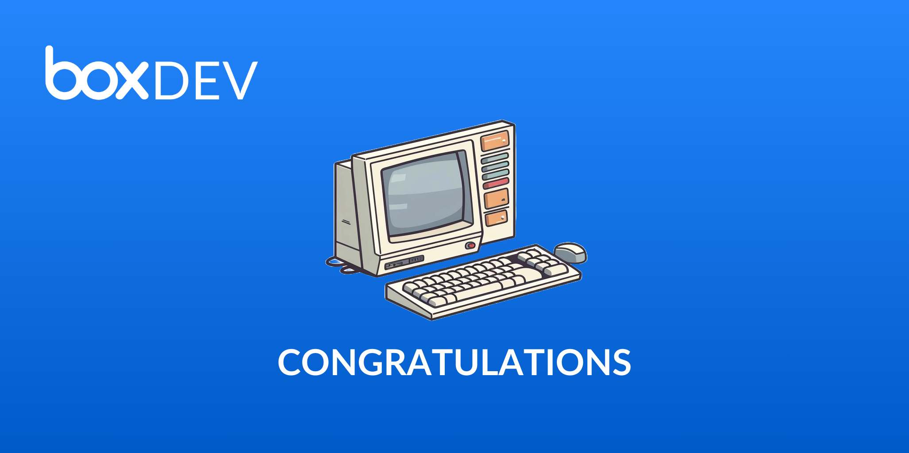

# Start Creating

Now that you have learned all about the various parts that makeup Box Platform,
you are ready to jump in and start creating. Visit
the [Box Developer Console][devconsole] to begin!

<ImageFrame center>

</ImageFrame>

If you are looking for other topics to learn about, be sure to checkout
information on the following: 

- [Architecture patterns][arch_patterns]: This page goes over some typical
    infrastructure patterns we see.
- [User Models][user_models]: This page goes over how to use the users types
    discussed earlier in this series.
- [Box Platform glossary][bpc]: This page lists out all of the terms related
    to Box Platform
- [Locating Common Values][common_values]: This page goes over how to find
    pieces of information like user IDs.
- [Errors][errors]: This page lists out all the error codes you can receive

[devconsole]: https://cloud.app.box.com/developers/console
[arch_patterns]: g://getting-started/architecture-patterns/
[user_models]: g://getting-started/user-models/
[bpc]: g://getting-started/box-glossary/
[common_values]: g://getting-started/locating-values/
[errors]: g://api-calls/permissions-and-errors/common-errors/