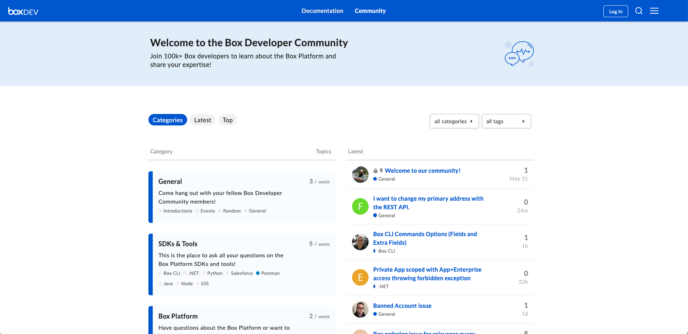
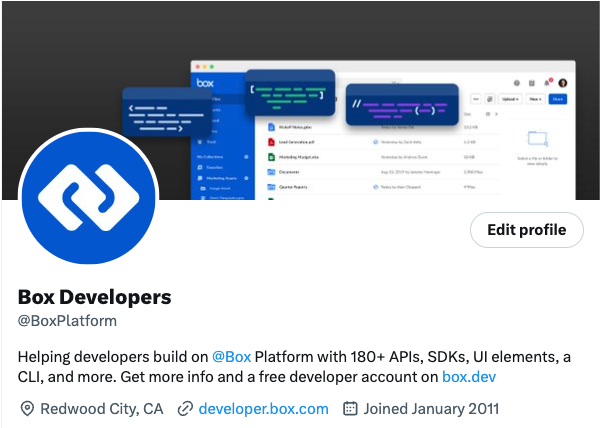

# Support

The Box Developer Relations team loves to help developers in any way we can.
Outside of interviewing developers regularly, we provide the following
options for you to connect with us.

## Developer Forum

Recently, we relaunched our developer community. It is now even easier to
connect with developers like yourself and ask questions about
your development issues. You can also share any successes you have had.
[Join Today][forum]!

<ImageFrame center>

</ImageFrame>

## Medium Blog

We + some of our partners write tutorials and make announcements on our
[Medium blog][medium] regularly. Typically, we release content every
Tuesday, but frequently, it is even more often than that. We welcome
any requests for content on our developer forum.

<ImageFrame center>

</ImageFrame>

## Box Platform Twitter

Like the changelog on the developer site, we post Box Platform
updates, as well as new blogs. You can follow at [Box Platform][twitter].

<ImageFrame center>

</ImageFrame>

<Next>
  Next step
</Next>

[samples]: g://cli/scripts/
<!-- i18n-enable localize-links -->
[forum]: https://forum.box.com/
[medium]: https://medium.com/box-developer-blog
[twitter]: https://twitter.com/BoxPlatform
<!-- i18n-disable localize-links -->
