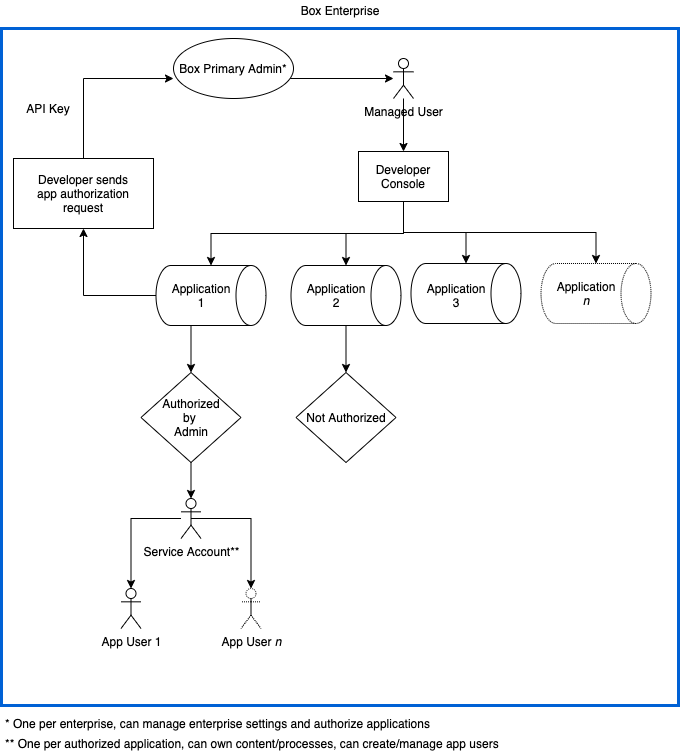
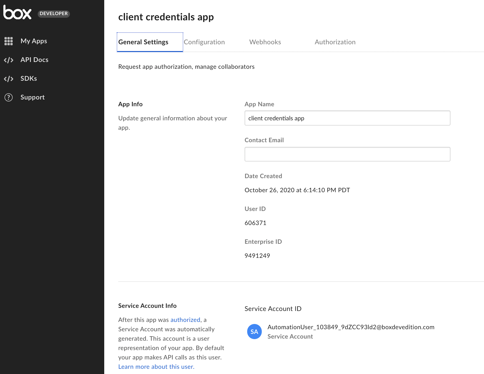
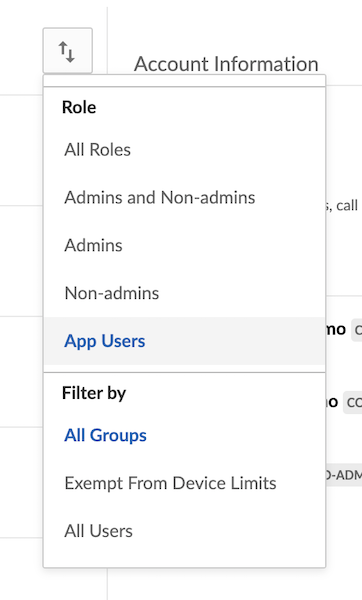
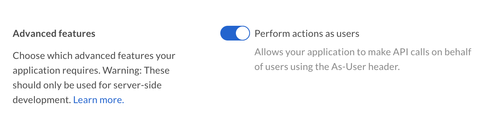

# User Types

A critical part of planning and developing an application is understanding the
types of users involved. There are four main types of users: managed (internal
and external), admin, service account, and app users. Let's take a closer look
at the differences.

<!-- markdownlint-disable line-length -->

|                  | Admin privileges                   | No Admin privileges         |
| ---------------- | ---------------------------------- | --------------------------- |
| Traditional user | Admin or Co-Admin User    | Managed User|
| Platform only    | Service Account | App User |

<!-- markdownlint-enable line-length -->

<Message>
  # What type of user does my application use?

The type of user an application is authenticated as is dependent on the
type of application created, as well as the type of authentication used to
create an Access Token.

</Message>

## Admin or Co-Admin User

The Box Admin is the principal Box account administrator. They can make
additional co-admins with similar or more restrictive administrative
privileges. Admins and Co-Admins
can directly edit, delete, enforce security settings, and run reports against
these users via the Admin Console.

## Managed Users

Each Box enterprise is assigned a unique enterprise ID. Managed Users are any
users that belong to one enterprise ID.  Managed Users consume a standard Box
license and often, but not
always, share the same email domain.

<Message>
  # Log in as Admin User

Some applications need permissions that only Admins have in order to
properly operate and therefore require an Admin to log in.

An example of this would be a security application that monitors enterprise
events and takes action on suspicious events. The events endpoint can only
be used by Admins or a Co-Admin with permission to access reporting.

</Message>

## External Users

An externally managed user, or External User, is a Managed
User that belongs to a different enterprise ID. External users are often
encountered when they are collaborated in on content owned by a Managed User of
the application's enterprise, or when they authorize an OAuth 2.0 application.
These users still have their own Box accounts, but cannot be managed via the
Admin Console.

## Service Account

A Service Account provides developers with a programmatic authentication
mechanism for server-side integrations with Box. In other words, an application
can authenticate to Box as the service, which is represented by a Service
Account user. A Service Account can then be used to create other application
specific users, called App Users described further below.

<ImageFrame center>

</ImageFrame>

### Creation

A unique Box Service Account is automatically generated as soon as an
application, leveraging server authentication, is [authorized][auth] in the
Admin Console. From that point forward, the Service Account represents the
application in the Box enterprise. Since every Box account must have an email
address, Box assigns one. The format will always be
`AutomationUser_AppServiceID_RandomString@boxdevedition.com`. For example:
`AutomationUser_123456_6jCo6Pqwo@boxdevedition.com`. This is why you may
sometimes hear the Service Account referred to as an Automation User.

The numbers surrounded by underscores are also unique to the application and are
called a Service ID. To locate a Service ID  in the [Developer Console][dc],
click on the tile for an application and look at the URL. For example,
`https://example.app.box.com/developers/console/app/123456`. As you can see,
this application corresponds to the Service Account provided in the example
above.

By default, most Service Accounts are allocated 10GB of storage. This is because
they abide by the storage allocation set in the **New User Default Settings**
found under the **User Settings** tab of the Admin Console. This amount may
differ based on whether an enterprise updated this setting or not. To
update the amount of storage allocated to a Service Account after its creation,
make an API call to the [update user][updateuser] endpoint and pass in the
desired value, in bytes, using the `space_amount` body parameter.

Once the Service Account is generated, a section is automatically added to the
General tab of the [Developer Console][dc] revealing the email address.

<ImageFrame center>

</ImageFrame>

If someone attempts to make API calls using a Service Account Access Token
before the application is authorized in the Admin Console they will receive an
error message:
`"error": "unauthorized_client"`
`"error_description": "This app is not authorized by the enterprise"`

### Use Cases

- *Distribution Publishing*: upload and share files with any number of users whether or not they are authenticated
- *On-Premises Systems and Devices*: programmatically ingest content from on-premises systems and connected devices
- *Content Migration and Monitoring*: move content from on-premises to the cloud or between cloud providers
- *Event Monitoring*: monitors events in an enterprise to ensure compliance and or trigger workflows based on actions
- *Content Archive*: house minimally accessed content

### Permissions

The endpoints that a Service Account Access Token can successfully interact with
are determined by the application [scopes][scopes] configured in the
[Developer Console][dc]. Depending on the granted scopes, a Service Account may
have the ability to perform Admin actions.

<Message type='warning'>
  # Admin Approval

With the right [scopes][scopes] enabled, a Service Account can perform many
Admin actions. For this reason JWT applications need
explicit [Admin approval][auth] before they can be used in an enterprise.
</Message>

### UI Access

Only Primary Admins have the ability to log in as a Service Account through the
[Content Manager][cm] in the Admin Console. To do this, use the Content
Manager's search bar to locate the name of the application, right click on it,
and select “Log in to user’s account”.

A Service Account can be thought of as having the permissions of a Box Co-Admin.
Similar to co-admins being unable to manage each other, co-admins cannot log in
as a Service Account user.

Service Accounts are not currently visible in the users and group tab of the
Admin Console.

### Folder Tree and Collaboration

Because a Service Account represents an application as a user within the
enterprise, it has its own folder tree and content ownership capabilities. By
default this folder tree is empty because the Service Account does not initially
own or collaborate on content. This is similar to when you first land on your
All Files page in a newly provisioned Box account.

To collaborate a Service Account on existing content use the assigned email
address to invite them as you would any other user. If you are instead adding
the collaboration [via the API][collabapi] you will need to use an Access Token
for a user that already has access to the content and has the appropriate
collaboration permissions to invite collaborators. You will also use the Service
Account’s user ID, which is returned when making a call to the
[get current user endpoint][getuser] using an Access Token for the Service
Account.

<Message type='notice'>
  It is possible to assign a Service Account an email alias if that is
  easier to remember when adding collaborations.
</Message>

### Box View

A Service Account is also automatically generated when a Limited Access App is
created in the [Developer Console][dc]. This Service Account has some additional
restrictions that a Service Account associated with a Platform App does not.

- All content used within the Limited Access App must be uploaded and owned by the Service Account
- The Service Account can not access any other user's information or content
- The Service Account can not create or otherwise manage any type of new user
- The Service Account can only access a subset of APIs related to previewing content

## App User

App users are only accessible via the API, meaning they do not have login
credentials. They can be created by a Service Account and therefore are
only applicable to applications leveraging server to server authentication. App
Users are tied to the application used to create them, and while they can
collaborate on content outside of the application, the user itself cannot be
moved under another application.

### Creation

App users are created using a Service Account access token to call the
[create user endpoint][createuser]. The `is_platform_access_only` body parameter
must be set to true or a managed user is created instead.

Since every Box account must have an email address, Box assigns one. The format
will always be `AppUser_AppServiceID_RandomString@boxdevedition.com`. For
example: `AppUser_1234567_LOCqkWI79A@boxdevedition.com`.

The numbers surrounded by underscores are also unique to the application and
are called a Service ID. To locate a Service ID in the [Developer Console][dc],
click on on the tile for an application and look at the URL. For example,
`https://exampl.app.box.com/developers/console/app/1234567` . As you can see,
this application corresponds to the App User in the example above.

### Use Cases

App Users extend the functionality of Box’s Platform to applications serving any
user, regardless of if they have an existing Box account. App users are often
used by applications that manage their own user authentication, but want to
store the data in unique Box user accounts.

- *Customer Portals*: Websites or applications where clients or patients can log in to access information provided by employees at a company and/or to store and retrieve their own sensitive documents.
- *Vendor Portals*: Content distribution sites for companies to provide materials including marketing collateral, price lists, product information, sales agreements or contracts, and other documents to vendors. Box's groups and permission model allow for companies to organize content for partners based on partner criteria and/or tier.
- *Branded Customer Facing Applications*: The ability to create App Users on behalf of an end-user allows companies to build seamless customer-facing features such as permissions, auditing, and reporting. This is particularly valuable for regulated industries such as Financial Services and Healthcare. Moreover, user-based data from our [reporting capabilities][events] allows developers to leverage analytic tools to better understand user behavior.

### Permissions

App Users cannot see or interact any content in the folder tree of the Service
Account unless explicitly added as a collaborator. Again, because App Users does
not have login credentials, they cannot access content outside of the
platform application.

### UI Access

App users are accessible via the [Users & Groups tab][uag-tab] of the Admin
Console. To filter for these users, use the view options button > Role >
App Users.

<ImageFrame center>

</ImageFrame>

App Users are also accessible through the [Content Manager][cm] in the Admin
Console.

### Folder Tree and Collaboration

Each App User has its own folder tree and content ownership capabilities. By
default this folder tree is empty because they do not initially own or
collaborate on content. This is similar to when you first land on your All Files
page in a newly provisioned Box account.

To collaborate an App User on existing content use the assigned email
address to invite them as you would any other user. If you are instead adding
the collaboration [via the API][collabapi] you will need to use an Access Token
for a user that already has access to the content and has the appropriate
collaboration permissions to invite collaborators.

## As-User

If you are using OAuth 2.0, JWT, or CCG as the authentication method for your
application, it is possible to make what are called `as-user` calls. This means
that even though you created an original connection to the Box API as yourself
or as a service account, you can make subsequent calls impersonating another
user. This is useful in automating administrative tasks like folder
reorganization or employee provisioning. In order to make `as-user` calls,
the appropriate scope must be added to the application when creating it
in the developer console. For example, in an OAuth 2.0 platform app, you
would need to turn on this switch.

<ImageFrame center>

</ImageFrame>

<Next>
  Next step
</Next>

[dc]: https://app.box.com/developers/console
[auth]: g://authorization/custom-app-approval
[scopes]: g://api-calls/permissions-and-errors/scopes
[collabapi]: e://post-collaborations
[getuser]: e://get-users-me
[updateuser]: e://put-users-id
[createuser]: e://post-users
[events]: e://get-events
<!-- i18n-enable localize-links -->
[cm]: https://support.box.com/hc/en-us/articles/360044197333-Using-the-Content-Manager
[uag-tab]: https://support.box.com/hc/en-us/articles/360043695714-Admin-Console-Guide
<!-- i18n-disable localize-links -->