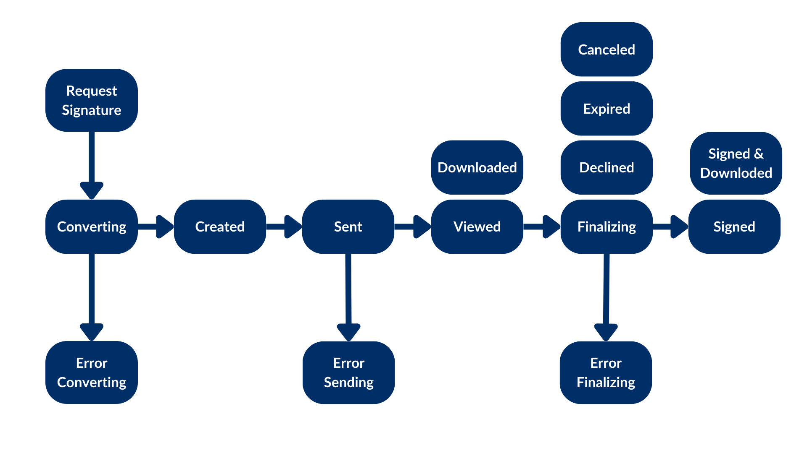

# Your first request

Imagine that you have a document stored in Box and you want to send it to a
customer for signature. At a minimum your app needs to know what document
to sign, where to store the signed document, and the signer email.

## Creating a signature request

You can use the Box Sign API or one of the available SDKs to create a
signature request. See the example:

<Tabs>
<Tab title='cURL'>

```bash

curl --location 'https://api.box.com/2.0/sign_requests' \
--header 'Content-Type: application/json' \
--header 'Authorization: Bearer <access token>'
--data-raw '{
    "is_document_preparation_needed": true,
    "parent_folder": {
        "id": "234102987614",
        "type": "folder"
    },
    "source_files": [
        {
            "id": "1355143830404",
            "type": "file"
        }
    ],
    "signers": [
        {
            "email": "signer@example.com",
            "role": "signer"
        }
    ]
}'

```

</Tab>
<Tab title='Python Gen SDK'>

```python

def sign_doc_single(
    client: Client,
    document_id: str,
    destination_folder_id: str,
    signer_email: str,
    prep_needed: bool = False,
) -> SignRequest:
    # Sign request params
    source_file = FileBase(id=document_id, type=FileBaseTypeField.FILE)
    destination_folder = FolderMini(
        id=destination_folder_id, type=FolderBaseTypeField.FOLDER
    )
    signer = SignRequestCreateSigner(signer_email)
    # sign document
    sign_request = client.sign_requests.create_sign_request(
        signers=[signer],
        parent_folder=destination_folder,
        source_files=[source_file],
        is_document_preparation_needed=prep_needed,
    )

    return sign_request

def main():
    conf = ConfigOAuth()
    client = get_client_oauth(conf)

    # Simple sign a pdf request with preparation
    sign_pdf_prep = sign_doc_single(
        client, SIMPLE_PDF, SIGN_DOCS_FOLDER, SIGNER_A, True
    )

    if sign_pdf_prep.prepare_url is not None:
        open_browser(sign_pdf_prep.prepare_url)

```

  </Tab>
</Tabs>

This will result in a signature request with a prepare document URL
(simplified):

<Tabs>
<Tab title='cURL'>

```json
{
  "is_document_preparation_needed": true,
  "signers": [
    {
      "email": "requester@example.com",
      "role": "final_copy_reader",
    },
    {
      "email": "signer@example.com",
      "role": "signer",
    }
  ],
  "id": "348decab-48a8-4f2c-9436-8967afebf7bb",
  "prepare_url": "https://app.box.com/sign/document/xyz-abc-123/.../prepare_doc/",
  "source_files": [
    {
      "id": "1355143830404",
      "type": "file",
    }
  ],
  "parent_folder": {
    "id": "234102987614",
    "type": "folder",
  },
  "name": "Simple-PDF.pdf",
  "type": "sign-request",
  "status": "converting",
  "sign_files": {
    "files": [
      {
        "id": "1381301154812",
        "type": "file",
      }
    ],
    "is_ready_for_download": true
  },
  "template_id": null
}
```

</Tab>
<Tab title='Python Gen SDK'>

```YAML

Simple sign request with prep: xyz-abc-123
  Status: converting
  Signers: signer@example.com
Prepare url: https://app.box.com/sign/document/xyz-abc-123/.../prepare_doc/

```

</Tab>
</Tabs>

## Check the status of the signature request

Creating the signature request is an asynchronous process, and can generate
errors. Your application should check the status of the request before
proceeding, and handle any errors.

A signature request can have the following statuses:



- `converting`: The file is converted to a `.pdf` for the signing process once the sign request is sent.
- `error_converting`: An issue occurred while converting the file to a `.pdf`.
- `created`: When the `document_preparation_is_needed` is set to `true`, but the `prepare_url` has not yet been visited.
- `sent`: The request was successfully sent, but no signer has interacted with it.
- `error_sending`: An issue occurred while sending the request.
- `viewed`: The first, or only, signer clicked on **Review document** in the signing email or visited the signing URL.
- `downloaded`: The document was downloaded by the signer.
- `signed`: All signers completed the request.
- `signed and downloaded`: The document was signed and downloaded by the signer.
- `declined`: If any signer declines the request.
- `cancelled`: If the request is cancelled via UI or API.
- `expired`: The date of expiration has passed with outstanding, incomplete signatures.
- `finalizing`: All signers have signed the request, but the final document with signatures and the signing log have not been generated yet.
- `error_finalizing`: The `finalizing` phase did not complete successfully.

## Preparing the document

Depending on your technical use case you may need to prepare the document. In
this specific example, we are signing a PDF, and the Box Sign engine has no
idea where to place the signature pad field or any other inputs. This is why we
used the `is_document_preparation_needed` flag.

If a prepare URL is present, then your application should open the prepare
URL in a browser, where the requester can add the signature pad field and any
other inputs needed for the signer to complete the document.

Once the document is prepared, the requester can send the signature request to
the signer.

This preparation step is not always necessary. Take a look at the [technical
use cases][technical-use-cases] for more information.

## Completing the signature request

The signer then receives an email from Box with a link to the signature
request. The signer can click the link and sign the document.

When the process is completed, both a signature log containing metadata and
the signed document are stored in the destination folder.

Congratulations! You have successfully created your first signature request.

<Message type='notice'>
This represents the basic use case for Box Sign. The `create` method has many
options that you can use to customize your signature request.

Be sure to check the [request options][request-options], and the
[technical use cases][technical-use-cases] sections for more
information.
</Message>

[request-options]:page://sign/request-options
[technical-use-cases]:page://sign/technical-use-cases