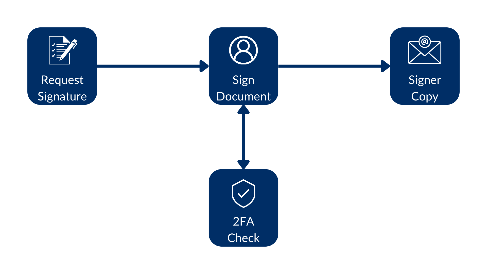
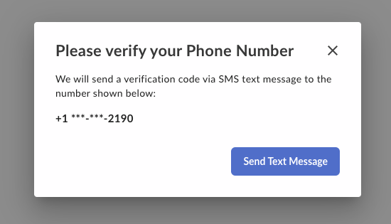
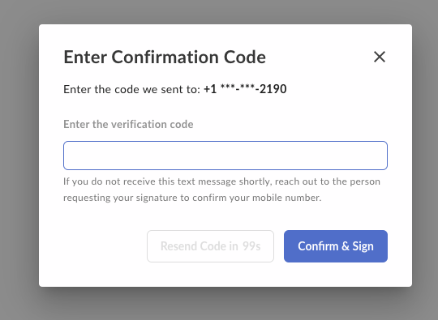
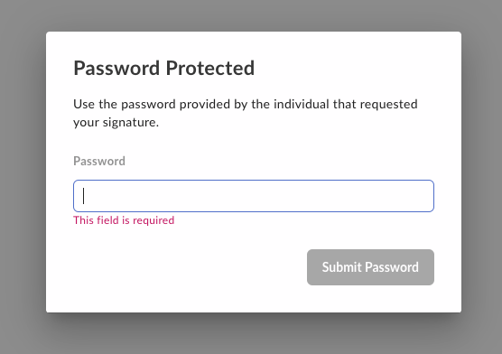

# Extra security (2FA)

Imagine you want an additional layer of security for your signature requests, 
by requesting the signer to use a password or a  phone verification.



## Phone verification

You can require the signer to use 2FA via phone, to complete the signature 
request by passing the `is_phone_verification_required_to_view` parameter. 

For example:

<Tabs>
<Tab title='cURL'>
    
```bash

curl --location 'https://api.box.com/2.0/sign_requests' \
--header 'Content-Type: application/json' \
--header 'Authorization: Bearer ej...3t'
--data-raw '{
    "is_document_preparation_needed": true,
    "parent_folder": {
        "id": "234102987614",
        "type": "folder"
    },
    "source_files": [
        {
            "id": "1358047520478",
            "type": "file"
        }
    ],
    "signers": [
        {
            "email": "verify@example.com",
            "role": "signer",
            "verification_phone_number":"+15551232190"
        }
    ]
}'

```
    
</Tab>
<Tab title='Python Gen SDK'>

```python

def sign_doc_verify_phone(
    client: Client,
    document_id: str,
    destination_folder_id: str,
    signer_email: str,
    signer_phone: str,
) -> SignRequest:

    # Sign request params
    source_file = FileBase(id=document_id, type=FileBaseTypeField.FILE)
    destination_folder = FolderMini(
        id=destination_folder_id, type=FolderBaseTypeField.FOLDER
    )

    signer = SignRequestCreateSigner(
        email=signer_email,
        verification_phone_number=signer_phone,
    )

    # sign document
    sign_request = client.sign_requests.create_sign_request(
        signers=[signer],
        parent_folder=destination_folder,
        source_files=[source_file],
        is_phone_verification_required_to_view=True,
    )

    return sign_request

def main():
    ...

    # Sign with phone verification
    sign_with_phone_verification = sign_doc_verify_phone(
        client,
        SIMPLE_PDF,
        SIGN_DOCS_FOLDER,
        SIGNER_A,
        SIGNER_A_PHONE,
    )
    check_sign_request(sign_with_phone_verification)

```

</Tab>
</Tabs>

When the signer tries to complete the signature request a phone verification 
pops up:



Then the signer is prompted to enter the code sent via SMS:



Note that this check is done on the last step, so it does not prevent the 
signer from accessing the document.

## Password verification

You can also require the signer to use a password to open the signature request 
by passing the `password` parameter in the `signer` object. For example:

<Tabs>
<Tab title='cURL'>
    
```bash

curl --location 'https://api.box.com/2.0/sign_requests' \
--header 'Content-Type: application/json' \
--header 'Authorization: Bearer ej...3t'
--data-raw '{
    "is_document_preparation_needed": true,
    "parent_folder": {
        "id": "234102987614",
        "type": "folder"
    },
    "source_files": [
        {
            "id": "1358047520478",
            "type": "file"
        }
    ],
    "signers": [
        {
            "email": "verify@example.com",
            "role": "signer",
            "password":"1234"
        }
    ]
}'
    
```
    
</Tab>
<Tab title='Python Gen SDK'>

```python

def sign_doc_verify_password(
    client: Client,
    document_id: str,
    destination_folder_id: str,
    signer_email: str,
    signer_password: str,
) -> SignRequest:

    # Sign request params
    source_file = FileBase(id=document_id, type=FileBaseTypeField.FILE)
    destination_folder = FolderMini(
        id=destination_folder_id, type=FolderBaseTypeField.FOLDER
    )

    # signer
    signer = SignRequestCreateSigner(
        email=signer_email,
        password=signer_password,
    )

    # sign document
    sign_request = client.sign_requests.create_sign_request(
        signers=[signer],
        parent_folder=destination_folder,
        source_files=[source_file],
    )

    return sign_request

def main():
    ...

    # Sign with phone verification
    sign_with_password_verification = sign_doc_verify_password(
        client,
        SIMPLE_PDF,
        SIGN_DOCS_FOLDER,
        SIGNER_A,
        "1234",
    )    

```

</Tab>
</Tabs>

Once you open the signature request you should see something like this:



Note the password verification is done on the first step, so it prevents the 
signer from accessing the document.

<Next>Custom URLs</Next>
