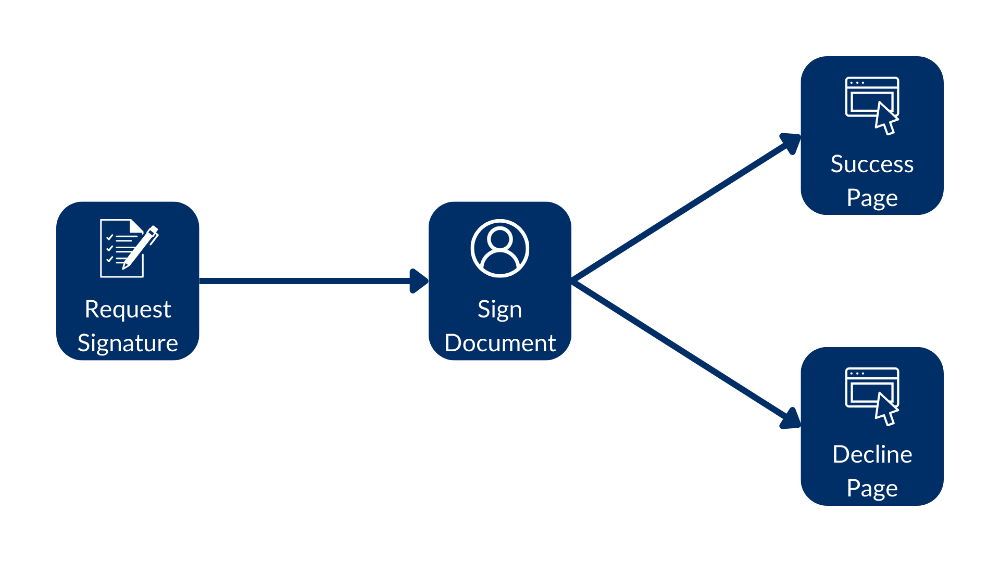

# Redirect URLs

Often after signing a document your company might want to redirect the user to 
a specific web page like a thank you or an onboarding page. There are two 
features to support these requirements.

When the signer completes the signature process, they can be redirected to a 
web page. The same can happen when the signer declines the signature request.

We can customize these pages by passing the `redirect_url` and 
`decline_redirect_url` parameters.



For example:

<Tabs>
<Tab title='cURL'>
    
```bash

curl --location 'https://api.box.com/2.0/sign_requests' \
--header 'Content-Type: application/json' \
--header 'Authorization: Bearer ej...3t'
--data-raw '{
    "is_document_preparation_needed": true,
    "redirect_url": "https://forum.box.com/",
    "declined_redirect_url":"https://developer.box.com/",
    "parent_folder": {
        "id": "234102987614",
        "type": "folder"
    },
    "source_files": [
        {
            "id": "1358047520478",
            "type": "file"
        }
    ],
    "signers": [
        {
            "email": "signer@example.com",
            "role": "signer"
        }
    ]
}'
    
```
    
</Tab>
<Tab title='Python Gen SDK'>

```python

def sign_doc_single_more_options(
    ...

    redirect_url: str = None,
    declined_redirect_url: str = None,
) -> SignRequest:
    ...

    # sign document
    sign_request = client.sign_requests.create_sign_request(
        ...

        redirect_url=redirect_url,
        declined_redirect_url=declined_redirect_url,
    )

    return sign_request

def main():
    ...
    
    # Sign with redirects
    sign_with_redirects = sign_doc_single_more_options(
        client,
        SIMPLE_PDF,
        SIGN_DOCS_FOLDER,
        SIGNER_A,
        prep_needed=False,
        redirect_url="https://forum.box.com/",
        declined_redirect_url="https://developer.box.com/",
    )
    check_sign_request(sign_with_redirects)    

```

</Tab>
</Tabs>

If you sign you’ll be redirected to our forum page. If you decline you’ll be 
redirected to our developer page.

<Next>Resend requests</Next>