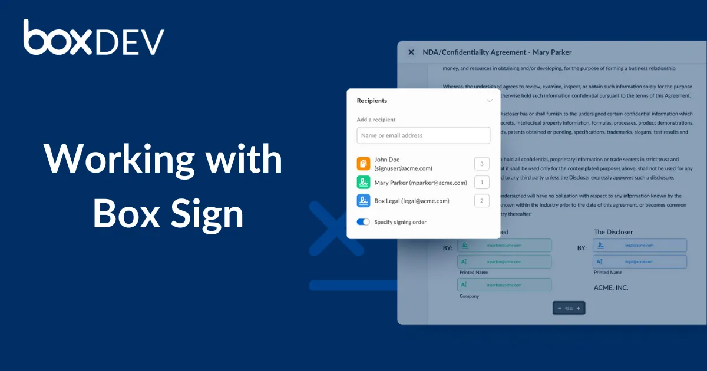

# Working with Box Sign

<ImageFrame center>

</ImageFrame>

This learning page is dedicated to providing developers with practical insights 
into working with Box Sign, aiming to facilitate the integration of the Box 
Platform Sign engine into their applications.

## Quick start

The [Quick start][quick-start] is tailored for developers who want to go 
straight into the creation of a signature request. It offers an API overview, 
and gets you strait to the creations of your first request.

## Technical use cases

In the [Technical use cases][technical-use-cases], you will learn how to handle 
the different type of documents that can be used in a signature request. From 
unstructured documents that require a preparation step, to templates, and even 
generated ready to sign documents.

## Request Options

In the [Request options][request-options], developers will find a detailed 
exploration of the available customization and configuration options when 
sending signing requests through the Box Sign API. Learn how to tailor the 
signing experience to match your application's user interface, workflow, and 
specific requirements.

## Business Use Cases

The [Business use cases][advanced-use-cases] delves into a few of the business 
use cases, requirements, and workflows you may encounter. See how the Box 
Platform features come together to provide a seamless signing experience for 
your users. 

Lets get started!

[quick-start]:page://sign/quick-start
[request-options]:page://sign/request-options
[technical-use-cases]:page://sign/technical-use-cases
[advanced-use-cases]:page://sign/advanced-use-cases

<!-- 
<Tabs>
<Tab title='cURL'>
    
```bash
    
```
    
</Tab>
<Tab title='Python Gen SDK'>

```python

```

</Tab>
</Tabs>
-->
