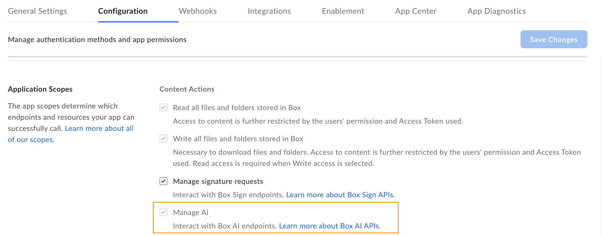

# Get started with AI studio

<Messsage type='caution'>

Box AI Studio is available only for Enterprise Advanced accounts.

</Message>

To start creating custom AI agents with AI studio you need a platform
application with enabled Box AI scope and a developer token to
authenticate your calls.

## Create a platform application

First you need to create a platform application you will use to make calls. To
create an application, follow the guide on [creating platform apps][createapps].

## Enable Box AI studio

To use Box AI studio, make sure it is enabled by a Box admin in the Admin
Console.
If you are a Box Admin, you will find the necessary information in
[Enabling Box AI Studio and Managing Agents][enable].

To interact with Box AI API, you need the `ai.readwrite` [scope][scope]
added for your application. Before you add the scope, make sure that the Box
Admin has granted you the access to Box AI API. If you can't see the
**Manage AI** option in your app configuration settings, contact your admin.

To add a scope:

1. Open your application in Developer Console.
2. Go to **Configuration** > **Required Access Scopes** > **Content Actions**
3. Select the **Manage AI** scope. Box Platform will automatically include the scope when making the call. If you are added as an collaborator for a given app, but do not have Box AI API access, you will see the **Manage AI** scope checked and grayed out. This means the app owner has the AI scope enabled but you cannot change this setting.

    

4. Submit your app for [authorization or enablement][authorization]. If you want to enable Box AI API for an existing application, you must [re-authorize][reauthorization] it.

## Generate a developer token

You need a developer token
to authenticate your app when sending requests.

To generate a token:

1. Go to **Developer Console** > **My Platform Apps**.
2. Click the **Options menu** button (…) on the right.
3. Select **Generate Developer Token**. The token will be automatically generated and saved to clipboard.

You can also open your app, go to
**Configuration** > **Developer Token**
and generate the token.

<Message type="notice">

A developer token is only valid for one hour.

</Message>

For additional details, see [developer token][token].
After you generate the token, you can use it in cURL
or other clients, such as [Postman][postman], to make
calls.

[enable]: https://support.box.com/hc/en-us/articles/37228079461267-Enabling-Box-AI-Studio-and-Managing-Agents/#h_01JH9HAMP43YYN6VWM51QCK413
[token]: g://authentication/tokens/developer-tokens
[scope]: g://api-calls/permissions-and-errors/scopes
[createapps]: g://applications/app-types/platform-apps
[postman]: g://tooling/postman
[authorization]: g://authorization
[reauthorization]: g://authorization/custom-app-approval#re-authorization-on-changes