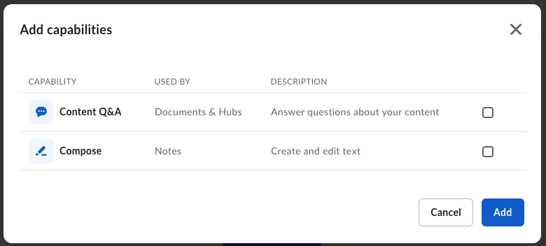

# Box AI Studio

<Messsage type="caution">

Box AI Studio is available only for Enterprise Advanced accounts.

</Message>

[Box AI Studio][ai-studio] allows you to build and manage custom AI agents to best suit your business needs. For example, you can create an AI agent that acts as a compliance consultant, answering questions regarding customer documentation with the FedRAMP Moderate compliance in mind.

## Box AI Studio capabilities

Currently, you can configure Box AI agent to answer user questions or generate text you can use in your documents.

## サポートされている言語

<!--alex ignore-->

Box AI studio works in a number of languages including English, Japanese, French, Spanish, and many more. However, the underlying models are primarily trained on English language documents. This means that prompts in other languages may return answers of lower quality than in English. Tests have shown satisfactory results for summarizing, checking grammar and spelling, and answering questions, but bear in mind that the results may be different than in English.

<!--alex enable-->

<Message type="tip">

<!--alex ignore-->

言語を日本語に切り替えると、より適切な結果が得られます。

</Message>

<!--alex enable-->

[ai-studio]: https://support.box.com/hc/en-us/articles/37228079461267-Enabling-Box-AI-Studio-and-Managing-Agents
