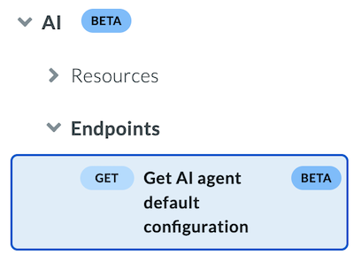

# APIのバージョン戦略

Boxでは、特定のAPIエンドポイントに対してバージョン管理機能を提供しています。このバージョン管理システムにより、Boxがエンドポイントのバージョンを新しく導入した場合でも、既存のエンドポイントのバージョンに対してシームレスな機能が保証されます。

APIのバージョン管理により、Boxは、自社のプラットフォームを継続的に強化できると同時に、機能の更新や廃止のための信頼できる手段をサードパーティの開発者に提供することもできます。

<Message type="tip">

今後予定されているAPIの変更について常に最新情報を把握できるように、[変更ログ](page://changelog)を注視し、開発者コンソールの \[アプリ情報] セクションで最新のメールアドレスを指定しておいてください。

</Message>

<!-- Commenting this until we enable base version support in Public API Service <Message type='notice'>

In 2024, Box introduced year-based API versioning.

All endpoints available at the end of 2024 were assigned the version `2024.0`.

**No action is required for API users to continue using Box APIs.**

To make version-aware API calls, include the `box-version` header with the value `2024.0` in your requests.

</Message>

-->

## Box APIのバージョン管理の仕組み

<Message type="notice">

Box API supports versioning in `header`. To determine which version to use, look at the API reference and included sample requests.

</Message>

### `header`におけるバージョン管理

Box API processes the `box-version` header which should contain a valid version name. For example, when a client wants to get a list of all sign requests using version `2025.0`, the request should look like this:

```curl
curl --location 'https://api.box.com/2.0/sign_requests' \
     --header 'box-version: 2025.0' \
     --header 'Authorization: Bearer …

```

If the provided version is correct and supported by the endpoint, a response is sent to the client. If the endpoint is available in multiple versions, the response will include the `box-version` header, which indicates the version used to handle the request. Endpoints introduced after 2024 may return a `400` error code if the version is incorrect. More information about versioning errors can be found [here](g://api-calls/permissions-and-errors/versioning-errors).

If your request doesn't include a version, the API defaults to the initial Box API version - `2024.0` - the version of endpoints available before year-based versioning was introduced. However, relying on this behavior is not recommended when adopting deprecated changes. To ensure consistency, always specify the API version, with each request. By making your application version-aware, you anchor it to a specific set of features, ensuring consistent behavior throughout the supported timeframe.

## リリーススケジュールと命名規則

Box can introduce a new breaking change to certain endpoints **once per year**, which results in a new API version. Introducing a new version of the Sign Request endpoint means that **all paths and HTTP methods** of an endpoint will support it.

たとえば、署名リクエストのエンドポイントが新しいバージョンを受け取ると、そのバージョンは、次の表に示すすべてのエンドポイントに適用されます。

| メソッド | リクエストURL                                           | 説明                   |
| ---- | -------------------------------------------------- | -------------------- |
| GET  | `https://api.box.com/2.0/sign_requests/:id`        | 特定の署名リクエストの詳細を取得します。 |
| GET  | `https://api.box.com/2.0/sign_requests/`           | すべての署名リクエストを取得します。   |
| POST | `https://api.box.com/2.0/sign_requests/`           | 新しい署名リクエストを作成します。    |
| POST | `https://api.box.com/2.0/sign_requests/:id/resend` | 特定の署名リクエストを再度送信します。  |
| POST | `https://api.box.com/2.0/sign_requests/:id/cancel` | 特定の署名リクエストをキャンセルします。 |

### 命名規則

APIの新しいバージョンは、リリースされた暦年に従ってラベルが付けられます。

**例**: 署名リクエストのエンドポイントの新しいバージョンが2025年にリリースされた場合、その名前は`2025.0`となります。

Boxは、1年に**1回**、APIエンドポイントに新しく重大な変更を行う場合がありますが、セキュリティやプライバシーに関する懸念に対処するためにさらに重大な変更をリリースする権利を留保します。このような場合、新しいバージョンではサフィックスが1ずつ増加します。

**例**: 以前にリリースされた署名リクエストのバージョン`2025.0`でセキュリティの問題に対処する必要がある場合、新しいバージョンには`2025.1`というラベルが付きます。

安定した各バージョンは最低12か月間サポートされます。つまり、新しいバージョンがリリースされると、以前のバージョンは非推奨となり、使用することはできますが、新機能が追加されなくなります。また、12か月経たずに新しいバージョンがリリースされることはありません。

アプリを更新して最新の安定したAPIバージョンにリクエストを実行することを強くお勧めします。ただし、アプリで使用している安定したバージョンがサポートされなくなると、HTTPエラーコード`400 - Bad Request`を含むレスポンスが返されます。詳細については、[バージョン管理のエラー](g://api-calls/permissions-and-errors/versioning-errors)を参照してください。

### エンドポイントのバージョン管理に関する表示

APIの現在の状態が常にわかるようにし、バージョン管理されているAPIリファレンスが読みやすくなるよう、影響を受けるエンドポイントには`x-stability-level`タグまたは`deprecated`属性に基づいた長円形アイコンが表示されます。



| スキーマ要素                                                 | 長円形アイコンの名前 | 説明                                                                                                                                                                                                                      |
| ------------------------------------------------------ | ---------- | ----------------------------------------------------------------------------------------------------------------------------------------------------------------------------------------------------------------------- |
| `x-stability-level: beta`                              | ベータ        | Endpoints marked with **beta**, are offered subject to Box’s Main Beta Agreement, meaning the available capabilities may change at any time. When the beta endpoint becomes stable, the **beta** indication is removed. |
| `x-stability-level: stable`、または`x-stability-level`タグなし | 最新バージョン    | **Latest version** marks the most recent stable API version of an endpoint.                                                                                                                                             |
| `deprecated: true`                                     | 非推奨        | エンドポイントは非推奨です。つまり、このエンドポイントは引き続き使用できますが、新機能が追加されなくなります。このようなエンドポイントには、`deprecated`属性を`true`に設定した状態で注釈が付けられています。                                                                                                         |

## バージョン管理のエラー

呼び出しなど、バージョン管理されているAPIのアクションを利用する際、ヘッダーに誤ったAPIバージョンや非推奨のバージョンが指定されていると、エラーが発生する可能性があります。

発生する可能性があるエラーの詳細については、[バージョン管理のエラー](g://api-calls/permissions-and-errors/versioning-errors)を参照してください。

## Box SDKのバージョン管理の仕組み

このバージョン戦略は、[次世代のSDK](page://sdks-and-tools/#next-generation-sdks)にのみ適用されます。

Box SDKは、**すべてのバージョンに対応**というSDKのアプローチをサポートしています。つまり、SDKの各リリースでは、現在サポートされている任意のバージョンのすべてのエンドポイントにアクセスできます。生成されたすべてのSDKはマネージャのアプローチを使用します。このアプローチでは、同じドメインを使用するすべてのエンドポイントを1つのマネージャにグループ化します。

たとえば、`FolderManager`には`create_folder`、`get_folder_by_id`、`update_folder_by_id`、`delete_folder_by_id`、`get_folder_items`、`copy_folder`のメソッドが含まれます。この分割は`x-box-tag`フィールドの値に基づいて行われます (このフィールドは公開APIサービスの仕様で各メソッドに割り当てられています)。ほとんどの場合、これはエンドポイントURLのルートに対応していますが、必ずしもそうとは限りません。たとえば、`FolderManager`には`https://api.box.com/2.0/folders`というルートURLを使用するメソッドが含まれますが、同じベースURLは`SharedLinkFoldersManager`のいくつかのメソッドでも使用されています。すべてのマネージャへの参照は、1つのBoxクライアントオブジェクトの下に保存されます。

エンドポイントのライフサイクルの例を見てみましょう。

1. 初期状態 (使用できるバージョンは1つのみ)。

```js
    class FilesManager {
        async updateFileById(
            fileId: string,
            requestBody: UpdateFileByIdRequestBody,
            queryParams: UpdateFileByIdQueryParams,
            headers: UpdateFileByIdHeaders
        ): Promise < FileFull > {}
    }

```

2. エンドポイントの新しい`v2025_0`バージョンが導入されます (以前のバージョンは非推奨になります)。

   SDKでは、エンドポイントの新しいバージョンごとに新しいメソッドが導入されます。これらのメソッドは古いメソッドと同じマネージャに保存されますが、その名前と対応するクラスの末尾にはバージョン番号が追加されます。古いメソッドは非推奨となり、最小限のメンテナンスが行われる日付が通知されます。これは、エンドポイントの公式サポートが終了した状態と見なされる日付です。

```js
    class FilesManager {
        /**
         * @deprecated This endpoint will be EOL'ed after 05-2026.
            */
        async updateFileById(
            fileId: string,
            requestBody: UpdateFileByIdRequestBody,
            queryParams: UpdateFileByIdQueryParams,
            headers: UpdateFileByIdHeaders
        ): Promise<FileFull> {}

        async updateFileById_2025_0(
            fileId: string,
            requestBody: UpdateFileByIdRequestBody_2025_0,
            queryParams: UpdateFileByIdQueryParams_2025_0,
            headers: UpdateFileByIdHeaders_2025_0
        ): Promise<FileFull_2025_0> {}
    }

```

3. APIエンドポイントが公式サポート終了 (EOL) としてマークされます。

   SDKは、公式サポート終了 (EOL) のエンドポイントの削除を伴う重大な変更をリリースします。SDKの新しいメジャーバージョンを何度もリリースするのを避けるために、すべてのエンドポイントの公式サポート終了日を四半期ごとに特定の日にまとめるのが理想的です。

```js
    class FilesManager {
        async updateFileById_2025_0(
            fileId: string,
            requestBody: UpdateFileByIdRequestBody_2025_0,
            queryParams: UpdateFileByIdQueryParams_2025_0,
            headers: UpdateFileByIdHeaders_2025_0
        ): Promise < FileFull_2025_0 > {}
    }

```

## 重大な変更と重大ではない変更

Box APIにおける重大な変更は、バージョン管理されたリリースの中で行われ、通常は新しいメジャーAPIバージョンを伴います。既存の機能を損なわない程度の微調整であれば、既存のAPIバージョンに統合できます。次の表では、重大な変更と重大ではない変更の例を示します。

| APIの変更                                                                                           | 重大な変更 |
| ------------------------------------------------------------------------------------------------ | ----- |
| 新しいエンドポイント                                                                                       | いいえ   |
| リクエストの新しい[読み取り専用](https://swagger.io/docs/specification/data-models/data-types/)フィールドまたは省略可フィールド | いいえ   |
| リクエストの新しい必須フィールド                                                                                 | はい    |
| リクエストの新しい文字列定数                                                                                   | はい    |
| 非推奨                                                                                              | いいえ   |
| 廃止/公式サポート終了となったエンドポイント                                                                           | はい    |
| フィールド、データ型、文字列定数の名前変更/再構築                                                                        | はい    |
| フィールド検証の制限を強化する変更                                                                                | はい    |
| フィールド検証の制限を緩和する変更                                                                                | いいえ   |
| 操作によって返されるHTTPステータスコードの変更                                                                        | はい    |
| 宣言済みプロパティの削除                                                                                     | はい    |
| APIまたはAPIパラメータの削除または名前変更                                                                         | はい    |
| 必須のリクエストヘッダーの追加                                                                                  | はい    |
| エラーコードの追加                                                                                        | いいえ   |
| エラーコードの削除または変更                                                                                   | はい    |
| 列挙へのメンバーの追加                                                                                      | はい    |

<Message type="tip">

[oasdiff](https://github.com/Tufin/oasdiff/blob/main/BREAKING-CHANGES-EXAMPLES.md)ツールを使用すると、重大と思われる変更の大半を検出できます。

</Message>

## AIエージェントの構成のバージョン管理

[AIエージェント](g://box-ai/ai-agents)のバージョン管理により、開発者はモデルのバージョン管理をより詳細に制御できるようになり、レスポンスの一貫性が確保されます。詳細については、[AIエージェントの構成のバージョン管理ガイド](g://box-ai/ai-agents/ai-agent-versioning)を参照してください。

## サポートポリシーと非推奨情報

Box APIとBox SDKの新しいバージョンがリリースされると、それより前のバージョンは廃止されます。Boxでは、バージョンを廃止する少なくとも24か月前に、そのバージョンを`deprecated`とマークします。つまり、非推奨バージョンの公式サポートが24か月経たずに終了することはありません。同様に、正式リリース (GA) されている個々のAPIについても、GAバージョンから削除する少なくとも24か月前にそのAPIを`deprecated`として宣言します。

Boxは、APIのメジャーバージョンを上げる際 (`2025.0`から`2026.0`など)、現在のバージョン (この例では`2025.0`) が即座に非推奨となることを発表し、その発表から24か月後にサポートを終了します。サービスのセキュリティや状態の信頼性に問題がある場合は、このポリシーに例外を認めることがあります。

APIが非推奨としてマークされている場合は、できるだけ早く最新バージョンに移行することを強くお勧めします。場合によっては、元のAPIが非推奨になってしばらくしてから、新しいアプリケーションで新しいAPIの使用を開始する必要があることを案内することもあります。

お客様が非推奨のAPIエンドポイントを呼び出すと、レスポンスには以下のようなヘッダーが含まれます。

```sh
Deprecation: date="Fri, 11 Nov 2026 23:59:59 GMT"
Box-API-Deprecated-Reason: https://developer.box.com/reference/deprecated

```

この日付は、いつこのバージョンが非推奨としてマークされたかをクライアントに示しています。

## バージョン管理に関する考慮事項

リクエストの作成時には、以下の点を考慮してください。

* Endpoints in version `2024.0` can be called without specifying the version in the `box-version` header. If no version is specified and the `2024.0` version of the called endpoint does not exist, the response will return an HTTP error code `400 - Bad Request`.
* If the `box-version` version header is specified but the requested version does not exist, the response will return an HTTP error code `400 - Bad Request`.

詳細については、[バージョン管理のエラー](g://api-calls/permissions-and-errors/versioning-errors)を参照してください。

APIに含まれるリソースまたはリソースのプロパティが非推奨になると、その変更は以下の1つ以上の方法で伝えられます。

* 非推奨の動作を伴う呼び出しにより、レスポンスヘッダー`Box-API-Deprecated-Reason`と、詳細を確認するためのリンクが返されます。

```sh
    box-version: 2025.0
    Deprecation: version="version", date="date"
    Box-API-Deprecated-Reason: https://developer.box.com/reference/deprecated

```

* 非推奨に関するお知らせが開発者向け変更ログに掲載されます。
* 影響を受けるリソースと必要な対応を特定できるように、APIリファレンスが更新されます。影響を受けるエンドポイントには**非推奨**の長円形アイコンが表示されます。
* アプリに影響する後方互換性のない変更が差し迫っている場合は、その非推奨についてアプリの連絡先メールアドレスに問い合わせることがあります。

## その他のリソース

* [APIリファレンス](page://reference)
