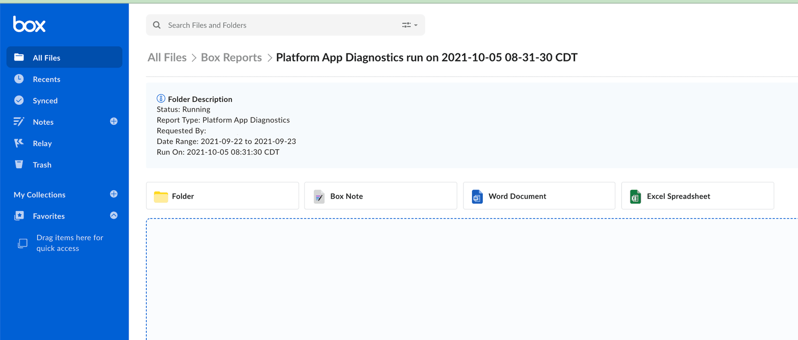
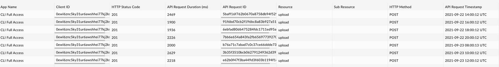

# App Diagnosticsレポート

App Diagnosticsレポートでは、指定した期間に特定のアプリケーションで実行された各APIコールの詳細を示したスプレッドシートが表示されます。このレポートでは、`API Request ID`を確認できます。これは、トラブルシューティングのためにBoxサポートに提出することができます。

<Message type="warning">

このレポートには、以下の項目は含まれません。

* 過去48時間以内に実行されたAPIコール
* 承認およびトークンに関するAPIコール

Boxでは、上記の項目を追加し、それによって、レポートが将来的にリアルタイムのトラブルシューティングに適したものになるよう取り組んでいます。

</Message>

## 1. \[**App Diagnostics**] タブをクリックする

App Diagnosticsレポートを実行するには、[開発者コンソール][console]でアプリケーションの構成セクションの上部にある \[**App Diagnostics**] オプションをクリックします。

<ImageFrame center shadow>

</ImageFrame>

## 2. \[**App Diagnosticsレポートを実行**] をクリックしてレポートを構成する

\[**App Diagnosticsレポートを実行**] をクリックすると、レポートのフィルタおよびパラメータを選択するためのポップアップが表示されます。

<ImageFrame center shadow>

![\[App Diagnostics\] メニュー](./images/Menu-Option-Screen.png)

</ImageFrame>

## 3. レポートのパラメータを選択して \[**実行**] をクリックする

現在から48時間前を基準に過去2週間以内の日付を選択できます。レポートは、合計24時間までを対象に実行できます。\[**実行**] をクリックすると、レポートが生成されます。

<ImageFrame center shadow>

</ImageFrame>

## 4. Box Reportsフォルダにアクセスする

\[[すべてのファイル][allfiles]] に移動し、Box Reportsフォルダを見つけます。今回初めてレポートを実行する場合は、このフォルダが自動的に生成されます。管理者の場合、これは、[管理コンソールのレポート][reports]にアクセスした場合と同じフォルダです。このフォルダを開きます。

<ImageFrame center shadow>

</ImageFrame>

## 5. 最新のPlatform App Diagnosticsレポートフォルダを探して開く

実行したレポートはすべて、Box Reportsフォルダに表示されます。最新のPlatform App Diagnostics実行のフォルダを探して開きます。

<ImageFrame center shadow>

</ImageFrame>

## 6. ステータスを確認する

レポートが完了するまで時間がかかります。ステータスは、フォルダの上部にあるボックスで確認できます。

<ImageFrame center shadow>

</ImageFrame>

## 7. レポートが完了する

完了すると、ステータスが変更され、フォルダ内に`.csv`ファイルが表示されます。

<ImageFrame center shadow>

</ImageFrame>

## 8. レポートを開く

ファイルは、ウェブブラウザで開くことも、ローカルで表示するためにダウンロードすることもできます。[Boxサポート][support]によるサポートが必要な場合は、ダウンロードしたコピーを添付するか共有リンクを使用して、チケットとともにレポートを送信することができます。

<ImageFrame center shadow>

</ImageFrame>

このレポートには列が9個あります。

| 列                | 説明                      |   |
| ---------------- | ----------------------- | - |
| アプリ名             | アプリケーションの名前             |   |
| クライアントID         | アプリケーションのクライアントID       |   |
| HTTPステータスコード     | Boxから返されたレスポンスコード       |   |
| APIリクエスト期間 (ミリ秒) | APIコールからレスポンスまでの時間      |   |
| APIリクエストID       | Boxサポートが使用できる一意の識別子     |   |
| リソース             | APIコールでアクセスされたプライマリリソース |   |
| サブリソース           | APIコールでアクセスされたセカンダリリソース |   |
| HTTPメソッド         | APIコールで使用されたHTTPメソッドの種類 |   |
| APIリクエストタイムスタンプ  | APIコールのタイムスタンプ          |   |

[support]: https://support.box.com/hc/en-us/requests/new

[console]: https://app.box.com/developers/console

[allfiles]: https://app.box.com/folder/0

<!-- i18n-enable localize-links -->

[reports]: https://support.box.com/hc/ja/articles/360043696534-レポートの実行

<!-- i18n-disable localize-links -->
