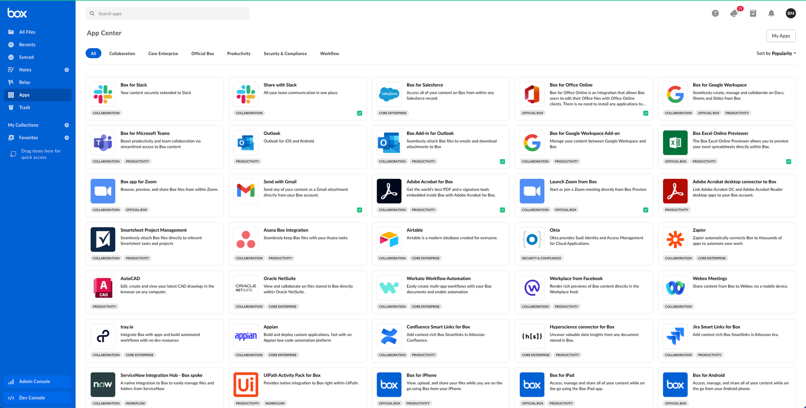

# App Center

The [Box App Center][app-center] is the first place for Box users to find out about applications that they can use in combination with Box. If your application is suited to be used by other enterprises, listing your service in the App Center can be a great way to find new users. App center groups apps into sections so that you can quickly find featured, most popular, or recently added apps.

<ImageFrame shadow center>

</ImageFrame>

## アプリの開発またはBoxパートナーへの参加

Box App Center用のアプリケーションの開発またはBoxパートナーへの参加の詳細については、Box Supportサイトの[Box Partner Resources][bp]のガイド (英語) を参照してください。

## アプリを公開する

[App Center][app-center]でアプリケーションを公開するには、以下の手順に従います。

### 前提条件

アプリケーションは、以下の要件を満たす必要があります。

* アプリケーションは完成した状態で、実稼働環境での使用準備ができていること。
* App CenterではOAuth 2.0以外の認証方法がサポートされていないため、アプリケーションではOAuth 2.0認証を利用すること。
* 開発者として、[開発者コンソール][devconsole]でそのアプリケーションにアクセスできること。

### 1. 開発者コンソールにログインする

[開発者コンソール][devconsole]に移動して、App Centerに送信するアプリケーションを選択します。

### 2. フォームに入力する

Select the **App Center** tab from the top menu.

<ImageFrame center border shadow>

![\[App Center\] パネル](./images/app-menu.png)

</ImageFrame>

\[アプリを送信] ボタンをクリックします。

<ImageFrame center border shadow width="400">

![\[アプリを送信\] ボタン](./images/submit-app.png)

</ImageFrame>

次に、フォームで、アプリケーションのカテゴリ、簡単な説明と詳しい説明、スクリーンショット、アプリのアイコンを指定します。

### 3. 掲載内容をプレビューする

\[プレビュー] ボタンを選択して、アプリケーションの掲載内容のプレビューを表示します。

<ImageFrame center border shadow>

</ImageFrame>

### 4. 承認用に送信する

最後に、\[承認用に送信] ボタンをクリックして、アプリケーションを承認用に送信します。

<Message>

# 承認の完了

承認のリクエストが届くと、Boxパートナーチームは通知を受け取り、リクエストをできるだけ早く確認します。

質問がある場合は、[`integrate@box.com`][email]までメールをお送りいただくか、サポートチケットを送信してください。

</Message>

## アプリケーションを未公開にする

承認されて公開されたアプリケーションは、同じコントロールパネルから未公開にすることができます。[開発者コンソール][devconsole]に移動して、アプリケーションを選択した後、左側のサイドバーから \[App Center] パネルを選択します。このページからアプリを未公開にすることができます。

[app-center]: https://app.box.com/services

[devconsole]: https://account.box.com/developers/services

[email]: mailto:integrate@box.com

[bp]: https://support.box.com/hc/en-us/sections/360009473734-Box-Partner-Resources
