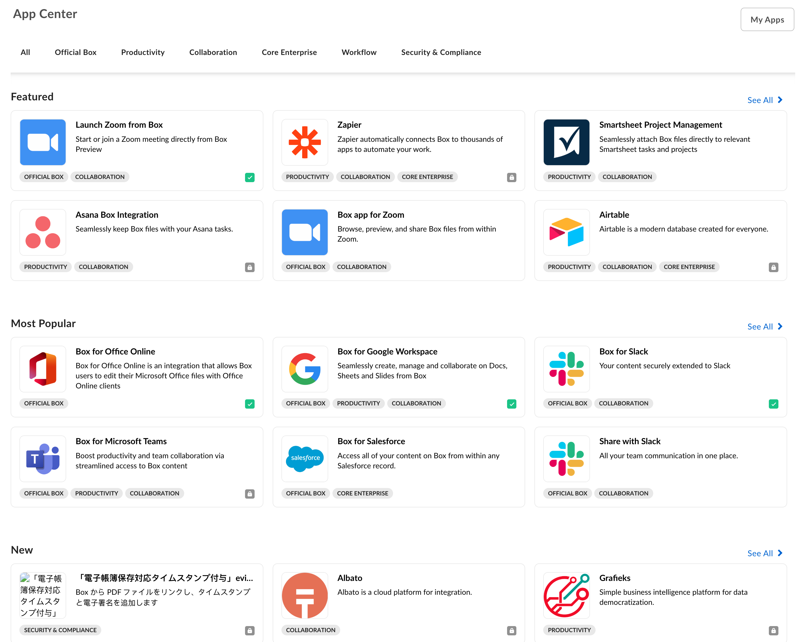
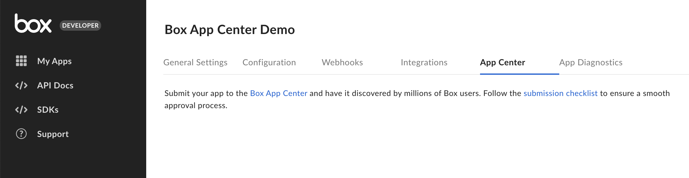

# App Center

The [Box App Center][app-center] is the first place for Box users to find out about applications that they can use in combination with Box. If your application is suited to be used by other enterprises, listing your service in the App Center can be a great way to find new users.

<ImageFrame shadow center>

</ImageFrame>

## Developing and app or becoming a Box Partner

If you would more information on developing an application for the Box App Center or becoming a Box Partner, visit our [Box Partner Resources][bp] guides on our community site.

## アプリを公開する

Use the following steps to publish an application in the [App Center][app-center].

### 前提条件

アプリケーションは、以下の要件を満たす必要があります。

* アプリケーションは完成した状態で、実稼働環境での使用準備ができていること。
* The application leverages OAuth 2.0 authentication, as the App Center does not support any other authentication methods.
* 開発者として、[開発者コンソール][devconsole]でそのアプリケーションにアクセスできること。

### 1. 開発者コンソールにログインする

Navigate to the [Developer Console][devconsole] and select your application to submit to the App Center.

### 2. フォームに入力する

Select the "App Center" tab from the top menu.

<ImageFrame center border shadow>

</ImageFrame>

\[アプリを送信] ボタンをクリックします。

<ImageFrame center border shadow width="400">

![\[アプリを送信\] ボタン](./images/submit-app.png)

</ImageFrame>

次に、フォームで、アプリケーションのカテゴリ、簡単な説明と詳しい説明、スクリーンショット、アプリのアイコンを指定します。

### 3. 掲載内容をプレビューする

\[プレビュー] ボタンを選択して、アプリケーションの掲載内容のプレビューを表示します。

<ImageFrame center border shadow>

</ImageFrame>

### 4. 承認用に送信する

最後に、\[承認用に送信] ボタンをクリックして、アプリケーションを承認用に送信します。

<Message>

# 承認の完了

承認のリクエストが届くと、Boxパートナーチームは通知を受け取り、リクエストをできるだけ早く確認します。

質問がある場合は、[`integrate@box.com`][email]までメールをお送りいただくか、サポートチケットを送信してください。

</Message>

## アプリケーションを未公開にする

Once approved and published, an application can be unpublished from the same control panel. Navigate to the [Developer Console][devconsole] and select your application. Then, select the "App Center" panel from the left-hand sidebar. The app can be unpublished from this page.

[app-center]: https://app.box.com/services

[devconsole]: https://account.box.com/developers/services

[email]: mailto:integrate@box.com

[bp]: https://support.box.com/hc/en-us/sections/360009473734-Box-Partner-Resources
