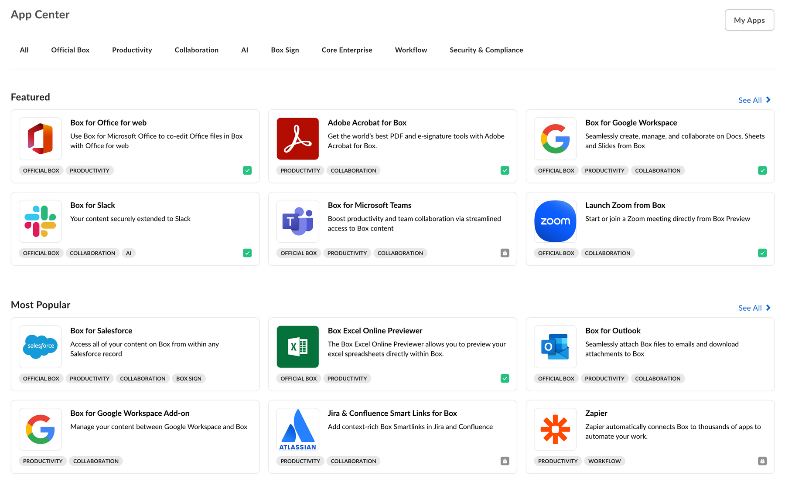

# App Center

[Box App Center][app-center]は、BoxユーザーがBoxと組み合わせて使用できるアプリケーションについて最初に確認できる場所です。アプリケーションが他の企業での使用にも適している場合は、App Centerにサービスを登録すると、新しいユーザーを見つけるのに役立ちます。App Centerでは、ユーザーが見つけやすいように、アプリが \[おすすめ]、\[人気]、\[新着] セクションに分類されています。

<ImageFrame shadow center>

</ImageFrame>

## アプリの開発またはBoxパートナーへの参加

Box App Center用のアプリケーションの開発またはBoxパートナーへの参加の詳細については、Box Supportサイトの[Box Partner Resources][bp]のガイド (英語) を参照してください。

## アプリを公開する

[App Center][app-center]でアプリケーションを公開するには、以下の手順に従います。

### 前提条件

アプリケーションは、以下の要件を満たす必要があります。

* アプリケーションは完成した状態で、実稼働環境での使用準備ができていること。
* App CenterではOAuth 2.0以外の認証方法がサポートされていないため、アプリケーションではOAuth 2.0認証を利用すること。
* 開発者として、[開発者コンソール][devconsole]でそのアプリケーションにアクセスできること。

### 1. 開発者コンソールにログインする

[開発者コンソール][devconsole]に移動して、App Centerに送信するアプリケーションを選択します。

### 2. フォームに入力する

上部のメニューで \[**App Center**] タブを選択します。

<ImageFrame center border shadow>

![\[App Center\] パネル](./images/app-center.png)

</ImageFrame>

\[アプリを送信] ボタンをクリックします。

<ImageFrame center border shadow width="400">

![\[アプリを送信\] ボタン](./images/submit-app.png)

</ImageFrame>

次に、フォームで、アプリケーションのカテゴリ、簡単な説明と詳しい説明、スクリーンショット、アプリアイコンを指定します。

### 3. 掲載内容をプレビューする

\[プレビュー] ボタンを選択して、アプリケーションの掲載内容のプレビューを表示します。

<ImageFrame center border shadow>

</ImageFrame>

### 4. 承認用に送信する

最後に、\[承認用に送信] ボタンをクリックして、アプリケーションを承認用に送信します。

<Message>

# 承認の完了

承認のリクエストが届くと、Boxパートナーチームは通知を受け取り、リクエストをできるだけ早く確認します。

質問がある場合は、[`integrate@box.com`][email]までメールをお送りいただくか、サポートチケットを送信してください。

</Message>

## アプリケーションを未公開にする

承認されて公開されたアプリケーションは、同じコントロールパネルから未公開にすることができます。[開発者コンソール][devconsole]に移動して、アプリケーションを選択した後、左側のサイドバーから \[App Center] パネルを選択します。このページからアプリを未公開にすることができます。

[app-center]: https://app.box.com/services

[devconsole]: https://cloud.app.box.com/developers/console

[email]: mailto:integrate@box.com

[bp]: https://support.box.com/hc/en-us/sections/360009473734-Box-Partner-Resources
