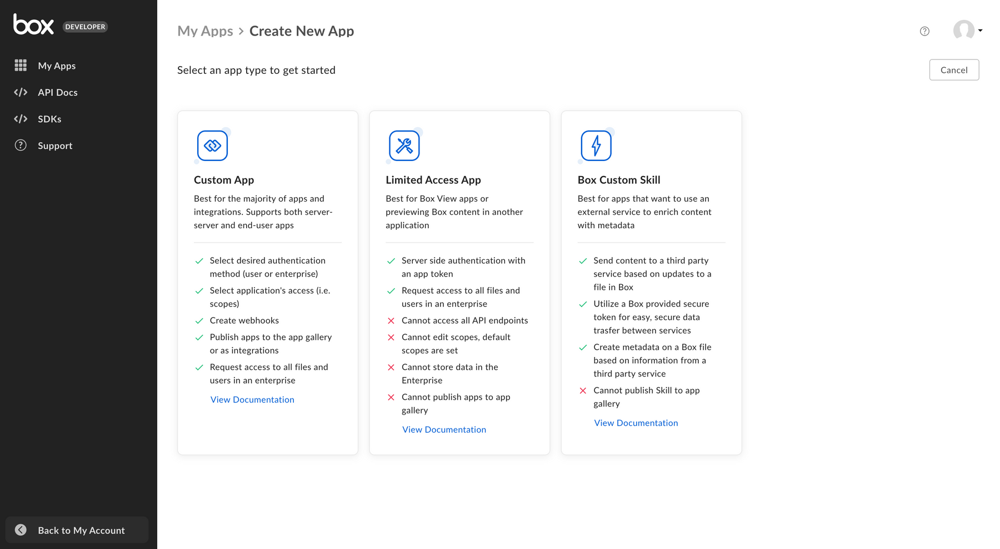

# アプリケーションの種類

以下に、作成できるさまざまなBoxアプリケーションの種類の概要を示します。

<ImageFrame border center>

</ImageFrame>

| アプリケーションの種類              | 認証方法                                                  |
| ------------------------ | ----------------------------------------------------- |
| [カスタムアプリ][custom-apps]   | [OAuth 2.0][oauth2]、[JWT][jwt]、または[クライアント資格情報許可][ccg] |
| [アクセス制限付きアプリ][laa]       | [アプリトークン][apptoken]                                   |
| [カスタムスキル][custom-skills] | 選択不要                                                  |

<CTA to="guide://applications/app-types/select">

アプリケーションの種類の選択方法を確認する

</CTA>

[oauth2]: g://authentication/oauth2

[jwt]: g://authentication/jwt

[apptoken]: g://authentication/app-token

[devtoken]: g://authentication/tokens/developer-tokens

[custom-apps]: g://applications/app-types/custom-apps

[custom-skills]: g://applications/app-types/custom-skills

[ccg]: g://authentication/client-credentials/

[laa]: g://applications/app-types/limited-access-apps/

[insights]: https://support.box.com/hc/en-us/articles/20738406915219-Platform-Insights
