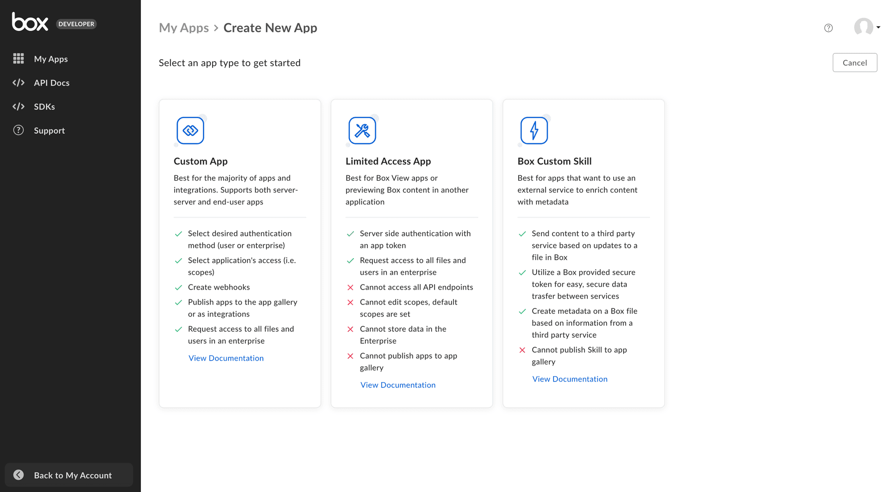

# Select App Type

Upon creating a new Box application in the [Developer Console][dev-console],
you must first select one of the following types of applications. The type of
application you select is dependent on the use case for your project and only
impacts the available authentication methods when configuring your application.
You cannot change this selection later on.

<ImageFrame shadow center>

</ImageFrame>

## Custom App

|                            |                                                                              |
| -------------------------- | ---------------------------------------------------------------------------- |
| **Authentication methods** | [OAuth 2.0][oauth2], [JWT][jwt], or [Client Credentials Authentication][ccg] |
| **Notable Features**        | Webhooks, App Center, and Web App Integrations                             |

Custom App encompasses most use cases and is the most flexible option.
This application type allows for interaction with our 150+ endpoints.
For example, downloading/uploading, searching, applying metadata and more.

<CTA to="g://applications/app-types/custom-apps">

Learn more about Custom Apps

</CTA>

## Limited Access App

|                            |                                       |
| -------------------------- | ------------------------------------- |
| **Authentication methods** | [App Token][app-token]                |
| **Notable Features**       | Limited API access                    |

A Limited Access App is best for leveraging [Box View][view-app] or previewing
Box content within another application. This type of application can only
interact with a limited number of endpoints.

<CTA to="g://applications/app-types/limited-access-apps">

Learn more about Limited Access Apps

</CTA>

## Custom Skills

|                            |                                |
| -------------------------- | ------------------------------ |
| **Authentication methods** | Access Tokens in Skills events |
| **Notable Features**       | Limited API access             |

A Custom Skill, or Box Skill is a type of application that performs custom
processing for files uploaded to Box. Skills are designed to make it possible to
use third-party Machine Learning services to automatically extract information
from files uploaded to Box.

<CTA to="g://applications/app-types/custom-skills">

Learn more about Custom Skills

</CTA>

[oauth2]: g://authentication/oauth2
[jwt]: g://authentication/jwt
[app-token]: g://authentication/app-token
[custom-apps]: g://applications/app-types/custom-apps
[dev-console]: https://app.box.com/developers/console
[view-app]: g://embed/box-view
[ccg]: g://authentication/client-credentials