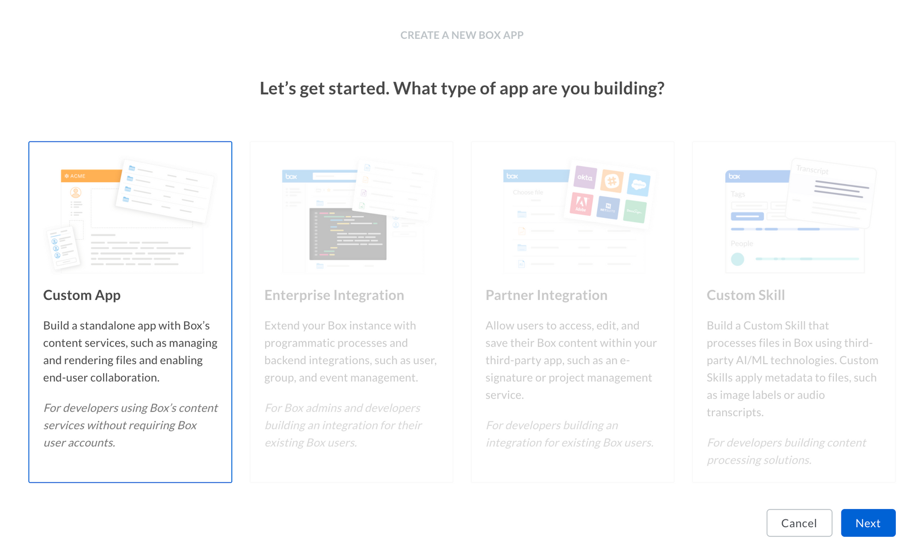
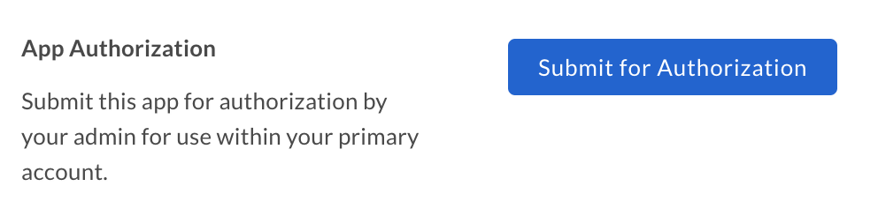

# アプリトークンを使用した設定

カスタムアプリは、認証にサーバー側の[アプリトークン][app-token]を使用するよう設定できます。

<CTA to="g://authentication/app-token">

アプリトークン認証のしくみを確認する

</CTA>

## 前提条件

アプリトークン認証を使用するカスタムアプリを設定するには、以下の要件を満たす必要があります。

* 会社の[開発者コンソール][devconsole]にアクセスできる必要があります。アクセスできない場合は、[Developerアカウント][devaccount]にサインアップしてください。

## アプリの作成

### 1. 開発者コンソールにログインする

[開発者コンソール][devconsole]に移動し、\[アプリの新規作成]を選択します。

### 2. カスタムアプリを作成する

アプリケーションの種類のリストから\[カスタムアプリ]オプションを選択し、\[次へ]を選択します。

<ImageFrame border>

</ImageFrame>

### 3. アプリトークンの認証を選択する

次の画面で\[標準OAuth 2.0 (ユーザー認証)]を選択し、\[次へ]を選択します。

<ImageFrame border width="400" center>

</ImageFrame>

### 4. 名前を入力する

最後に、アプリケーションの一意の名前を入力します。この名前は、Box上のすべてのアプリケーションで一意である必要があります。

<ImageFrame border width="600" center>

</ImageFrame>

## アプリの承認

アプリケーションの使用とアプリトークンの作成を可能にするには、Boxに登録されている会社内で会社の管理者ユーザーがそのアプリケーションを承認しておく必要があります。

[開発者コンソール][devconsole]でアプリケーションに移動し、アプリケーションの左側のサイドバーで\[一般]リンクを選択して、\[アプリの承認]セクションまで下にスクロールします。

<ImageFrame border width="400" center>

</ImageFrame>

承認用にアプリケーションを送信すると、会社の管理者にはアプリケーションを有効にするようメールが送信されます。このプロセスの詳細については、[アプリの承認に関するコミュニティ記事][app-auth]を参照してください。

## 基本的な構成

アプリケーションを使用するには、事前にいくつかの基本的な追加構成が必要になる場合があります。

### プライマリおよびセカンダリアプリトークン

このようなアプリケーションにおける認証は、あらかじめ構成された[アプリトークン][app-token]を使用して行われます。アプリトークンを構成するには、[開発者コンソール][devconsole]に移動してアプリケーションを選択し、左側のサイドバーから\[構成]パネルを選択します。

ここで、\[プライマリアクセストークン]セクションまで下にスクロールし、\[キーを生成]ボタンを選択して最初のアクセストークンを作成します。

<ImageFrame border width="600" center>

</ImageFrame>

トークンは、自動的に期限切れになるよう構成することも、有効期限なしで構成することもできます。作成後は、キーが有効になるため、[API呼び出し][api-calls]の実行に使用できます。

<Message warning>

# アプリの承認

アプリトークンは、アプリケーションが承認されるまで生成できません。

</Message>

### CORSドメイン

アプリケーションがJavaScriptでフロントエンドのブラウザコードからAPI呼び出しを実行する場合、それらの呼び出しの実行元となるドメインを、[クロスオリジンリソース共有][cors](CORS)のため許可する必要があります。

このようなリクエストを発行するには、アプリケーションで有効にする必要があるドメインのURIをすべて入力します。すべてのリクエストがサーバー側のコードから発行される場合、このセクションは空白のままになっている可能性があります。

<ImageFrame border>

</ImageFrame>

[devconsole]: https://app.box.com/developers/console

[devaccount]: https://account.box.com/signup/n/developer

[devtoken]: g://authentication/access-tokens/developer-tokens

[scopes]: g://api-calls/permissions-and-errors/scopes

[cors]: https://en.wikipedia.org/wiki/Cross-origin_resource_sharing

[app-token]: g://authentication/app-token

[api-calls]: g://api-calls

[app-auth]: https://community.box.com/t5/Managing-Developer-Sandboxes/Authorizing-Apps-in-the-Box-App-Approval-Process/ta-p/77293
