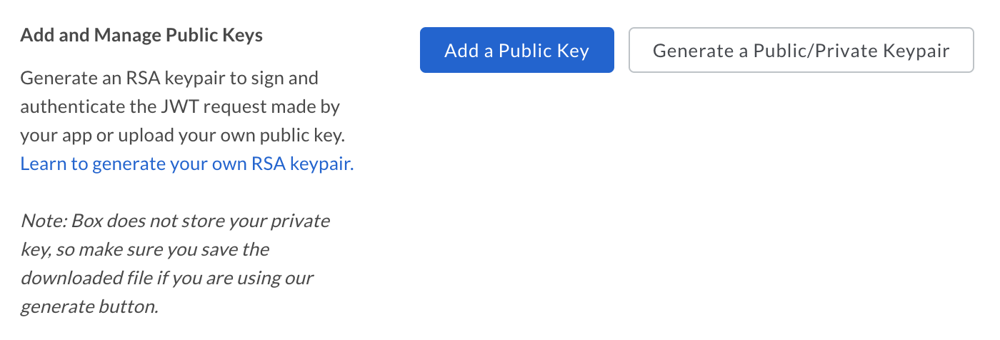
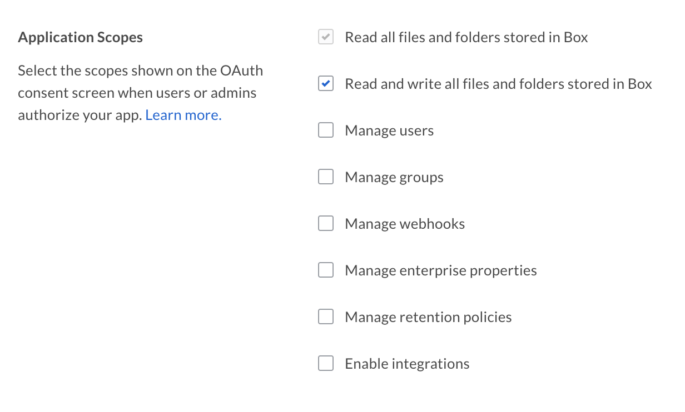

# JWTを使用した設定

カスタムアプリは、[JWT][jwt]によるサーバー側認証を使用するよう設定できます。

<CTA to="g://authentication/jwt">

JWT認証のしくみを確認する

</CTA>

## 前提条件

JWT認証を使用するカスタムアプリを設定するには、以下の要件を満たす必要があります。

* 会社の[開発者コンソール][devconsole]にアクセスできる必要があります。アクセスできない場合は、[Developerアカウント][devaccount]にサインアップしてください。

## アプリの作成

### 1. 開発者コンソールにログインする

[開発者コンソール][devconsole]に移動し、\[アプリの新規作成]を選択します。

### 2. カスタムアプリを作成する

アプリケーションの種類のリストから\[カスタムアプリ]オプションを選択し、\[次へ]を選択します。

<ImageFrame border>


</ImageFrame>

### 3. OAuth 2.0認証を選択する

次の画面で\[JWTを使用したOAuth 2.0 (サーバー認証)]を選択し、\[次へ]を選択します。

<ImageFrame border width="400" center>


</ImageFrame>

### 4. 名前を入力する

最後に、アプリケーションの一意の名前を入力します。この名前は、Box上のすべてのアプリケーションで一意である必要があります。

<ImageFrame border width="600" center>


</ImageFrame>

## JWTキーペア

JWT認証は、公開/秘密RSAキーペアを使用して機能します。このキーペアは開発者コンソールで生成できます。また、開発者が独自の公開キーを提供することもできます。

### キーペアの生成(推奨)

カスタムアプリがJWT認証を使用するように作成されたら、[開発者コンソール][devconsole]では、Boxに構成ファイルを作成させるためのオプションを使用できます。この構成ファイルには、キーペアに加え、認証で使用されるさまざまなアプリケーションの詳細が含まれています。

アプリケーションの左側のサイドバーで\[構成]オプションをクリックし、\[公開キーの追加と管理]セクションまで下にスクロールします。

<ImageFrame border width="600" center>



</ImageFrame>

\[公開/秘密キーペアを生成]ボタンをクリックして、Boxでキーペアを生成します。これにより、アプリケーションコードに移動できるJSON構成ファイルのダウンロードが開始されます。

<Message danger>

Boxは、セキュリティ上の懸念事項となるため、秘密キーを保存しません。秘密キーは解放しないでください。そうしないと、キーペア全体のリセットが必要になります。

</Message>

### 手動によるキーペアの追加

Boxに公開/秘密キーペアを生成させる代わりに、手動でキーペアを作成し、公開キーをBox開発者コンソールにアップロードする方法もあります。

OpenSSLを使用してキーペアを作成するには、ターミナルウィンドウを開き、以下のコマンドを実行します。

```shell
openssl genrsa -des3 -out private.pem 2048
openssl rsa -in private.pem -outform PEM -pubout -out public.pem
```

<Message>

# Windowsシステムの場合

Windowsユーザーは、[Cygwin][cygwin]パッケージをインストールして使用することで、OpenSSLを実行できます。

</Message>

次に、[開発者コンソール][devconsole]でアプリケーションに移動し、アプリケーションの左側のサイドバーから\[構成]リンクを選択して、\[公開キーの追加と管理]セクションまで下にスクロールします。

<ImageFrame border width="600" center>


</ImageFrame>

\[公開キーを追加]ボタンをクリックすると、Boxでは、先ほど作成した公開キーがアップロードされます。

## アプリの承認

キーペアがアプリケーションに追加されたら、そのキーペアは、Boxに登録されている会社内で会社の管理ユーザーが承認する必要があります。

[開発者コンソール][devconsole]でアプリケーションに移動し、アプリケーションの左側のサイドバーで\[一般]リンクを選択して、\[アプリの承認]セクションまで下にスクロールします。

<ImageFrame border width="400" center>


</ImageFrame>

これにより、会社の管理者にはアプリケーションを有効にするようメールが送信されます。このプロセスの詳細については、[アプリの承認に関するコミュニティ記事][app-auth]を参照してください。

### 変更の再承認

アプリケーションのスコープまたはアクセスレベルが変更された場合は、アプリケーションを再承認する必要があります。新しい変更を有効にするには、上記のプロセスを繰り返して新しいアクセストークンをリクエストしてください。

## 基本的な構成

アプリケーションを使用するには、事前にいくつかの基本的な追加構成が必要になる場合があります。

### アプリケーションアクセス

デフォルトでは、アプリケーションで操作できるのは、そのアプリケーション自体のデータと、アプリケーションによって作成される[App User][user-types]のデータのみです。会社全体の既存の管理対象ユーザーも操作するには、アプリケーションで「会社のアクセス権」を有効にする必要があります。

<ImageFrame border>


</ImageFrame>

### アプリケーションスコープ

これらのオプションでは、アプリケーションがデータにアクセスするのに必要な権限を定義します。各オプションの詳細については、[スコープのガイド][scopes]を参照してください。

<ImageFrame border width="600" center>



</ImageFrame>

### CORSドメイン

アプリケーションがJavaScriptでフロントエンドのブラウザコードからAPI呼び出しを実行する場合、それらの呼び出しの実行元となるドメインを、[クロスオリジンリソース共有][cors](CORS)のため許可する必要があります。

このようなリクエストを発行するには、アプリケーションで有効にする必要があるドメインのURIをすべて入力します。すべてのリクエストがサーバー側のコードから発行される場合、このセクションは空白のままになっている可能性があります。

<ImageFrame border>


</ImageFrame>

[devconsole]: https://app.box.com/developers/console

[devaccount]: https://account.box.com/signup/n/developer

[devtoken]: g://authentication/access-tokens/developer-tokens

[scopes]: g://api-calls/permissions-and-errors/scopes

[cors]: https://en.wikipedia.org/wiki/Cross-origin_resource_sharing

[user-types]: g://authentication/user-types

[cygwin]: http://www.cygwin.com/

[app-auth]: https://community.box.com/t5/Managing-Developer-Sandboxes/Authorizing-Apps-in-the-Box-App-Approval-Process/ta-p/77293

[jwt]: g://authentication/jwt
