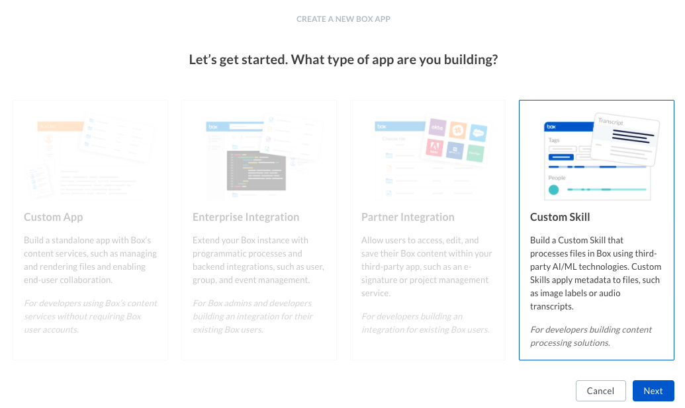
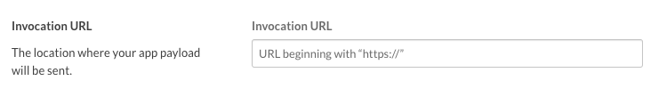
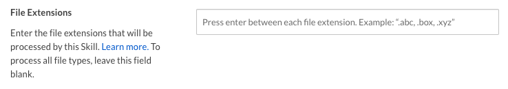

# 設定

カスタムスキルの設定は、複数の手順からなるプロセスです。

## 前提条件

カスタムスキルを設定するには、以下の要件を満たす必要があります。

* 会社の[開発者コンソール][devconsole]にアクセスできる必要があります。アクセスできない場合は、[Developerアカウント][devaccount]にサインアップしてください。

## アプリの作成

### 1. 開発者コンソールにログインする

[開発者コンソール][devconsole]に移動し、\[**アプリの新規作成**] を選択します。

### 2. カスタムスキルを作成する

アプリケーションの種類のリストから \[**カスタムスキル**] オプションを選択し、\[**次へ**] を選択します。

<ImageFrame border>

</ImageFrame>

### 3. 名前を入力する

次の画面で、アプリケーションの一意の名前を入力します。この名前は、Box上のすべてのアプリケーションで一意である必要があります。

<ImageFrame border width="600" center>

</ImageFrame>

## 承認

カスタムスキルを使用するには、スキルがトリガーされるフォルダに割り当てておく必要があります。

<CTA to="g://applications/custom-skills/approval">

カスタムスキルの承認の詳細を確認する

</CTA>

## 基本的な構成

カスタムスキルをフォルダに対して有効にするには、事前にいくつかの基本的な追加構成を設定する必要があります。

### 呼び出しURL

カスタムスキルは、アップロードされた各ファイルのペイロードをリモートURLに送信することで動作します。このURLは、呼び出しURLと呼ばれます。

呼び出しURLには、サーバー、開発マシン、またはサーバーレス関数を表す任意のHTTPエンドポイントを指定できます。唯一の条件は、URLが公開されていて、Boxサーバーからアクセスできることです。そのため、`localhost`は有効なアドレスではありません。

呼び出しURLを設定するには、[開発者コンソール][devconsole]に移動し、アプリケーションを選択して、左側にある\[構成]パネルで選択します。

\[呼び出しURL]セクションまで下にスクロールします。

<ImageFrame border width="600" center>

</ImageFrame>

セキュアなHTTPSアドレスを入力し、フォームを保存します。これで、呼び出しURLが構成されました。

### ファイル拡張子

デフォルトでは、フォルダ内の任意のファイルの種類に対してカスタムスキルがトリガーされます。スキルがトリガーされる対象となる特定のファイル拡張子を指定するには、アプリケーションの\[構成]パネルの\[ファイル拡張子]セッションまで下にスクロールします。

<ImageFrame border width="600" center>

</ImageFrame>

[devconsole]: https://app.box.com/developers/console

[devaccount]: https://account.box.com/signup/n/developer
