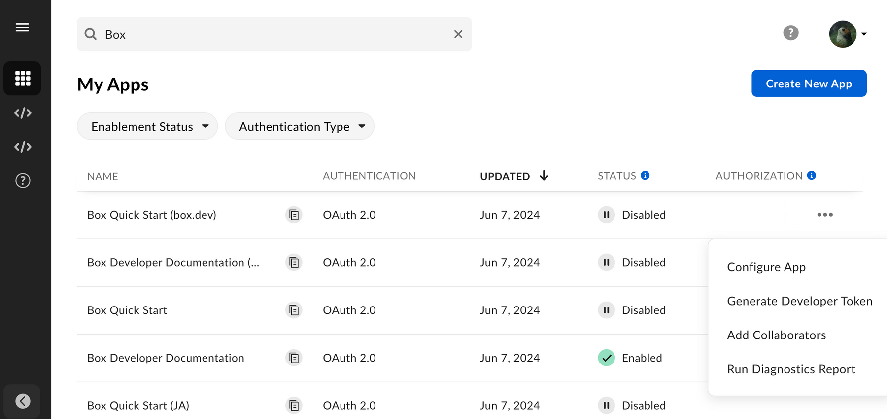

# アプリケーション

Box開発者コンソールでは、後でBoxとの統合に使用できるアプリケーションを作成できます。\[**マイアプリ**] ビューには、すでに作成済みのアプリケーションのリストが表示されるので、ここから構成の詳細にすばやくアクセスできます。そのため、毎回アプリを開かなくても、開発者トークンを生成したり、クライアントIDをコピーしたり、レポートを生成したりできます。

## 機能

\[**マイアプリ**] ページでは、以下の操作を行うことができます。

* 作成済みのアプリのリストを検索する。
* \[**有効化ステータス**] および \[**認証タイプ**] でアプリにフィルタをかける。
* [新しいアプリ][select]を作成する。
* アプリの[クライアントID][clientcredentials]をコピーする。
* アプリの名前を変更し、1回のクリックでその詳細にアクセスする。
* アプリケーションの[有効化][enablement]ステータスと[承認][authorization]ステータスを確認する。App Centerに公開されたアプリには、App Centerでのステータスが表示されます。

各エントリに用意されている**オプションメニュー**を使用すると、以下の操作を行うことができます。

* アプリケーションの構成の詳細にアクセスする。
* [開発者トークン][token]を生成する。
* アプリケーションにコラボレータを追加する。
* [App Diagnosticsレポート][report]を実行する。

## アプリインサイト

管理者と共同管理者は、組織におけるプラットフォームの利用状況を集約した、Platformインサイトのダッシュボードにアクセスできます。これには、以下のような、アプリ関連のデータが含まれます。

* アプリケーションごとのAPIコールの合計数
* 企業内の上位アプリケーションのリスト
* 承認を保留中のアプリケーションのリスト
* 有効化待ちのアプリケーションのリスト

詳細については、[Platformインサイト][insights]を参照してください。

<Message type="notice">

Platformインサイトにアクセスして表示するには、以下の権限が必要です。

* 会社の設定とアプリを表示する
* 会社の設定とアプリを編集する
* 新規レポートの実行および既存レポートへのアクセスを行う

</Message>

[token]: g://authentication/tokens/developer-tokens

[authorization]: g://authorization

[enablement]: g://authorization/custom-app-approval#user-authentication-apps

[select]: g://applications/app-types/select

[report]: g://api-calls/permissions-and-errors/app-diagnostics-report

[clientcredentials]: g://authentication/client-credentials

[insights]: https://support.box.com/hc/en-us/articles20738406915219-Platform-Insights
