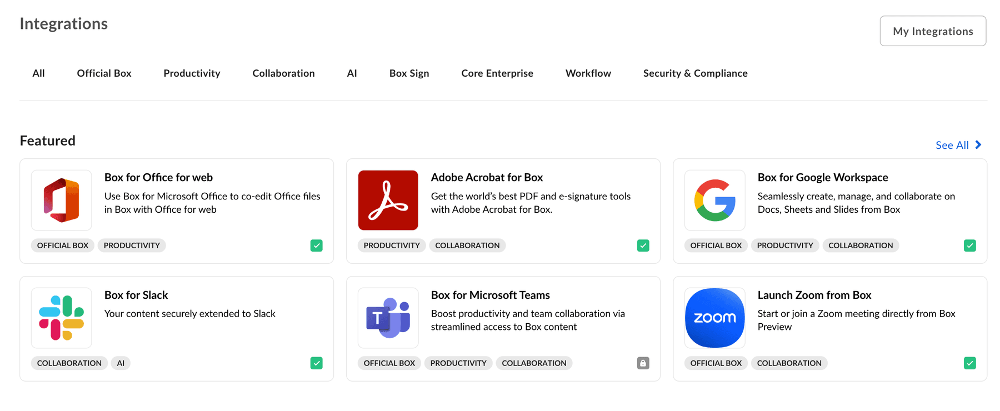
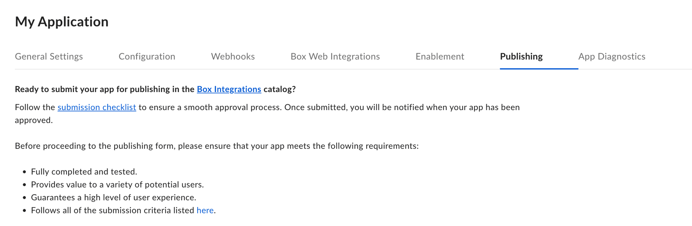

# Integrations

[Box Integrations][app-center] is the first place for Box users to find out
about applications they can use in combination with Box. If your
application can be user by other enterprises, listing your service in
under **Integrations** can be a great way to find new users.
Integrations group apps into sections so that you can
quickly find featured, most popular, or recently added apps.

## Developing and app or becoming a Box Partner

If you would more information on developing an application for the Box Integrations or becoming a Box Partner, visit our [Box Partner Resources][bp] guides on our community site.

## Publishing an app

Use the following steps to publish an application in Box Integrations.

### Prerequisites

Your application must meet the following requirements:

* The application is in a finished state and ready for production usage.
* The application leverages OAuth 2.0 authentication, as Integrations do not support any other authentication methods.
* You are a developer with access to the application in the [Developer Console][devconsole].

### Steps

1. Navigate to the [Developer Console][devconsole] > **My Platform Apps** and select the application you want to publish.
2. Select the **Publishing** tab from the top menu.

    

3. Read through the submission checklist and check the confirmation checkbox if your application meets all the requirements.
4. Fill in the form by providing:

    * the categories your application falls under
    * a short and a long description 
    * screenshots and an app icon
    * supplementary information that will be used to support the users

5. Use the **Preview** button in the top left corner to see how your application will look when listed.
6. Finally, submit the application for approval by clicking the **Submit for Approval** button. Once a request for approval is received, the Box Partner team will be notified and review your request as soon as possible. For any questions, email [`integrate@box.com`][email] or submit a support ticket.

## Unpublishing an application

Once approved and published, an application can be unpublished from the same
control panel. Navigate to the [Developer Console][devconsole] and select
your application. Then, select the **Integrations** panel from the left-hand
sidebar. The app can be unpublished from this page.

[app-center]: https://app.box.com/services
[devconsole]: https://cloud.app.box.com/developers/console
[email]: mailto:integrate@box.com
[bp]: https://support.box.com/hc/en-us/sections/360009473734-Box-Partner-Resources