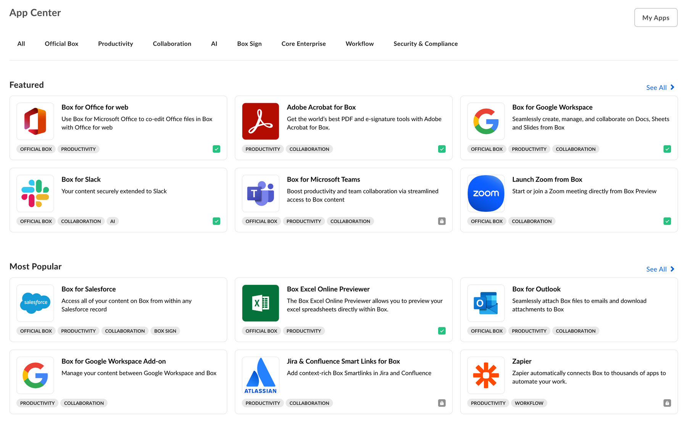

# 統合

[Box統合][app-center]は、BoxユーザーがBoxと組み合わせて使用できるアプリケーションについて最初に確認できる場所です。アプリケーションが他の企業での使用にも適している場合は、統合にサービスを登録すると、新しいユーザーを見つけるのに役立ちます。統合では、ユーザーが見つけやすいように、アプリが \[おすすめ]、\[人気]、\[新着] セクションに分類されています。

<ImageFrame shadow center>

</ImageFrame>

## アプリの開発またはBoxパートナーへの参加

Box App Center用のアプリケーションの開発またはBoxパートナーへの参加の詳細については、Box Supportサイトの[Box Partner Resources][bp]のガイド (英語) を参照してください。

## アプリを公開する

[App Center][app-center]でアプリケーションを公開するには、以下の手順に従います。

### 前提条件

アプリケーションは、以下の要件を満たす必要があります。

* アプリケーションは完成した状態で、実稼働環境での使用準備ができていること。
* 統合ではOAuth 2.0以外の認証方法がサポートされていないため、アプリケーションではOAuth 2.0認証を利用すること。
* 開発者として、[開発者コンソール][devconsole]でそのアプリケーションにアクセスできること。

### 手順

1. Navigate to the [Developer Console][devconsole] and select your application to submit.

2. Select the **Publishing** tab from the top menu.

   ![\[統合\] パネル](./images/publishing-app.png)

3. Fill in the form with your application's categories, a short and a long description, screenshots and an app icon.

4. Click **Preview** to see a preview of your application listing.

5. Finally, submit the application for approval by clicking the **Submit for Approval** button.

<Message>

# 承認の完了

承認のリクエストが届くと、Boxパートナーチームは通知を受け取り、リクエストをできるだけ早く確認します。

質問がある場合は、[`integrate@box.com`][email]までメールをお送りいただくか、サポートチケットを送信してください。

</Message>

## アプリケーションを未公開にする

承認されて公開されたアプリケーションは、同じコントロールパネルから未公開にすることができます。[開発者コンソール][devconsole]に移動して、アプリケーションを選択した後、左側のサイドバーから \[統合] パネルを選択します。このページからアプリを未公開にすることができます。

[app-center]: https://app.box.com/services

[devconsole]: https://cloud.app.box.com/developers/console

[email]: mailto:integrate@box.com

[bp]: https://support.box.com/hc/en-us/sections/360009473734-Box-Partner-Resources
