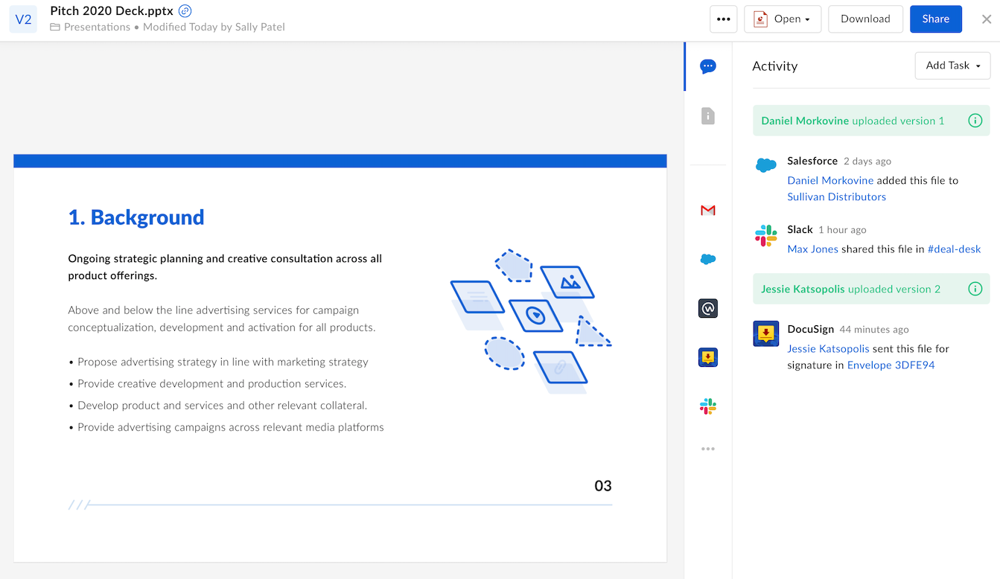

# ウェブアプリ統合

ウェブアプリ統合により、サードパーティ製アプリケーションをBox内で使用できるようになり、ユーザーはファイルを編集または共有する際にそのサードパーティ製アプリケーションを使用できます。

## 機能

ウェブアプリ統合を使用した場合、ユーザーはサードパーティ製アプリケーションを使用して、Boxに保存されているコンテンツを変更、共有、または編集できます。また、ウェブアプリ統合では、Boxプレビューに表示される[推奨アプリ][recommended-apps]を通じて、Boxユーザーに新しい機能を提供することもできます。

<ImageFrame border shadow width="600" center>

</ImageFrame>

ウェブアプリ統合を有効にすると、アプリケーションを \[推奨アプリ] に追加できるため、ユーザーはそのアプリケーションでファイルを使用できるようになります。統合は、特定のコンテンツタイプとファイル拡張子に制限することができます。

<CTA to="g://applications/web-app-integrations/configure">

ウェブアプリ統合の作成方法を確認する

</CTA>

[app-center]: g://applications/app-center

[custom-app]: g://authentication/oauth2/oauth2-setup

[oauth2]: g://authentication/oauth2

<!-- i18n-enable localize-links -->

[devconsole]: https://app.box.com/developers/console

[recommended-apps]: https://support.box.com/hc/ja/articles/360044195533-推奨アプリをEnterpriseに導入する

<!-- i18n-disable localize-links -->
