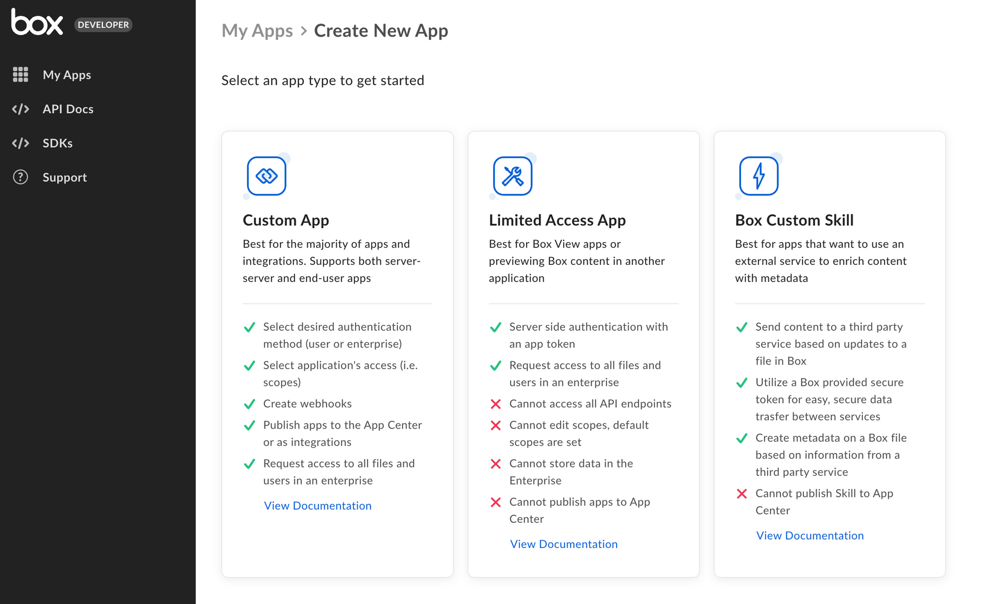
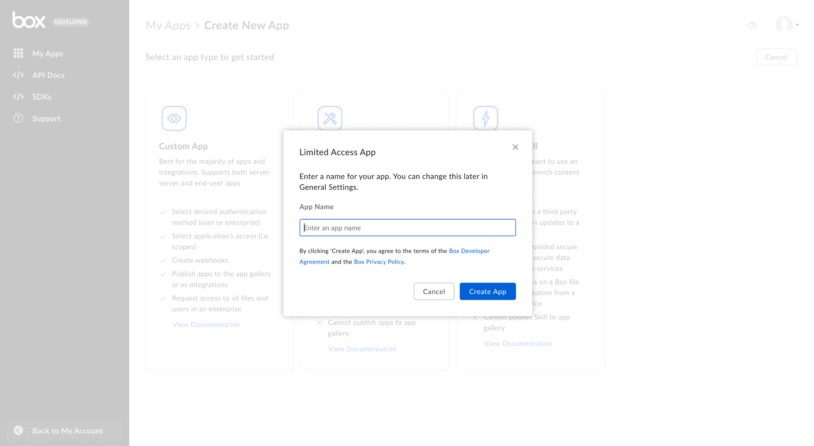
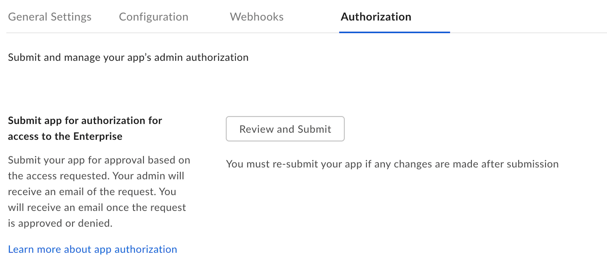
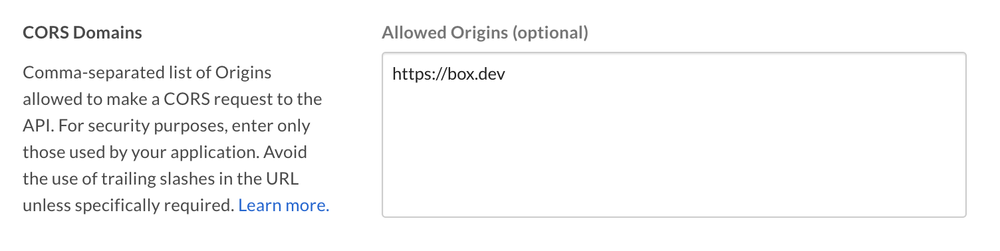

# アプリトークン認証を使用した設定

アクセス制限付きアプリは、認証にサーバー側の[アプリトークン][app-token]を使用するよう設定できます。

<CTA to="g://authentication/app-token">

アプリトークン認証のしくみを確認する

</CTA>

## 前提条件

サーバー側認証を使用してカスタムアプリを設定するには、Box Enterpriseアカウントから[開発者コンソール][devconsole]にアクセスできることを確認する必要があります。または、[Developerアカウント][devaccount]にサインアップすることもできます。

## アプリの作成手順

### 1. 開発者コンソールにログインする

Boxにログインし、[開発者コンソール][devconsole]に移動して、\[**アプリの新規作成**] を選択します。

### 2. カスタムアプリを作成する

アプリケーションの種類のリストから \[**アクセス制限付きアプリ**] を選択します。次の手順を促すモーダルが表示されます。

<ImageFrame border>

</ImageFrame>

### 3. アプリ名を選択する

最後に、アプリケーションの一意の名前を選択し、\[**アプリの作成**] をクリックします。

<ImageFrame border width="600" center>

</ImageFrame>

## アプリの承認

キーペアがアプリケーションに正常に追加されたら、Box Enterprise管理者はBox管理コンソール内でこのアプリケーションを承認する必要があります。

[開発者コンソール][devconsole]内でアプリケーションの \[**一般設定**] タブに移動し、\[**アプリの承認**] セクションまで下にスクロールします。

<ImageFrame border width="400" center>

</ImageFrame>

\[**確認して送信**] をクリックして、承認を得るためにBox Enterprise管理者にメールを送信します。このプロセスの詳細については、[承認ガイド][auth]を参照してください。

## 基本的な構成

アプリケーションを使用するには、事前にいくつかの基本的な追加構成が必要になる場合があります。

### プライマリおよびセカンダリアプリトークン

アクセス制限付きアプリでの認証は、あらかじめ構成された[アプリトークン][app-token]を使用して行われます。アプリトークンを構成するには、[開発者コンソール][devconsole]内でアプリケーションの \[**構成**] タブに移動します。

\[**プライマリアクセストークン**] セクションまで下にスクロールし、\[**キーを生成**] ボタンをクリックします。

<ImageFrame border width="600" center>

</ImageFrame>

アプリトークンは、自動的に期限切れになるよう構成することも、有効期限なしで構成することもできます。作成後は、このキーを使用して[API呼び出し][api-calls]を実行できます。

<Message warning>

# アプリの承認

アプリトークンは、Box管理コンソール内でアプリケーションの承認が成功するまで生成できません。

</Message>

### CORSドメイン

アプリケーションがJavaScriptでフロントエンドのブラウザコードからAPI呼び出しを実行する場合は、[クロスオリジンリソース共有][cors] (CORS) のために、これらの呼び出しの実行元となるドメインを許可リストに追加する必要があります。すべてのリクエストがサーバー側のコードから発行される場合は、このセクションをスキップできます。

許可リストにすべてのURIを追加するには、[開発者コンソール][devconsole]の \[**構成**] タブの下部にある \[**CORSドメイン**] セクションに移動します。

<ImageFrame border>

</ImageFrame>

[devconsole]: https://app.box.com/developers/console

[devaccount]: https://account.box.com/signup/n/developer

[devtoken]: g://authentication/tokens/developer-tokens

[scopes]: g://api-calls/permissions-and-errors/scopes

[cors]: https://en.wikipedia.org/wiki/Cross-origin_resource_sharing

[app-token]: g://authentication/app-token

[api-calls]: g://api-calls

[auth]: g://authorization
