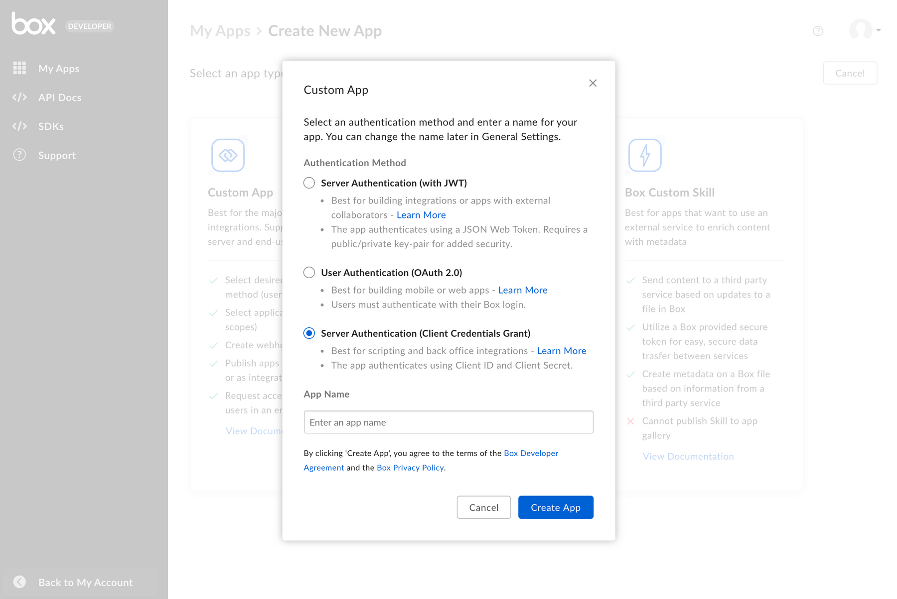
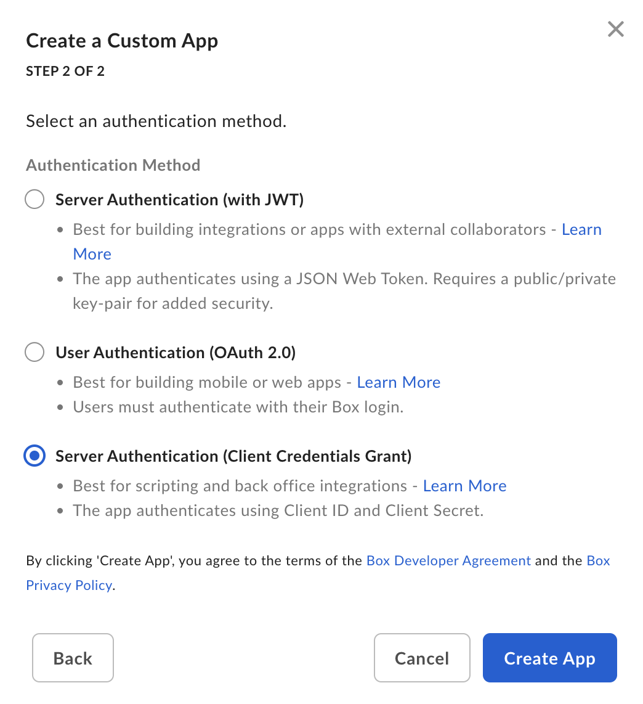

# Setup with Client Credentials Grant

## Prerequisites

To set up a Custom App using server-side authentication, you will need to ensure
you have access the [Developer Console][devconsole] from your Box enterprise
account. Alternatively, you may sign up for a [developer account][devaccount].

## App creation steps

### Navigate to the Developer Console

Log into Box and go to the [Developer Console][devconsole].
Select **Create New App**.

### Select application type

Select **Custom App** from the list of application types. A modal will appear to
prompt a selection for the next step.

<ImageFrame border>

</ImageFrame>

### Provide basic application information

<!-- markdownlint-disable line-length -->

To describe your app, provide an app name and description.
Use the drop-down list to select the app's purpose.
Depending on the option chosen, you might
need to specify further details.

| Purpose | Details|
|------| --------|
|Automation, Custom Portal| Specify if the app is built by a customer or partner. |
|Integration|  Specify the integration category, external system name if the app is built by a customer or partner. |
|Other| Specify the app purpose and if it is built by a customer or partner. |

<ImageFrame border center width="300">

>

</ImageFrame>

<!-- markdownlint-enable line-length -->

### Select application authentication

Select **Server Authentication (with Client Credentials Grant)**
if you would like to verify
application identity with a client
ID and client secret, and confirm with **Create App**.

<Message warning>

Once you make a selection, you will not be able to change to a different
authentication method without creating a new application.

</Message>

<ImageFrame border center width="300">

>

</ImageFrame>

## App Authorization

Before the application can be used, a Box Admin needs to authorize the
application within the Box Admin Console.

Navigate to the **Authorization** tab for your application within the
[Developer Console][devconsole].

<ImageFrame border width="400" center>

</ImageFrame>

Click **Review and Submit** to send an email to your Box enterprise Admin for
approval. More information on this process is available in our
[authorization guide][app-auth].

<CTA to='g://authorization/custom-app-approval'>

Learn how to authorize a Custom Application

</CTA>

## Basic configuration

### Application Access

An application's access level determines which users and content your app may
access. By default, an application can only successfully interact with the
content of its [Service Account][sa] and any [App Users][user-types]. To also
access existing Managed Users of an enterprise, navigate to the
**Application Access** settings accessible via the **Configuration** tab of the
[Developer console][devconsole] and set to **App + Enterprise Access**. 

<ImageFrame border>

</ImageFrame>

### Application Scopes

An application's scopes determine which endpoints and resources an application
can successfully call. See the [scopes guide][scopes] for detailed information
on each option.

<ImageFrame border width="600" center>

</ImageFrame>

### CORS Domains

If your application makes API calls from front-end browser code in
Javascript, the domain that these calls are made from will need to be
added to an allow-list due to [Cross Origin Resource Sharing][cors],
also known as CORS. If all requests will be made from server-side code,
you may skip this section.

To add the full URI(s) to the allow-list, navigate to the **CORS Domain**
section at the bottom of the **Configuration** tab in the
[Developer console][devconsole].

<ImageFrame border>

</ImageFrame>

## Using SDKs and Client Credentials Grant

To learn more about Client Credentials Grant for each SDK head over to:

- [.Net][.Net]

- [Java][Java]

- [Python][Python]

- [Node][Node]

- [IOS][IOS]

[.Net]: https://github.com/box/box-windows-sdk-v2/blob/main/docs/authentication.md#server-auth-with-ccg
[Java]: https://github.com/box/box-java-sdk/blob/main/doc/authentication.md#client-credentials-grant
[Python]: https://github.com/box/box-python-sdk/blob/main/docs/usage/authentication.md#client-credentials-grant
[Node]: https://github.com/box/box-node-sdk/blob/main/docs/authentication.md#client-credentials-grant-authentication
[IOS]: https://github.com/box/box-ios-sdk/blob/main/docs/usage/authentication.md#client-credentials-grant

[devconsole]: https://app.box.com/developers/console
[devaccount]: https://account.box.com/signup/n/developer
[scopes]: g://api-calls/permissions-and-errors/scopes
[cors]: https://en.wikipedia.org/wiki/Cross-origin_resource_sharing
[user-types]: page://platform/user-types
[sa]: page://platform/user-types/#service-account
[app-auth]: g://authorization