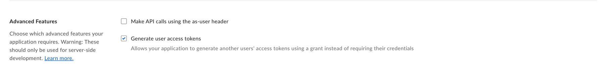

# クライアント資格情報許可

サーバー認証を利用し、クライアントIDとクライアントシークレットを使用してアプリケーションのIDを確認する場合は、以下の手順に従います。

## 前提条件

* Box[開発者コンソール][devconsole]でサーバー認証 (クライアント資格情報許可使用) を使用するカスタムアプリケーション
* \[構成] タブからアプリケーションのクライアントシークレットを表示およびコピーするために、Boxアカウントで[2要素認証][2fa]が有効になっていること
* Box管理コンソールでアプリケーションが[承認][auth]されていること

<Message danger>

クライアントシークレットは機密情報であり、保護する必要があります。アクセストークンの取得時にBoxがアプリケーションのIDを安全に確認するために使用されるため、クライアントシークレットを自由に配布するべきではありません。配布方法には、メール、公開フォーラム、コードリポジトリ、分散されたネイティブアプリケーション、クライアント側のコードなどがあります。さらにセキュリティメカニズムを追加する場合は、Boxの標準的なJWTアプリケーションを使用することをお勧めします。

</Message>

## 利用方法

APIコールを実行して[アクセストークン][accesstoken]を取得する際は、リクエスト本文にクライアントIDとクライアントシークレットを含める必要があります。`grant_type`を`client_credentials`に設定します。

アプリケーションの[サービスアカウント][sa]として認証する場合は、以下のようにします。

* `box_subject_type`を`enterprise`に設定する
* `box_subject_id`をEnterprise IDに設定する

管理対象ユーザーとして認証する場合は、以下のようにします。

* `box_subject_type`を`user`に設定する
* `box_subject_id`をユーザーIDに設定する

<Samples id="x_auth" variant="with_client_credentials">

</Samples>

## 一般的なエラー

<!--alex ignore invalid-->

### Grant credentials are invalid (許可の資格情報が無効です)

認証中に、次のエラーが表示される場合があります。

```sh
Grant credentials are invalid [400 Bad Request] invalid_grant - Grant credentials are invalid

```

このエラーは次のいずれかを示します。

* 渡されたクライアントIDとクライアントシークレットが正しくないか、同じアプリケーションのものではない。

* 選択した[アプリケーションアクセス][aa]に基づいて`box_subject_id`を使用できない。たとえば、送信時に`enterprise`を`box_subject_type`に設定し、アプリケーションが \[アプリアクセスのみ] に設定されている場合、`grant credentials are invalid`エラーが返されます。

* `box_subject_type`を`user`に設定して使用するには、\[**構成**] タブの \[**高度な機能**] セクションでユーザーアクセストークンを生成するようアプリケーションを構成する必要があります。

  

<Message warning>

アプリの設定に変更を加えたら、忘れずに管理コンソールでアプリケーションを[再承認][reauth]してください。

</Message>

<!-- i18n-enable localize-links -->

[2fa]: https://support.box.com/hc/ja/articles/360043697154-アカウントの多要素認証の設定

<!-- i18n-disable localize-links -->

[devconsole]: https://app.box.com/developers/console

[accesstoken]: e://post-oauth2-token/

[sa]: page://platform/user-types/#service-account/

[auth]: g://authorization

[aa]: g://authentication/client-credentials/client-credentials-setup/#application-access

[reauth]: g://authorization/custom-app-approval#re-authorization-on-changes
